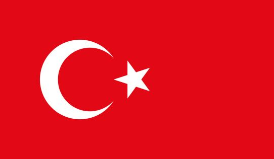

# Benutzerhandbuch Open Food Network \(OFN\)


--&gt;​ Diese Seite ist noch nicht vollständig ins Deutsche übersetzt. Wenn du mithelfen möchtest, melde dich gerne bei uns [per E-Mail](mailto:konrad@openfoodnetwork.de) oder [im Slack](https://join.slack.com/t/openfoodnetwork/shared_invite/zt-9sjkjdlu-r02kUMP1zbrTgUhZhYPF~A)!



_Dies ist die deutsche Version des Benutzerhandbuchs zum Open Food Network \(OFN\)!_


|  |  |  |  |  |  |  |
| :---: | :---: | :---: | :---: | :---: | :---: | :---: |
| [English](https://app.gitbook.com/@ofn-user-guide/s/ofn-user-guide-master) | [Français](https://ofn-user-guide.gitbook.io/guide-utilisateur-open-food-network/) | [Español](https://app.gitbook.com/@ofn-user-guide/s/ofn-user-guide-master/v/es/) | [Português](https://guia.openfoodbrasil.com.br/) | [Russian](https://guide.openfoodnetwork.ru/) | [Türkçe](https://kilavuz.acikgida.com/) | [Catalan](https://guia.katuma.org/) |

**Dieses Benutzerhandbuch hilft Ihnen alle Möglichkeiten der Open Food Network Plattform auszuschöpfen und so den Betrieb von regionalen Lebensmittelunternehmen zu ermöglichen und kurze Produktions- und Lieferketten zu realisieren - überall.**

## Einführung

Das Open Food Network ermöglicht es, Lebensmittel regional und direkt von Erzeugern, Landwirten und Produzenten zu beziehen. Darüber hinaus können sich weitreichende Netzwerke von kleinen Lebensmittelproduzenten, Distributoren, Einzelhändlern, Food Hubs, Kooperativen und Einkaufsgemeinschaften bilden, um kurze Produktions- und Lieferketten zu schaffen.

Das Open Food Network ist ein globales Projekt, das die organisatorischen Abläufe von Produzenten und Verbrauchern \(z.B. in Kooperativen\) beim Handel regionaler Lebensmittel unterstützt. Die von uns entwickelte Software ist Open Source und wir arbeiten mit großartigen Menschen aus der ganzen Welt zusammen, um sie ständig zu verbessern! Wir unterstützen auch die Planungen zum Aufbau und Betrieb verschiedenster Vermarktungsmodelle, z.B. eines Food Hubs oder eines online Wochenmarkts. Bitte kontaktieren Sie gerne Ihren[ OFN Ansprechpartner vor Ort](local-ofn-organizations-and-contacts.md), um mehr zu erfahren!

Das folgende Video gibt Ihnen eine kurze Einführung in die Funktionsweise des Open Food Network und zeigt Ihnen, was wir für Ihr Lebensmittelunternehmen oder Ihre Organisation tun können.



## How to use this guide?

### &gt; Quick setup guides tailored to your enterprise

Starting scratch, open an online shop that perfectly fits your needs [in a few simple steps](your-quick-start-on-ofn-given-who-you-are.md)! 


We recommend these guides to users starting out on the Open Food Network platform for the first time.


### &gt; Features to meet your needs

Find a [detailed explanation of every feature our platform offers](basic-features/), so you can set up your Open Food Network enterprise to specifically meet your local needs.


We recommend these guides to users who would like to customise their Open Food Network enterprise specifically to meet the needs of their business or customers.



They are also a great resource for answering any questions you may have.


### _&gt;_ Guidelines on complementary software you might like to use in combination with the Open Food Network

The Open Food Network does a lot of things, but no one tool can fit all needs. We have listed [some needs for which you might need complementary software, and how you can set them up](complementary-tools-software/) to work hand in hand with your local Open Food Network platform.

### &gt; Trouble shooting

Still not finding what you need ? Check the [Trouble Shooting section](trouble-shooting.md) to see if others had the same questions as you!

### &gt; Search

Looking for information on something specific? Use the search bar in the top left corner to find the information you need.

## Feedback

Any difficulty with that user guide? Any information missing? Or maybe you want to share some features you would like to see in the future? Get in touch with [your local OFN entity](local-ofn-organizations-and-contacts.md) for any feedback!

