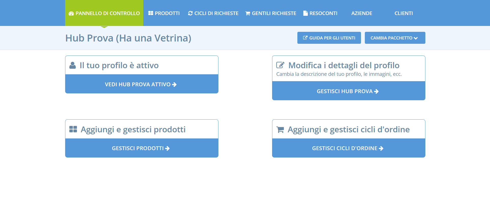

# Pannello di controllo

Attraverso il Pannello di Controllo puoi modificare e gestire le impostazioni e le funzionalità del tuo profilo di Open Food Network. Se hai deciso di registrarti come [negozio](../your-quick-start-on-ofn-given-who-you-are.md#shop) o [hub](../your-quick-start-on-ofn-given-who-you-are.md#hub) qui puoi anche modificare i tuoi prodotti ed i tuoi cicli di richieste.

Accedi al tuo pannello di controllo dalla pagina principale: innanzitutto effettua l'accesso, poi clicca sull'icona del profilo nell'angolo in alto a destra e seleziona **Amministratione** dal menù a tendina.

Le opzioni che visualizzerai sul tuo pannello di controllo dipendono dal tipo di profilo che hai scelto in fase di [registrazione](register-and-create-your-profile.md). Le immagini seguenti mostrano i pannelli di controllo per i dversi tipi di profilo.

### Produttore - solo Profilo

### Negozi e Hub

