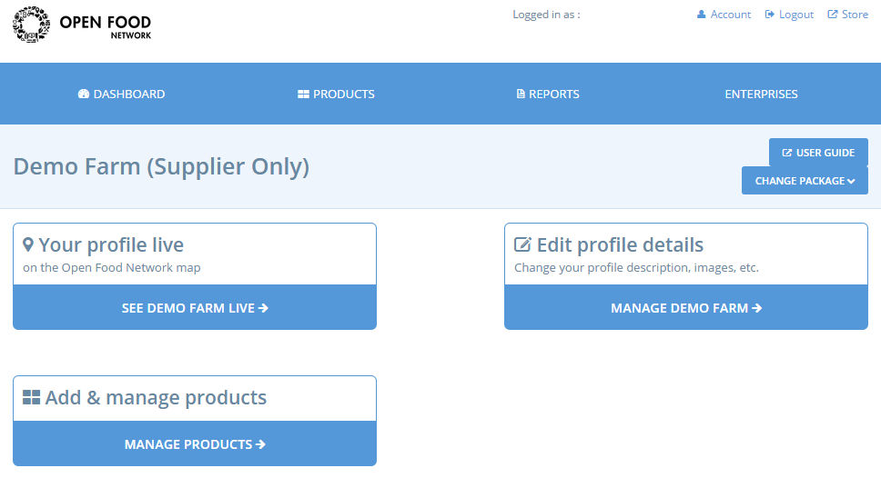
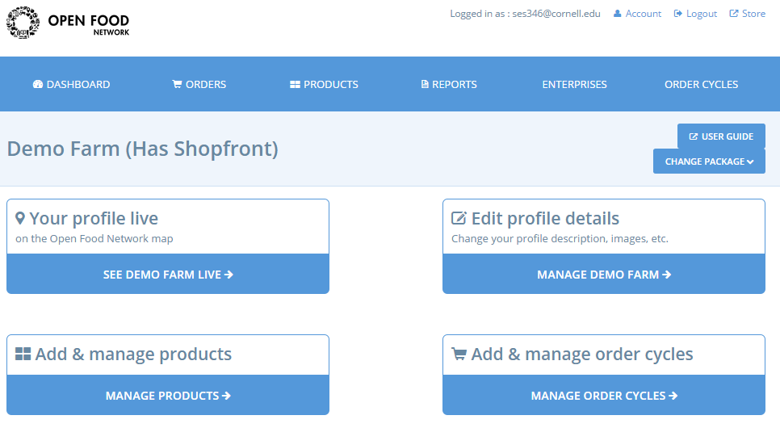
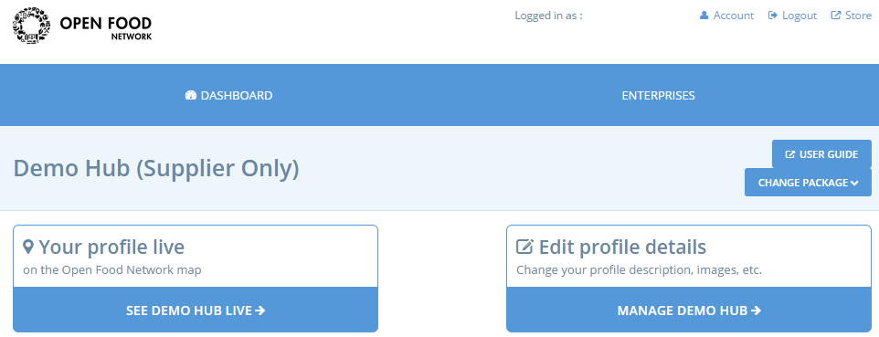
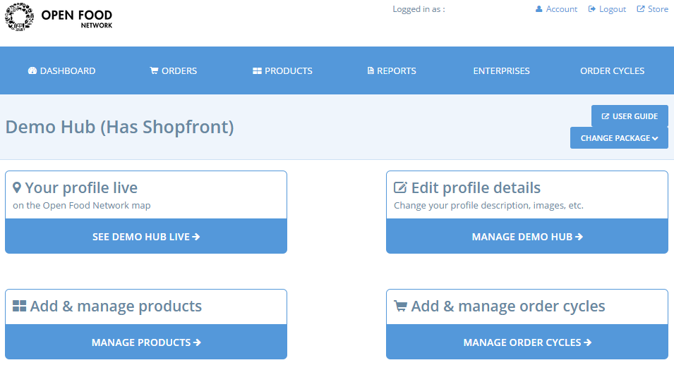

# Dashboard

Das Dashboard ist der Ort, an dem Sie die Funktionen und Einstellungen Ihres Unternehmens auf der Open Food Network-Plattform bearbeiten und verwalten können. Wenn Sie sich entschieden haben, Ihr Unternehmen als [Laden](../your-quick-start-on-ofn-given-who-you-are.md#laeden) oder [Hub](../your-quick-start-on-ofn-given-who-you-are.md#hub) zu registrieren, können Sie auch Ihre Produkte und Bestellzyklen über das Dashboard bearbeiten.

Greifen Sie von der Startseite aus auf Ihr Dashboard zu, indem Sie sich zunächst anmelden, dann auf das Profilsymbol in der oberen rechten Ecke klicken und aus dem Dropdown-Menü die Option **Verwaltung** auswählen.

Die Optionen, die Sie auf Ihrem Dashboard sehen, hängen davon ab, welchen Unternehmenstyp Sie bei der [Registrierung](register-and-create-your-profile.md) wählen. Die folgenden Screenshots zeigen die Dashboard-Ansicht für verschiedene Arten von Nutzern.

### Produzenten











### Hubs










