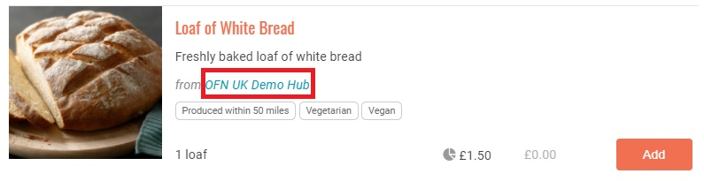

# Erstellen oder verbinden Sie sich mit Ihren Zulieferer auf der Plattform


Diese Seite ist nur für Nutzer relevant, die sich Food Hubs (Produzenten - Food Hubs oder auch  Nicht - Produzenten  - Food Hubs) registriert haben.


Für Food Hubs ist die Verbindung mit bestehenden OFN-Produzenten oder die Einrichtung von Konten für Ihre Produzenten eine notwendige Vorstufe für die Aufnahme Ihrer Produktpalette in Ihren Shop.


Alle Produzent:innen, die Produkte über das Open Food Network anbieten, müssen ein Unternehmenskonto auf der Plattform haben. Die Produkte werden in den Katalog des Produzenten eingetragen und dann  im Online - Laden des Produzenten und/oder im Online - Laden eines oder mehreren Food Hubs, denen der Produzent die [Erlaubnis](enterprise-to-enterprise-permissions-e2es.md) erteilt hat, "angezeigt". Dies ist ein wichtiges Merkmal des OFN, da es den Kunden ermöglicht, die Herkunft der Produkte zu verfolgen.


Ein Beispiel dafür, wie dies im Online - Laden angezeigt wird, finden Sie unten:

Bevor Sie Produkte zu Ihrem Online - Laden hinzufügen können, haben Sie zwei Möglichkeiten:

1. Erstellen Sie OFN-Profile für die Produzenten, die Sie beliefern (falls sie nicht bereits ein Profil haben)
2. Beantragen Sie die [Erlaubnis](enterprise-to-enterprise-permissions-e2es.md), die Produkte von bereits im OFN eingetragenen Produzent:innen zu verkaufen.

Wenn Sie sich nicht sicher sind, ob eine Produzent:in, die ihr Food Hub beliefert, bereits ein OFN-Profil hat, können Sie dies herausfinden, indem Sie im Hauptmenü nach der Produzent:in suchen.

## Der Produzent verfügt NICHT über ein OFN-Profil.

Wenn ein Produzent noch kein OFN-Profil hat, können Sie eines in seinem Namen erstellen. Sie sind dann der "Besitzer" dieses Profils und können die Produkte des Produzenten mit ihren Preisen und Lagerbeständen hinzufügen und sie in Ihrem Shop auflisten. Das neue Produzentenunternehmen wird auf Ihrem Dashboard sichtbar, wenn Sie sich in Ihr bestehendes Konto einloggen. Sollte der Produzent jemals Eigentümer seines Profils werden wollen, [kann das Eigentum einfach übertragen werden](transfer-ownership.md). Wenn der Produzent sein Profil und seinen Katalog verwalten möchte, aber damit einverstanden ist, dass Sie der Eigentümer seines Profils sind, können Sie[ ihn als Manager einladen](enterprise-settings.md#benutzer).

### Was ist vor der Erstellung eines Produzentenprofils zu beachten?

Bevor Sie ein Profil für Ihre Produzent:innen erstellen, sollten Sie mit ihnen Kontakt aufnehmen und sie darüber informieren, dass Sie für sie ein Konto und ein Unternehmen im OFN einrichten werden. Möglicherweise möchten sie in den Prozess einbezogen werden und sogar eine gewisse Verantwortung für die Verwaltung des Profils und ihrer Produkte usw. übernehmen. In den meisten Fällen ziehen es die Hersteller jedoch vor, dass die Hubs ihre Profile für sie besitzen und verwalten.

Fragen Sie den Produzenten, welche Informationen er in seinem Profil veröffentlichen möchte. Oftmals können Sie Texte und Bilder von bestehenden Websites oder Social-Media-Seiten übernehmen, Sie sollten jedoch immer um Erlaubnis bitten, bevor Sie deren Inhalte verwenden. Wenn Sie die Informationen vorliegen haben, sollte die Erstellung eines Profils nicht länger als 10 Minuten dauern.


Standardmässig können Sie bis zu 5 Unternehmensprofile auf der Plattform erstellen. Dies ist eine Methode zum Schutz vor Spam, aber sobald wir wissen, dass Sie kein Roboter sind, geben wir Ihnen die Erlaubnis, weitere Unternehmensprofile zu erstellen. Wenn Sie mehr erstellen möchten, wenden Sie sich an [Ihre lokale OFN-Einheit](https://openfoodnetwork.org/find-your-local-open-food-network/) (Open Food Network Schweiz info@openfoodswitzerland.ch)


### Erstellen eines Produzentenprofils:

Sie können ein neues Profil für einen Erzeuger erstellen, indem Sie im horizontalen blauen Banner auf **Unternehmen** und dann auf **+ Neues Unternehmen** klicken. Denken Sie daran, dass "Unternehmen" ein allgemeiner Begriff ist, der für jedes Produzenten- oder Hub-Profil im OFN verwendet wird.

Dies führt Sie zu dieser Seite:

Ein paar Dinge sind zu beachten:

**Name:** Geben Sie den Namen des Produzentenbetriebs/Unternehmens ein. Wenn Sie eine Fehlermeldung erhalten, die besagt, dass dieser Name bereits vergeben ist, bedeutet dies, dass es bereits ein Profil für diesen Produzenten gibt. Daher können Sie zu [Lieferant hat ein bereits vorhandenes OFN-Profil](create-or-connect-with-your-supplying-producers.md#supplyingproducer) springen.

**Hauptproduzent:** Markieren Sie dieses Kästchen, da Sie ein Unternehmen hinzufügen, das Lebensmittel herstellt/anbaut, die Sie für dieses Unternehmen in Ihrem Hub-Shop verkaufen werden.

**E-Mail und Telefon:** Diese E-Mail und Telefonnummer werden auf dem Profil sichtbar sein. Wenn der Produzent nicht möchte, dass die Öffentlichkeit Kontakt mit ihm aufnimmt, geben Sie hier die Kontaktdaten Ihrers Food Hubs an.

Dann können Sie auf die gleiche Seite mit den [Unternehmenseinstellungen](enterprise-settings.md) zugreifen wie zuvor beschrieben. Einige Empfehlungen:

**Sichtbar in der Suche:** Sie sollten mit dem Hersteller besprechen, ob er im OFN sichtbar sein möchte oder nicht. Wenn er unsichtbar sein möchte, werden sein Name und sein Profil weiterhin neben seinen Produkten in Ihrem Shop angezeigt, aber er wird nicht auf der Karte oder in den Listen auf der ersten Seite zu finden sein.

**Über uns:** Denken Sie daran, dass es beim OFN darum geht, Transparenz in das Lebensmittelsystem zu bringen, und dass die Kunden zunehmend daran interessiert sind, woher ihre Lebensmittel stammen. Daher lohnt es sich, viele Details über Ihre Produzent:innen hinzuzufügen und darüber, was sie einzigartig macht.

**Bilder:** Wir empfehlen dringend, dass alle Profile sowohl ein Logo als auch Werbebilder enthalten. Diese Bilder machen das Online-Erlebnis für die Kunden angenehmer und ansprechender und verleihen den Unternehmen Glaubwürdigkeit.

## Der Produzent hat ein bereits ein bestehendes SFN-Profil 

Wenn ein Produzent bereits ein OFN-Profil hat, müssen Sie seine/ihre Erlaubnis einholen, um Produkte zu seinem/ihrem Profil hinzuzufügen (falls er/sie dies noch nicht getan hat) und sie in Ihrem Geschäft anzubieten. Die Kontaktdaten des Produzenten finden Sie in seinem OFN-Profil.

Denken Sie daran, dass Produzent:innen als Produzentenprofil registriert sein können, ihre Produkte und ihr Unternehmen aber bereits von einem anderen Hub verwaltet werden. OFN kann es ermöglichen, dass zwei (oder mehr) Hubs die Produkte desselben Produzenten auf ihren separaten Online - Läden anbieten, z.B. über die [Inventarisierungsfunktion](../products-1/inventory-tool.md). Wenn die Hubs **zusammenarbeiten und sich gegenseitig über alle Änderungen informieren**, die sie an den von ihnen verwalteten Produzentenbetrieben vornehmen, die aber mehrere Hubs beliefern, können Distributionsprobleme vermieden werden.

Innerhalb des OFN werden [Unternehmensberechtigungen](enterprise-to-enterprise-permissions-e2es.md) verwendet, um die Art der Handelsvereinbarungen zwischen Produzenten und Hubs zu steuern. Produzenten können Hubs verschiedene Arten von Unternehmensberechtigungen in unterschiedlichen Kombinationen erteilen, um genau festzulegen, mit welchen Elementen ihres Kontos der Hub interagieren kann. Auf der einfachsten Ebene kann ein Produzent einem Hub die Erlaubnis erteilen, seine Produkte im Shop des Hubs anzubieten. Er kann dem Hub auch erlauben, seine Produkte zu erstellen und zu ändern oder sein Profil zu bearbeiten.

Auf [dieser Seite](enterprise-to-enterprise-permissions-e2es.md) finden Sie alle Details zu den verschiedenen verfügbaren Unternehmensberechtigungen und wie Produzent:innen sie einem Hub erteilen kann. Besprechen Sie mit den Produzent:innen, die Ihren Hub mit Waren beliefern werden, welche Berechtigungen Sie benötigen.
