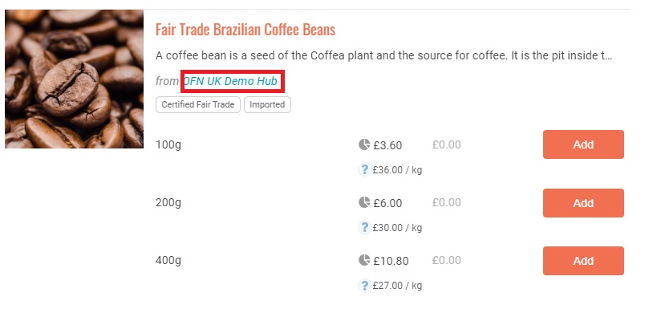
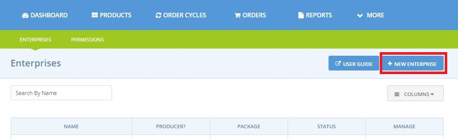

# Créez ou contactez-vous aux profils de vos fournisseurs


 Cette page concerne uniquement les utilisateurs qui sont enregistrés en tant que **Hub producteurs ou non-producteurs**.


Pour un Hub, la mise en relation avec des producteurs d'OFN existants ou la création de comptes pour vos producteurs est un préalable nécessaire pour ajouter votre gamme de produits à votre boutique.


Tous les producteurs fournissant/vendant des produits sur l'Open Food Network doivent avoir un compte d'entreprise sur la plateforme. Les produits sont enregistrés dans le catalogue du producteur et ensuite "affichés" \(avec des prix et des stocks potentiellement différents\) sur la vitrine du producteur et/ou sur les vitrines d'autres distributeurs auxquels le producteur a donné son accord. Il s'agit d'une fonctionnalité importante du RFO, car elle permet aux clients de retracer l'origine des produits.


Un exemple d'affichage dans la vitrine est présenté ci-dessous :

En tant que hub, avant de pouvoir ajouter des produits à votre vitrine, vous avez deux possibilités :

1. Créer des profils OFN pour les producteurs qui vous fournissent \(s'ils n'ont pas déjà un profil\). 
2. Demandez la permission de vendre les produits de producteurs déjà enregistrés auprès de l'OFN.

Si vous n'êtes pas sûr que votre fournisseur possède déjà un profil OFN, vous pouvez le vérifier en allant dans le menu principal "Producteurs" et en effectuant une recherche.

## Si le fournisseur n'a pas encore de compte sur OFN

Si un fournisseur n'a pas de profil OFN, vous pouvez en créer un en son nom. Vous serez le "propriétaire" de ce profil et pourrez ajouter les produits du producteur, avec leurs prix et les quantités disponibles, puis les répertorier dans votre boutique. La nouvelle entreprise du producteur sera visible sur votre tableau de bord lorsque vous vous connecterez à votre compte existant. Si le producteur souhaite un jour devenir propriétaire de son profil, la propriété peut être facilement transférée. Si le producteur souhaite gérer son profil et son catalogue mais que vous souhaitez rester propriétaire de son profil, vous pouvez l'inviter en tant que gestionnaire.

### A savoir avant de créer un profil de producteur:

Avant de créer un profil pour vos fournisseurs, vous devez les contacter et leur faire savoir que vous créez un compte et une entreprise pour eux sur l'OFN. Ils peuvent souhaiter être impliqués dans le processus et même assumer une certaine responsabilité dans la gestion du profil et de leurs produits, etc. Mais le plus souvent, les producteurs préfèrent que les hubs possèdent et gèrent leurs profils pour eux. 

N'oubliez pas de demander au producteur quelles informations il souhaite voir figurer sur son profil. Vous pouvez souvent reprendre du texte et des images de leurs sites Web ou de leurs sites de médias sociaux existants, mais vous devez toujours demander la permission avant d'utiliser leur contenu. Une fois que vous avez leurs informations sous les yeux, la création d'un profil ne devrait pas vous prendre plus de 10 minutes.


Par défaut, vous pouvez créer jusqu'à 5 profils d'entreprise sur la plateforme. Il s'agit d'une méthode pour éviter les spams, mais lorsque nous saurons que vous n'êtes pas un robot, nous vous donnerons la permission de créer plus de profils d'entreprise. Si vous avez besoin d'en créer davantage, contactez votre entité OFN locale.


### Comment créer un profil de producteur:

Vous pouvez créer un nouveau profil pour un producteur en cliquant sur **Entreprises** dans la bannière bleue horizontale, puis en cliquant sur **Nouvelle entreprise**. N'oubliez pas que le terme "entreprise" est un terme général utilisé pour tout profil de producteur ou de hub sur l'OFN.

Vous arriverez sur cette page:

Quelques éléments à noter : 

**Nom** : Entrez le nom de l'exploitation/entreprise du producteur. Si vous obtenez un message d'erreur indiquant que ce nom a déjà été pris, cela signifie que ce producteur a déjà un profil. Vous pouvez donc passer à "Fournisseur a un profil OFN préexistant". 

**Producteur principal** : Cochez cette case, car vous ajoutez une entreprise qui produit/cultive des aliments que vous vendrez au détail pour eux sur la façade de votre hub. 

**Courriel et téléphone** : Cet e-mail et ce numéro de téléphone seront visibles sur le profil. Si ce producteur ne souhaite pas être contacté par le public, placez-y les coordonnées de votre hub. Vous pourrez alors accéder à la même page de paramétrage de l'entreprise que celle décrite précédemment. 

Voici quelques recommandations : 

**Visible dans la recherche** : Vous devez discuter avec le producteur s'il souhaite ou non être visible sur l'OFN. S'il ne souhaite pas être visible, son nom et son profil seront toujours affichés à côté de ses produits dans votre boutique, mais il ne sera pas possible de le rechercher sur la carte ou dans les listes de la première page. 

**À propos** : N'oubliez pas que le RFO a pour objectif de rendre le système alimentaire transparent et que les consommateurs s'intéressent de plus en plus à la provenance de leurs aliments. Il est donc utile d'ajouter de nombreux détails sur vos producteurs et sur ce qui les rend uniques. 

**Images** : Nous recommandons que tous les profils comportent à la fois un logo et des images promotionnelles. Ces images rendent l'expérience en ligne des clients plus agréable, et rendent les entreprises plus crédibles.

## Si le fournisseur a déjà un compte sur OFN 

Si un fournisseur possède déjà un profil OFN, vous devrez obtenir son autorisation pour ajouter des produits à son profil \(si ce n'est pas déjà fait\) et les stocker dans votre boutique. Vous pourrez trouver leurs coordonnées sur leur profil OFN. 

N'oubliez pas qu'ils peuvent être enregistrés en tant que profil de producteur mais faire gérer leurs produits et leur entreprise par un autre centre. OFN peut permettre à deux hubs \(ou plus\) de stocker les produits du même producteur sur leurs façades de magasin séparées grâce à la fonction d'inventaire. Si les hubs **travaillent ensemble et s'informent mutuellement** de tout changement apporté aux entreprises de producteurs qu'ils gèrent, mais qui elles-même approvisionnent plusieurs hubs, les problèmes de distribution peuvent être évités. 

Au sein de l'OFN, les autorisations d'entreprise à entreprise sont utilisées pour contrôler la nature des accords commerciaux entre les producteurs et les hubs. Les producteurs peuvent accorder aux hubs différents types de permissions d'enterprise, dans différentes combinaisons, afin de spécifier exactement les éléments de leur compte avec lesquels le hub peut interagir. Au niveau le plus simple, un producteur peut accorder à un hub la permission de stocker ses produits dans la boutique du hub. Il peut également autoriser le hub à créer et à modifier ses produits, ou à éditer son profil. 

Cette page couvre tous les détails des différentes autorisations d'entreprise disponibles et la façon dont le producteur peut les accorder à un hub. Déterminez avec le producteur qui va fournir des marchandises à votre hub les autorisations dont vous avez besoin.

