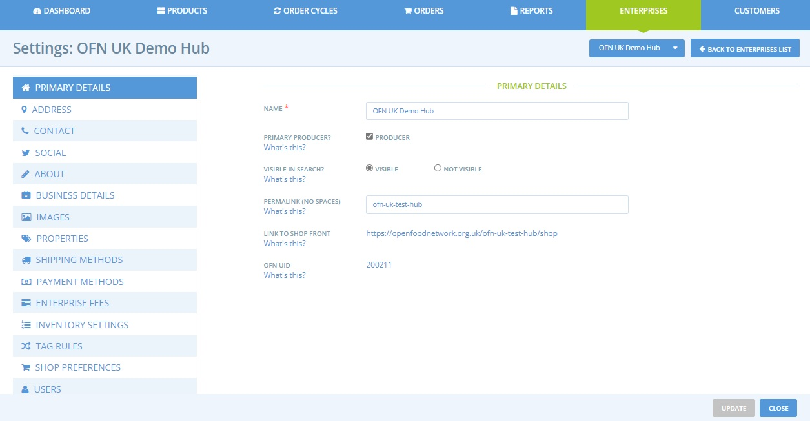
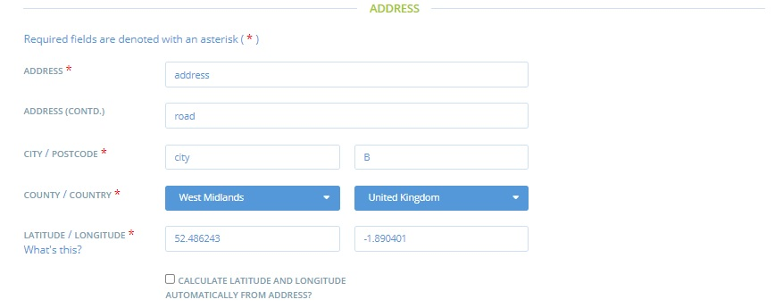
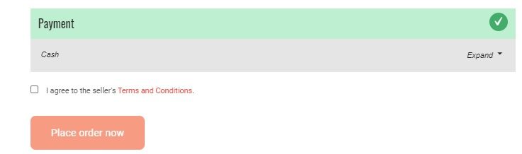
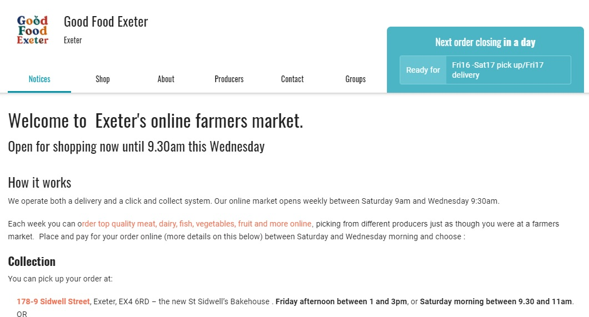
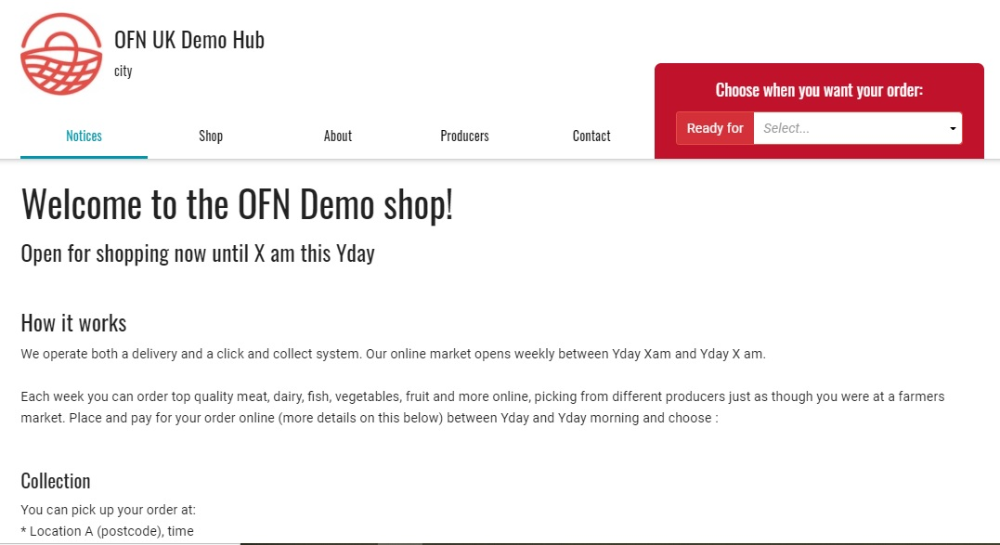
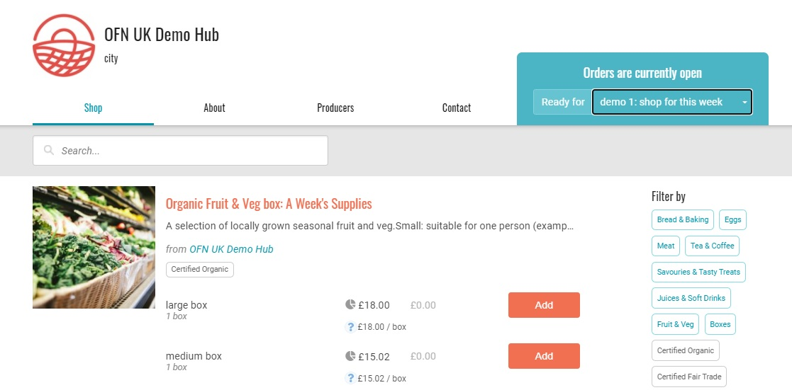
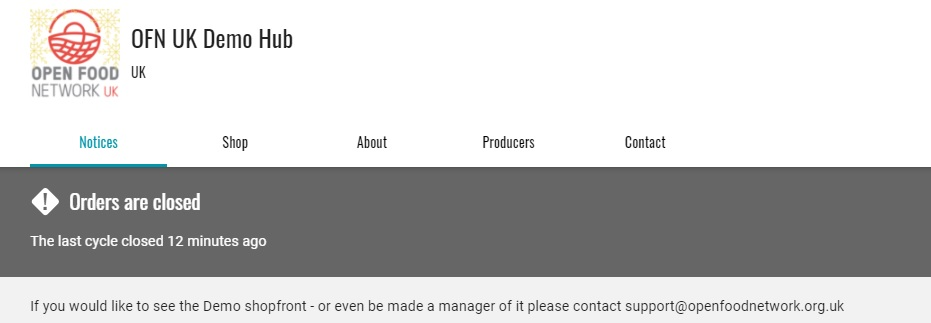
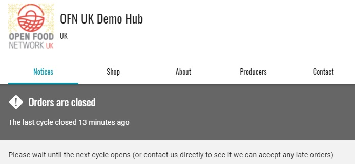

# Paramètres de l'Entreprise

## Accédez aux paramètres de votre entreprise

1. Une fois connecté, et en accédant à votre tableau de bord d'administration, sélectionnez "Entreprises" sur le menu horizontal bleu.
2. Sélectionnez "Paramètres" à côté de votre entreprise.


Pour sauvegarder un changement de type de profil, n'oubliez pas de cliquer sur "sauvegarder" en bas de la fenêtre de droite.


Vous accéderez alors à un menu comportant plusieurs options. Les options varient selon le type d'entreprise. Cet exemple est pour un Hub :


Pour enregistrer vos modifications, cliquez sur "mettre à jour" en bas de la page. Nous recommandons d'enregistrer chaque page avant de la modifier.


Cette vidéo donne un aperçu rapide des étapes et des options détaillées ci-dessous :

## Détails essentiels

**Nom** : Il s'agit du nom de votre entreprise. Il sera le titre de votre profil \(et de votre boutique\). 

**Producteur principal** : Cochez la case producteur si vous êtes un producteur.


Seules les entreprises marquées comme Producteurs peuvent ajouter des produits à OFN. Les plateformes non productrices ne doivent sélectionner cette option que si elles vendent au détail des boîtes mixtes qu'elles emballent et qui contiennent des articles provenant de plusieurs producteurs.


**Visible dans la recherche** : Si votre profil est prêt à être publié, sélectionnez "visible" et votre entreprise apparaîtra dans l'annuaire et la carte de l'OFN. Si vous êtes encore en train de faire des ajustements, sélectionnez "non visible", jusqu'à ce que vous soyez prêt. 

**Lien permanent** : Vous pouvez personnaliser une partie de l'adresse web qui hébergera votre boutique. 

**Lien vers la vitrine de la boutique** : Il s'agit de l'adresse Web de votre boutique sur l'OFN \(si vous avez choisi un type de profil avec vitrine\). Vous pouvez personnaliser une partie de l'URL ci-dessus. 

**Identifiant OFN** : Cet identifiant permet de reconnaître sans ambiguïté votre entreprise même si vous décidez de changer son nom par exemple, et simplifie le travail de l'équipe de support si nécessaire.

### Adresse

Ces informations sont utilisées pour géolocaliser votre entreprise sur la carte OFN. Vous pouvez choisir d'entrer manuellement les coordonnées de votre adresse si l'emplacement calculé automatiquement est incorrect. Ceci est utile pour les endroits très ruraux.

Votre adresse exacte n'apparaîtra pas si vous êtes uniquement enregistré en tant que profil de producteur ou de non-producteur. En revanche, si vous êtes enregistré en tant que boutique ou hub, votre adresse apparaîtra sous forme de texte dans l'onglet "Coordonnées" de votre vitrine.

### Contact

**Nom de contact** : Nous demandons un nom de contact pour les dossiers de l'OFN. Ce nom ne sera pas affiché sur votre profil, mais sera inclus dans les courriels de confirmation de commande si vous gérez une boutique. 

**Courriel, téléphone et site Web** : Ces points de contact seront indiqués sur votre profil OFN et sur votre vitrine, afin de vous contacter.

### Réseaux Sociaux

**Facebook, Instagram, LinkedIn, Twitter :** Des liens vers ces pages seront créés sur votre profil et votre vitrine.

### A Propos

**Description** : Elle s'affiche lorsque votre profil est consulté dans la liste. Elle doit comporter une ou deux phrases décrivant brièvement ce que vous faites. 

**À propos de nous** : Il s'agit d'une description plus longue de votre entreprise. Elle s'affichera lorsque votre profil sera consulté dans son intégralité. Elle doit faire entre une demi-page et une page.

### Détails de l'entreprise


Ils diffèrent d'un pays à l'autre et dépendent des réglementations et lois locales.








**Les deux champs Numéro d'entreprise** : Il s'agit de numéros d'entreprise de différents types. Si vous avez l'intention d'imprimer des factures, vous devez en indiquer le contenu ici. Il peut s'agir de n'importe quoi : le numéro d'enregistrement de votre entreprise, un numéro de téléphone, etc. Il apparaîtra sur les factures imprimées et envoyées par courrier électronique. Si vous n'avez pas l'intention d'imprimer ou d'envoyer des factures, vous n'avez pas besoin de remplir ce champs. 

**Taxe de vente** : Si l'un des produits que vous vendez est soumis à une taxe de vente dans votre province, vous devez sélectionner "oui". Sinon, sélectionnez "non". 

**Afficher le logo sur les factures** : Si vous avez téléchargé un logo et que vous souhaitez qu'il apparaisse sur vos factures, cochez la case. 

**Ajouter un message à la fin des factures** : Ce que vous écrivez ici apparaîtra à la fin de vos factures. Il peut s'agir d'un message de remerciement ou d'un autre message adressé aux clients. 

**Conditions générales** : voir ci-dessous



**Siret** : Cette information ne sera pas publique. Elle est importante pour les commerçants lorsqu'ils veulent émettre des factures à partir de la plateforme. 

**N° TVA intracommunautaire** : Cette information ne sera pas publique. 

**Dans le système de TVA ?** : Si vous êtes dans le système de TVA, sélectionnez "oui".

 **Afficher le logo sur la facture** : Vous pouvez choisir d'afficher ou non le logo de votre entreprise sur les factures émises depuis la plateforme. 

**Ajouter une mention en bas des factures** : Vous pouvez ajouter une mention spécifique que vous auriez l'obligation ou le souhait d'ajouter sur vos factures.



**Terms and Conditions** \(pdf files only\) : Let your customers know any terms and conditions associated with purchasing from your business \(for example your refund policy\) by uploading a .pdf file here.

If you opt to add a file here, the customer will be required to check the box to say that they have read and agree with your terms and conditions before they can submit their order.

### Images

**Logo image:** This will be visible when your profile is viewed in brief, as a pop up window. It will also show on your profile. This image must be square \(i.e. 100 x 100\), or it will appear warped.  All images inserted here will be resized to 100 x 100 pixels.

**Promo image:** This image will run horizontally along the top of your profile page. It should be 1200 x 260 pixels in size.

An example profile is shown below in its complete version \(from the map or shopfront pages\).

And now in its condensed version \(from the producer listing page\).

### Properties 


Visible to **Producers** only


You can add properties \(such as free range or certified organic\) to your enterprise. These properties will then be automatically applied to **all** of your products. 

You can also specify properties for particular products only. This is useful if you stock both certified organic and ordinary groceries, for example. More information about this can be found [here](../products-1/product-properties.md). 

### Shipping Methods, Payment Methods & Enterprise Fees


Visible to Shops or Hubs registered enterprises only \(ie invisible for Producer/Non-Producer Profiles\)


The [Shipping Methods](../shopfront/shipping-methods.md), [Payment Methods](../shopfront/payment-methods.md) and [Enterprise Fees](../shopfront/enterprise-fees.md) are covered in greater detail in later chapters in this user manual.


At least one method of **payment** and **delivery** must be setup to be able to open your online shopfront.


### Inventory Settings


Visible to Shop and Hub registered enterprises only.


For most enterprises the recommended setting can be used.

Advanced users who need greater flexibility with product management should consult the [Inventory](../products-1/inventory-tool.md) page of this guide before changing the settings.

### Tag Rules


Visible to Shop and Hub registered enterprises only.


Under this menu are all the 'tags' which have been assigned to the customers of your enterprise.

'Tags' are labels you apply to customers, products and other settings to assign differential access, pricing or other benefits to specific groups.  They are particularly useful if you wish to charge loyal customers or 'members' of your food hub preferential prices or allow them to pay by BACS rather than PayPal/Stripe.

 For more information, visit the ['customer management and conditional displays/prices' section](../shopfront/customer-management-and-conditional-displays-prices/).

### Shop Preferences


Visible to Shop and Hub registered enterprises only.


**Shopfront Message**: This message is optional. If completed the message will be visible under a 'Notices' tab on the top menu bar.  Your shop \(and it's products\) will appear under the 'Shop' tab.

The Shop Front message or 'Notice' is an opportunity to provide basic information to the customer about how your store works. For example, you may explain how your order cycles are structured, or any membership requirements. It could also be a friendly greeting, or a chance to promote specials. You can include links to external websites \(perhaps to showcase where your products are grown\), social media and more.

If left blank the 'Notices' tab will not appear on your shop front.

**Shopfront Closed Message**: This message will be displayed under both the 'Notices' AND 'Shop' tabs when your shopfront is closed \(no active order cycle\). It’s a chance to tell customers when the shop will next be open and accepting orders.


TIP: Copy and paste your 'ShopFront Message' into the Shopfront Closed Message. Then you can inform customers about how your shop works, link to external websites with more information about your products and ethics etc as well as inform them of when the next order cycle will open.


**Shopfront Category Ordering**: By default, products are arranged alphabetically in your shop. You can choose to display the products in order of category according to your wish. In this case, the products will be displayed in order of category and then in alphabetical order within their category. E.g. you may wish to have your Meat & Fish products to appear at the top, with your less important Pickles & Preserves appearing further down the shopfront.

**Sort order cycles on shopfront by:** If your shopfront has [more than one order cycle open at the same time](../shopfront/order-cycle/opening-more-than-one-order-cycle.md) you can select the order in which they appear on the shopfront. You may opt to sort them by closing date \(closing soonest first\) or by opening date \(opening soonest first\).

**Publicly visible shopfront?** If you select ‘public’, any shopper will be able to access your shopfront and place an order. If you select ‘visible to registered customers only’, shoppers who come to your shop will be prompted to login and only those users who are on your customers list will be given access to your shop. Learn more about the [private shop feature](../shopfront/private-shopfront.md).

**Guest Orders?** If you select ‘allow guest checkout’ shoppers won’t need to login to the OFN to shop with you, so they don't need to sign up and have a user account. If you want the extra security of knowing your customers must have an OFN account in order to have placed an order then select "require login to order". 

In order for a customer to have an OFN account they must have confirmed the email sent to them when registering with us.  Thus, by selected "require login to order" it may help limit the number of orders placed that are subsequently never collected as you know that the customer's order confirmation email will be sent to an active email account.


The 'Guest orders' setting is not applicable if you have opted for 'visible to registered customers only'.


**Change Orders:** We recommend the default setting of 'Placed orders can not be changed or cancelled', especially if your allow 'guest customers' \(ie people without an OFN account\) to place orders.  This is just so, as a shop or hub manager, you can keep track of payments received and refunds issued.  If a customer wishes to change their order, you can still do so, on their behalf, using the '[Edit Order](../orders/view-orders.md#editing-an-order)' functionality.


_**Customers can change or cancel orders while an order cycle is open**_ is ONLY suitable if you use the **'cash/EFT/...**' [payment method](../shopfront/payment-methods.md) provider.  



Opting for 'customers can change or cancel orders while an order cycle is open' with an **automated** [payment provider](../shopfront/payment-methods.md) \(Stripe/Paypal\) is **strongly advised against**.


Opting for 'Customers can change or cancel orders while an order cycle is open' allows customers to change the quantities of **products already in their basket** **or cancel their order** altogether while the shop is open.  They will **not be able to add new products** to their original order- doing this will generate a 2nd order.  


[Refunds](../orders/refunds-and-adjusting-payments.md) will not be automatically issued to the customer, nor will additional funds be automatically collected.


**Subscriptions:** If you would like to offer to set up regular repeating orders for your customers then you can enable the [subscriptions](../subscriptions/) functionality here.

**Customer names in reports.** If you distribute products from other suppliers / producers, they will be able to run reports showing details of their products as sold through your Order Cycles. This option allows you to make the names of customers visible in these reports. Depending on the distribution model you have in place, this may be necessary for Producers to pack and distribute orders to the customers.

### Users

**Owner:** This is the email of the primary user responsible for this enterprise. They have the power to change all aspects of the profile. Only the owner can change the owner, choosing among the enterprise managers list. This user will have a star next to their name in the managers' field.

**Notifications:** This is the email of the user to whom the OFN system correspondence will be directed, i.e. order confirmations etc. Only the owner can nominate the user who will receive the notifications, among the enterprise managers list. This user will have an envelope symbol next to their name in the managers' field.

**Managers:** Other OFN users who have been granted permission to manage this account. Want to add a new manager? You can search for existing emails of users who have registered for an OFN account and add them as managers. If you don't find any user for the email you are looking for, the user doesn't exist yet on the OFN, you need to invite them \(see next point\).

**Invite manager:** This is for adding a manager who is not registered with OFN. When you add them, they'll be sent an email confirmation and when they confirm their email they'll be able to set a password, and login to administer this enterprise.

