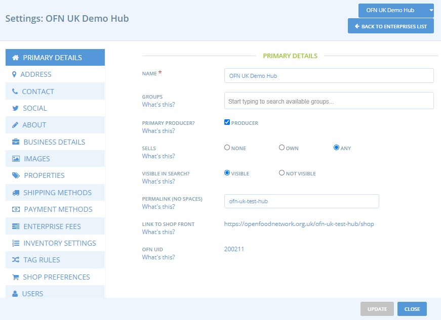
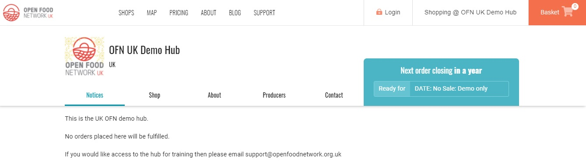
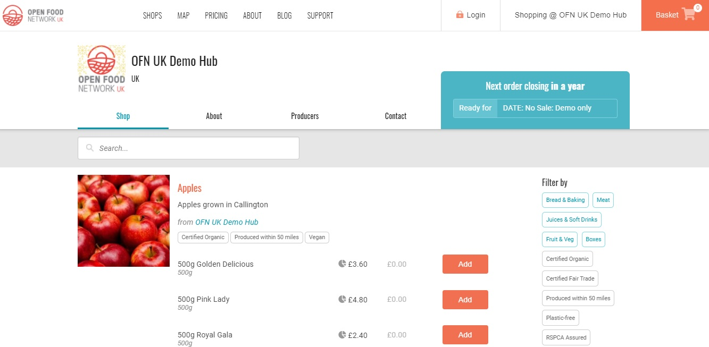

# Unternehmenseinstellungen

## Zugriff auf Ihre Unternehmenseinstellungen

1. Sobald Sie eingeloggt sind und auf Ihr Admin-Dashboard zugreifen, wählen Sie "Unternehmen" im blauen horizontalen Menü
2. Wählen Sie "Einstellungen" neben Ihrem Unternehmen


Um eine Änderung des Profiltyps zu speichern, vergessen Sie nicht, unten im rechten Fenster auf "Speichern" zu klicken.


Sie erhalten dann ein Menü mit mehreren Optionen. Die genauen verfügbaren Optionen variieren je nach Unternehmenstyp. Dieses Beispiel ist für einen Hub:


Um Ihre Änderungen zu speichern, müssen Sie unten auf der Seite auf "Aktualisieren" klicken. Es wird empfohlen, jede Seite zu speichern, bevor Sie die Seiten wechseln.


Dieses kurze Video gibt einen kurzen Einblick in die unten aufgeführten Schritte und Optionen:

## Primäre Details

**Name:** Dies ist der Name Ihres Unternehmens. Er wird der Titel Ihres Profils (und Ihres Shops) sein.

**Hauptproduzent:** Markieren Sie das Feld Produzent, wenn Sie ein Produzent sind.


Nur Unternehmen, die als Erzeuger gekennzeichnet sind, können Produkte zum SFN hinzufügen. [Nicht-Erzeuger-Hubs](package-types.md#nicht-produzenten-hub-multi-producer-shop) müssen diese Option nur wählen, wenn sie gemischte Kisten verkaufen, die sie verpacken und Artikel von mehreren Erzeugern enthalten.


**Sichtbar in der Suche:** Wenn Ihr Profil bereit ist, veröffentlicht zu werden, wählen Sie "sichtbar", und Ihr Unternehmen wird im Verzeichnis und auf der Karte des OFN erscheinen. Wenn Sie noch Anpassungen vornehmen müssen, wählen Sie "nicht sichtbar", bis Sie fertig sind.

**Permalink:** Sie können einen Teil der Webadresse, die zu Ihrem Geschäft führt, anpassen.

**Link zur Ladenfront:** Dies ist die Webadresse Ihres Shops im OFN (wenn Sie einen Profiltyp mit Shopfront gewählt haben). Sie können einen Teil der obigen URL individuell anpassen.

**OFN ID:** Diese Kennung ermöglicht es, Ihr Unternehmen eindeutig wiederzuerkennen, auch wenn Sie sich z.B. für eine Namensänderung entscheiden, und vereinfacht die Arbeit des Support-Teams, falls erforderlich.

### Addresse

Diese Informationen werden verwendet, um Ihr Unternehmen auf der OFN-Karte zu lokalisieren. Ihre genaue Adresse wird nicht angezeigt, wenn Sie nur als Produzent oder Nicht-Produzent registriert sind. Wenn Sie jedoch als Shop oder Hub registriert sind, wird Ihre Adresse in Textform auf der Registerkarte "Kontaktinformationen" Ihrer Shopfront angezeigt.

### Kontakt

**Name der Kontaktperson:** Wir bitten Sie um einen Kontaktnamen für die Unterlagen des OFN. Dieser Name wird nicht in Ihrem Profil angezeigt, aber in den Bestellbestätigungs-E-Mails, wenn Sie einen Shop betreiben.

**E-Mail, Telefon und Website:** Diese Kontaktdaten werden auf Ihrem OFN-Profil und in Ihrem Schaufenster aufgeführt, damit andere mit Ihnen in Kontakt treten können.

### Soziales

**Facebook, Instagram, LinkedIn, Twitter:** Links zu diesen Seiten werden in Ihrem Profil und Ihrem Schaufenster eingerichtet.

### Über

**Kurze Beschreibung:** Diese wird angezeigt, wenn Ihr Profil in der Liste angezeigt wird. Sie sollte weniger als 1-2 Sätze umfassen, die kurz beschreiben, was Sie tun.

**Über uns:** Dies ist eine längere Beschreibung Ihres Unternehmens. Sie wird angezeigt, wenn Ihr Profil vollständig angezeigt wird. Sie sollte eine halbe bis eine Seite lang sein.

### Geschäftliche Details


Diese sind von Land zu Land unterschiedlich und hängen von den örtlichen Vorschriften und Gesetzen ab.




**ABN:** Australian Business Number

**ACN:** Australian Company Number

**Charges GST:** Wenn Sie Ihren Kunden die Goods and Services Tax (GST) in Rechnung stellen möchten

**Display Logo on Invoices:** wenn gewünscht.

**Add Customised Text at the end of Invoices:** wie z.B. die Zahlungsdaten







**Die 2 Felder Geschäftsnummer:** Diese beziehen sich auf verschiedene Arten von Geschäftsnummern. Wenn Sie beabsichtigen, Rechnungen zu drucken, müssen Sie hier einen Inhalt eingeben. Das kann alles Mögliche sein - Ihre Unternehmensregistrierungsnummer, eine Telefonnummer oder etwas anderes. Sie wird auf den gedruckten und gemailten Rechnungen erscheinen. Wenn Sie keine Rechnungen ausdrucken oder versenden wollen, brauchen Sie hier keine Angaben zu machen. &#x20;

**Erhebt die** **Umsatzsteuer:** Wenn eines der Produkte, die Sie verkaufen, in Ihrer Provinz umsatzsteuerpflichtig ist, sollten Sie "ja" auswählen. Wenn nicht, wählen Sie "nein".&#x20;

**Logo auf** **Rechnungen anzeigen:** Wenn Sie ein Logo hochgeladen haben und es auf Ihren Rechnungen angezeigt werden soll, aktivieren Sie das Kästchen

**Benutzerdefinierte Steuer am Ende von Rechnungen hinzufügen:** Was auch immer Sie hier eintragen, wird am Ende Ihrer Rechnungen erscheinen. Dies kann ein Dankeschön oder eine andere Nachricht an Ihre Kunden sein.&#x20;

**Bedingungen und Konditionen:** siehe unten







**Siret:** Diese Informationen werden nicht veröffentlicht. Sie ist für Shop-Betreiber wichtig, wenn sie über die Plattform Rechnungen ausstellen wollen.

**N° intra-Community VAT:** Diese Informationen werden nicht veröffentlicht.

**In VAT scheme?** Wenn Sie unter die Mehrwertsteuerregelung fallen, wählen Sie "ja".

**Display the logo on the invoice:** Sie können wählen, ob das Logo Ihres Unternehmens auf den von der Plattform ausgestellten Rechnungen erscheinen soll oder nicht.

**Add a specific mention at the bottom of the invoices:** Sie können einen speziellen Vermerk hinzufügen, den Sie auf Ihren Rechnungen anbringen müssen oder möchten.



**Unternehmensnummer:** Für Unternehmen, die beim Companies House registriert sind, ist dies Ihre eindeutige Identifikationsnummer.

**Wohltätigkeitsnummer:** Wenn Ihr Unternehmen eine eingetragene Wohltätigkeitsorganisation ist

**Berechnet die Mehrwertsteuer:** Unternehmen, die für Mehrwertsteuerzwecke registriert sind, sollten diese Option wählen, damit die Mehrwertsteuer auf Rechnungen und Berichten entsprechend ausgewiesen wird.

Hinweise zum Verkauf als mehrwertsteuerlich registriertes Unternehmen finden Sie in diesem Dokument:


Selling as VAT registered enterprise


**Logo auf Rechnungen anzeigen:** falls gewünscht.

**Fügen Sie benutzerdefinierten Text am Ende von Rechnungen hinzu:** z. B. Zahlungsdetails (wenn Zahlungen per BACS akzeptiert werden) oder Geschäftsbedingungen.



**ABN:** Diese wird nicht öffentlich angezeigt. Sie ist für Shop-Benutzer erforderlich, die Rechnungen drucken möchten.&#x20;

**ACN:** Diese wird nicht öffentlich angezeigt.&#x20;

**GST berechnen** - Wenn Sie die GST für Ihre Produkte berechnen möchten, wählen Sie "ja".



**Allgemeine Geschäftsbedingungen** (nur pdf-Dateien) : Informieren Sie Ihre Kunden über alle Bedingungen, die mit dem Kauf bei Ihrem Unternehmen verbunden sind (z. B. Ihre Rückerstattungsrichtlinien), indem Sie hier eine .pdf-Datei hochladen.

Wenn Sie sich dafür entscheiden, hier eine Datei hinzuzufügen, muss der Kunde das Kästchen ankreuzen, um zu bestätigen, dass er Ihre Allgemeinen Geschäftsbedingungen gelesen hat und ihnen zustimmt, bevor er seine Bestellung abschicken kann.

### Bilder

**Logo-Bild:** Es wird sichtbar sein, wenn Ihr Profil in einem Pop-up-Fenster kurz angesehen wird. Es wird auch in Ihrem Profil angezeigt. Dieses Bild muss quadratisch sein (d.h. 100 x 100), sonst wird es verzerrt dargestellt. Alle hier eingefügten Bilder werden auf 100 x 100 Pixel verkleinert.

**Promo-Bild:** Dieses Bild wird horizontal am oberen Rand Ihrer Profilseite angebracht. Es sollte 1200 x 260 Pixel gross sein.

Nachfolgend ist ein Beispielprofil in seiner vollständigen Version (von der Karte oder den Schaufensterseiten) dargestellt.

Und nun in der Kurzfassung (von der Seite mit den Herstellerangaben).

### Eigenschaften&#x20;


Sichtbar nur für **Produzenten**


Sie können Ihrem Unternehmen Eigenschaften (wie z. B. Freilandhaltung oder zertifizierter biologischer Anbau) hinzufügen. Diese Eigenschaften werden dann automatisch auf **alle** Ihre Produkte angewendet.

Sie können auch Eigenschaften nur für bestimmte Produkte angeben. Das ist zum Beispiel nützlich, wenn Sie sowohl zertifizierte Bio-Produkte als auch normale Lebensmittel führen. Weitere Informationen dazu finden Sie [hier](../products-1/product-properties.md).

### Versandmethoden, Zahlungsarten und Unternehmensgebühren


Sichtbar nur für in Shops oder Hubs registrierte Unternehmen (d.h. unsichtbar für Hersteller/Nicht-Hersteller-Profile)


Die [Versandarten](../shopfront/shipping-methods.md), [Zahlungsarten](../shopfront/payment-methods.md) und [Unternehmensgebühren](../shopfront/enterprise-fees.md) werden in späteren Kapiteln dieses Benutzerhandbuchs ausführlicher behandelt.


Mindestens eine Zahlungs- und Liefermethode muss eingerichtet sein, damit Sie Ihren Online-Shop öffnen können.


### Inventar-Einstellungen


Nur für im Shop und Hub registrierte Unternehmen sichtbar.


Für die meisten Unternehmen kann die empfohlene Einstellung verwendet werden.

Fortgeschrittene Benutzer, die eine grössere Flexibilität bei der Produktverwaltung benötigen, sollten die Seite "[Inventar](../products-1/inventory-tool.md)" in diesem Handbuch konsultieren, bevor sie die Einstellungen ändern.

### **Stichwortregeln**&#x20;


Nur für im Shop und Hub registrierte Unternehmen sichtbar.


In diesem Menü finden Sie alle "Stichwörter", die den Kunden Ihres Unternehmens zugewiesen wurden.

"Stichwörter" sind Etiketten, die Sie Kunden, Produkten und anderen Einstellungen zuweisen, um bestimmten Gruppen unterschiedlichen Zugang, Preise oder andere Vorteile zu gewähren. Sie sind besonders nützlich, wenn Sie treuen Kunden oder "Mitgliedern" Ihres Lebensmittelzentrums Vorzugspreise gewähren oder ihnen erlauben möchten, per BACS statt per PayPal/Stripe zu bezahlen.

Weitere Informationen finden Sie im Abschnitt "[Kundenverwaltung und bedingte Anzeigen/Preise](../shopfront/customer-management-and-conditional-displays-prices/)".

### Laden - Einstellungen


Nur für im Shop und Hub registrierte Unternehmen sichtbar.


**Willkommen-Nachricht im Laden:** Diese Nachricht ist optional. Wenn Sie die Nachricht ausfüllen, wird sie unter der Registerkarte "Mitteilungen" in der oberen Menüleiste angezeigt. Ihr Shop (und seine Produkte) werden unter der Registerkarte "Shop" angezeigt.

 (1).jpg>)

Die Willkommen-Nachricht oder der "Hinweis" ist eine Gelegenheit, dem Kunden grundlegende Informationen darüber zu geben, wie Ihr Geschäft funktioniert. Sie können zum Beispiel erklären, wie Ihre Bestellzyklen strukturiert sind oder welche Voraussetzungen für eine Mitgliedschaft gelten. Es könnte auch eine freundliche Begrüssung sein oder eine Gelegenheit, um für Sonderangebote zu werben. Sie können Links zu externen Websites (vielleicht um zu zeigen, wo Ihre Produkte angebaut werden), zu sozialen Medien und mehr einfügen.

Wenn Sie dieses Feld leer lassen, wird die Registerkarte "Bekanntmachungen" nicht auf der Startseite Ihres Shops angezeigt.

**"Laden geschlossen" - Nachricht:** Diese Nachricht wird sowohl unter den Registerkarten "Mitteilungen" als auch "Shop" angezeigt, wenn Ihr Laden geschlossen ist (kein aktiver Bestellzyklus). So können Sie Ihren Kunden mitteilen, wann der Shop das nächste Mal geöffnet sein wird und Bestellungen entgegennimmt.


TIPP: Kopieren Sie Ihre "Willkommen - Nachricht" und fügen Sie sie in die "Laden geschlossen - Nachricht" ein. Dann können Sie Ihre Kunden darüber informieren, wie Ihr Shop funktioniert, auf externe Websites mit weiteren Informationen über Ihre Produkte und Ethik usw. verlinken und ihnen mitteilen, wann der nächste Bestellzyklus eröffnet wird.


**Produkteanordnung nach Kategorie :** Standardmässig sind die Produkte in Ihrem Shop alphabetisch geordnet. Sie können wählen, ob Sie die Produkte in der Reihenfolge ihrer Kategorie anzeigen lassen möchten. In diesem Fall werden die Produkte in der Reihenfolge der Kategorie und dann in alphabetischer Reihenfolge innerhalb ihrer Kategorie angezeigt. So können Sie z. B. Ihre Fleisch- und Fischprodukte ganz oben anzeigen lassen, während Ihre weniger wichtigen Produkte wie Essiggurken und Konserven weiter unten im Schaufenster erscheinen.

**Sortieren der Bestellzyklen im Laden nach:** Wenn in Ihrem Online - Shop [mehrere Bestellzyklen gleichzeitig geöffnet sind](../shopfront/order-cycle/opening-more-than-one-order-cycle.md), können Sie die Reihenfolge auswählen, in der sie im Schaufenster erscheinen. Sie können sie nach Schliessungsdatum (Schliessung am frühesten) oder nach Öffnungsdatum (Öffnung am frühesten) sortieren.

**Öffentlich sichtbarer Laden?** Wenn Sie "öffentlich" wählen, kann jeder Käufer auf Ihren Laden zugreifen und eine Bestellung aufgeben. Wenn Sie "nur für registrierte Kunden sichtbar" wählen, werden Kunden, die Ihren Laden besuchen, aufgefordert, sich anzumelden, und nur die Benutzer, die auf Ihrer Kundenliste stehen, erhalten Zugang zu Ihrem Shop. Erfahren Sie mehr über die [Funktion des privaten Shops](../shopfront/private-shopfront.md).

**Gastbestellungen?** Wenn Sie die Option "Gastbestellungen zulassen" wählen, müssen sich Ihre Kunden nicht beim OFN anmelden, um bei Ihnen einkaufen zu können, d.h. sie brauchen kein Benutzerkonto. Wenn Sie die zusätzliche Sicherheit haben möchten, dass Ihre Kunden ein OFN-Konto haben müssen, um eine Bestellung aufzugeben, wählen Sie "Anmeldung für die Bestellung erforderlich".

Damit ein Kunde ein OFN-Konto hat, muss er die E-Mail bestätigen, die er bei der Registrierung erhalten hat. Wenn Sie also die Option "Anmeldung für die Bestellung erforderlich" wählen, kann dies dazu beitragen, die Anzahl der Bestellungen zu begrenzen, die später nie abgeholt werden, da Sie wissen, dass die Bestellbestätigungs-E-Mail des Kunden an ein aktives E-Mail-Konto gesendet wird.


Die Einstellung "Gastbestellungen" ist nicht anwendbar, wenn Sie sich für "nur für registrierte Kunden sichtbar" entschieden haben.


**Bestellungen ändern:** Wir empfehlen die Standardeinstellung "Erteilte Aufträge können nicht geändert oder storniert werden", insbesondere wenn Sie "Gastkunden" (d.h. Personen ohne OFN-Konto) erlauben, Aufträge zu erteilen. Dies dient nur dazu, dass Sie als Laden- oder Hub-Manager den Überblick über Zahlungseingänge und Rückerstattungen behalten können. Wenn ein Kunde seine Bestellung ändern möchte, können Sie dies in seinem Namen über die Funktion "[Bestellung bearbeiten](../orders/view-orders.md#editing-an-order)" tun.


Kunden können Bestellungen ändern oder stornieren, während ein Bestellzyklus offen ist. Dies ist NUR möglich, wenn Sie den Anbieter der [Zahlungsmethode](../shopfront/payment-methods.md) 'Bargeld/EFT/...' verwenden.



Bei **automatisierten** [Zahlungsanbietern](../shopfront/payment-methods.md) (Stripe/Paypal) **wird dringend davon abgeraten**, die Option "Kunden können Bestellungen ändern oder stornieren, solange ein Bestellzyklus offen ist" zu wählen.


Wenn Sie sich für die Option "Kunden können Bestellungen ändern oder stornieren, während ein Bestellzyklus geöffnet ist" entscheiden, können Kunden die Menge der Produkte in ihrem Warenkorb ändern oder ihre Bestellung stornieren, solange der Shop geöffnet ist. Sie können keine neuen Produkte zu ihrer ursprünglichen Bestellung hinzufügen - dies würde eine zweite Bestellung erzeugen.


Es werden weder automatisch [Rückerstattungen](../orders/refunds-and-adjusting-payments.md) an den Kunden ausgestellt, noch werden automatisch zusätzliche Gelder eingezogen.


**Abonnements:** Wenn Sie Ihren Kunden anbieten möchten, regelmässig wiederkehrende Bestellungen aufzugeben, können Sie hier die [Abonnementfunktion](../subscriptions/) aktivieren.

**Kundennamen in Berichten.** Wenn Sie Produkte von anderen Lieferanten/Herstellern vertreiben, können diese Berichte erstellen, die Details zu ihren Produkten zeigen, die über Ihre Auftragszyklen verkauft wurden.Mit dieser Option können Sie die Namen der Kunden in diesen Berichten sichtbar machen. Je nach Ihrem Vertriebsmodell kann dies für Produzenten notwendig sein, um Bestellungen zu verpacken und an die Kunden zu verteilen.

### Benutzer

**Eigentümer/in:** Dies ist die E-Mail-Adresse des Hauptnutzers, der für dieses Unternehmen verantwortlich ist. Er/sie hat die Befugnis, alle Aspekte des Profils zu ändern. Nur der Besitzer kann den Besitzer ändern, indem er/sie aus der Liste einen Unternehmensmanager auswählt. Diese/r Benutzer/in hat ein Sternchen neben seinem Namen im Feld "Manager".

**Benachrichtigungen:** Dies ist die E-Mail des Benutzers, an den die Korrespondenz des OFN-Systems gerichtet wird, z. B. Auftragsbestätigungen usw. Nur der Eigentümer kann den Benutzer, der die Benachrichtigungen erhalten soll, in der Liste der Unternehmensmanager benennen. Dieser Benutzer hat ein Briefumschlagsymbol neben seinem Namen im Managerfeld.

**Verwalter/in:** Andere OFN-Benutzer, denen die Erlaubnis erteilt wurde, dieses Konto zu verwalten. Möchten Sie einen neuen Manager hinzufügen? Sie können nach vorhandenen E-Mails von Benutzern suchen, die sich für ein OFN-Konto registriert haben, und sie als Manager/in hinzufügen. Wenn Sie keinen Benutzer für die gesuchte E-Mail finden, existiert der Benutzer noch nicht im OFN, Sie müssen ihn/sie einladen (siehe nächster Punkt).

**Manager/in einladen:** Hier können Sie eine/n Manager/in hinzufügen, der nicht bei OFN registriert ist. Wenn Sie ihn hinzufügen, erhält er eine E-Mail-Bestätigung. Wenn er seine E-Mail bestätigt, kann er ein Passwort festlegen und sich anmelden, um dieses Unternehmen zu verwalten.
