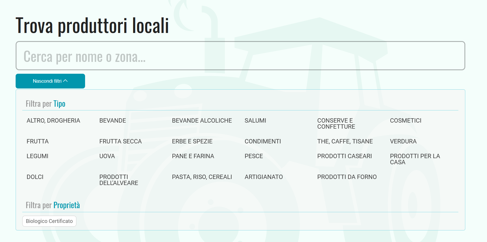
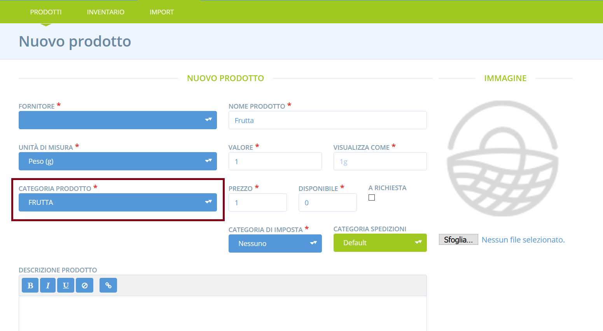

# Rendere un profilo produttore ricercabile per categoria di prodotto

Quando i consumatori navigano su Open Food Network, possono cercare i produttori per nome o località. Possono anche filtrare i profili produttori a seconda dei tipi di prodotto che hanno a disposizione \(vedi sotto\). 

Il sistema considera i dati dei prodotti caricati dai produttori che hanno un negozio online su OFN per filtrarli per categoria. Dunque, i produttori che non hanno un profilo "Azienda" ma solo un semplice profilo non saranno ricercabili a meno che non aggiungano prodotti fittizi nel sistema. Aggiungendo un prodotto fittizio per ogni categoria di prodotto sotto cui vuoi che il tuo profilo sia ricercabile, apparirai quando i consumatori cercheranno produttori con prodotti di quella categoria. 

Ecco come fare...

Clicca **Prodotti** nel menu blu orizzontale, poi clicca su  **+ Nuovo Prodotto** per aggiungere i tuoi prodotti fittizi.

Dal momento che non hai una vetrina su OFN, questo prodotto non sarà visibile da nessuna parte. Quindi puoi inserire nome, prezzo ed unità a caso. L'importante è selezionare la **Categoria Prodotto** corretta, che corrispnde alla tua produzione. Clicca poi su "crea" in basso a sinistra. Qui sotto un esempio di un prodotto fittizio della categoria "Frutta". Questo profilo produttore comparirà ora se un consumatore cercherà produttori di frutta.

La categoria "Frutta" comparirà anche nella scheda del profilo. 

