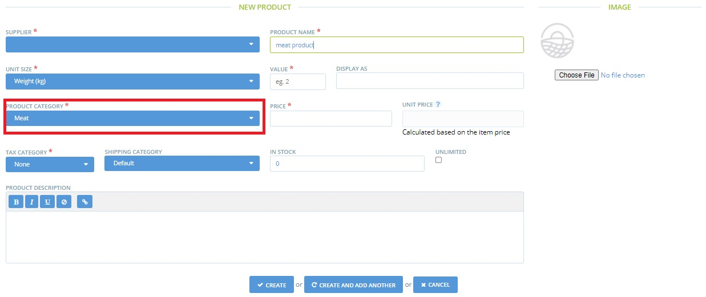

# Rendre le profil d'un producteur consultable par catégorie de produits

Lorsque les clients se rendent sur le réseau Open Food Network, ils peuvent rechercher des producteurs par nom ou par lieu. Ils peuvent également filtrer les profils des producteurs en fonction des types de produits qu'ils proposent \(voir ci-dessous\).

Les producteurs disposant d'un magasin en ligne sur l'OFN ont des produits dans le système, qui sont détectés par l'outil de filtrage de recherche. Cependant, les producteurs qui n'ont pas de magasin OFN \(juste un profil\) ne pourront pas être recherchés de cette manière, à moins qu'ils n'ajoutent quelques produits factices dans le système. En ajoutant un produit factice pour chaque catégorie de produits dans laquelle vous souhaitez être consultable, vous apparaîtrez lorsque les clients rechercheront vos produits. 

Voici comment procéder... 

Cliquez sur **Produits** dans le menu bleu horizontal, puis cliquez sur **+ Nouveau produit** pour ajouter vos produits factices.

Comme vous n'avez pas de vitrine OFN, ce produit ne sera visible nulle part. Par conséquent, vous pouvez l'appeler comme vous le souhaitez et définir le prix et les unités comme bon vous semble. L'important est de sélectionner la **catégorie de produit** correcte dans laquelle vous souhaitez être trouvé. Vous trouverez ci-dessous un exemple de produit de viande fictif. Le profil de ce producteur apparaîtra désormais si un client recherche des producteurs de viande.

Leur résumé de profil indiquera également qu'ils vendent de la viande \(ci-dessous\).

