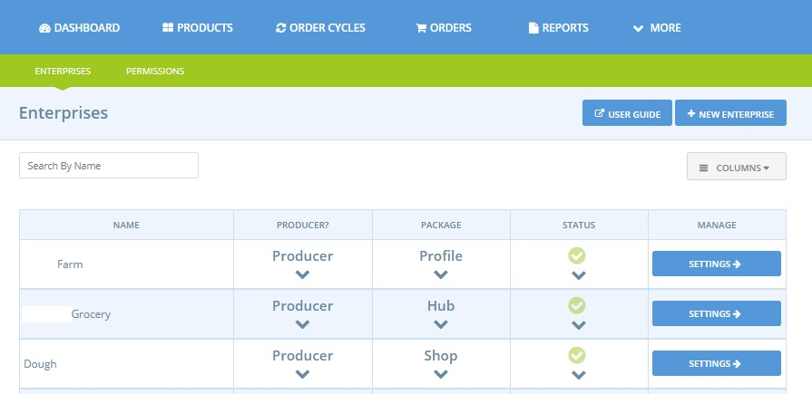

# Types de Profils/Packs

Après avoir terminé l'enregistrement de votre entreprise, vous pouvez accéder directement à la page des paramètres de l'entreprise.

À partir de là, vous devrez choisir le profil OFN qui correspond le mieux à votre modèle d'entreprise. **Sans cette étape, votre compte d'entreprise ne sera pas créé et, par conséquent, votre entreprise restera invisible sur notre carte**.

Open Food Network propose trois types de profils d'entreprise qui diffèrent en fonction de si vous êtes un producteur ou non, et si vous souhaitez ou non ouvrir une boutique en ligne pour vendre sur Open Food Network. C'est pourquoi nous les décrivons ci-dessous en deux sections principales : les profils pour les producteurs et ensuite les profils pour les distributeurs \(ou "Hubs" dans le monde d'Open Food Network :-\)\).

## Pour les Producteurs

Il y a trois types de profils pour producteurs:



Avec cette option, non seulement votre entreprise sera visible sur la carte OFN et pour les clients qui recherchent notre plateforme, mais vous pourrez aussi gérer un catalogue de produits. Vos produits peuvent être distribués et vendus par d'autres entreprises qui font partie du réseau OFN. 

En tant que "profil de producteur", vous ne serez pas en mesure de gérer votre propre façade de magasin en ligne. Pour plus d'informations sur le guide de configuration rapide pour ce type de profil, cliquez ici.


Si vous souhaitez vendre vos produits sur une plateforme de vente en ligne existante et utiliser OFN pour accroître votre visibilité, le pack "Profil de producteur" est fait pour vous ! 

Vous pouvez mettre le lien vers votre boutique en ligne dans la description de votre entreprise.




#### Vous souhaitez vendre uniquement vos propres produits sur OFN

Cette option vous permet de gérer une vitrine qui vend uniquement les produits de votre propre catalogue. Notez que les "Boutiques de Producteurs" peuvent réaliser des ventes via leur propre vitrine et/ou agir en tant que fournisseur d'autres vitrines \(hubs\). 

Pour plus d'informations sur le guide de configuration rapide de ce type de profil, cliquez ici.



#### Vous souhaitez vendre vos propres produits ainsi que ceux d'autres producteurs

Cette option vous permet de gérer une boutique qui vend à la fois des produits fabriqués par vous-même et des produits fabriqués par d'autres producteurs locaux. Vous pouvez vendre au détail les produits de tout producteur qui vous a autorisé à le faire. 

Pour plus d'informations sur le guide de configuration rapide de ce type de profil, cliquez ici.



## Pour les Non-Producteurs \(Hubs\)

Deux types de profils sont disponibles pour les non-producteurs \(distributeurs / hubs\) :



Avec cette option, votre entreprise sera visible sur la carte de l'OFN et pour les clients qui effectuent des recherches sur notre plateforme. 

Pour plus d'informations sur le guide de configuration rapide de ce type de profil, cliquez ici.


Si vous souhaitez vendre des produits fabriqués par un ensemble de producteurs sur une plate-forme de vente en ligne existante et utiliser OFN pour accroître votre visibilité, le forfait "Profil de non-producteur" est fait pour vous ! 

Vous pouvez mettre le lien vers votre boutique en ligne dans la description de votre entreprise.




#### Vous souhaitez créer une boutique en ligne

Cette option vous permet de gérer une boutique qui vend des produits fabriqués par d'autres. Vous pouvez vendre au détail les produits de tout producteur qui vous a autorisé à le faire. 

Pour plus d'informations sur le guide de configuration rapide de ce type de profil, cliquez ici.



## Changer votre type de profil

Vous pouvez changer votre type de profil \(pack\) à tout moment dans le futur. Connectez-vous d'abord à votre compte admin OFN :

and then visit your [Enterprise Settings menu](enterprise-settings.md). From the table, select the correct option\(s\) from the drop down menus.  \(You will need to be the '[Owner](enterprise-settings.md#users)' of the enterprise to do this.\)

## Etape suivante

Une fois que vous avez choisi le type de profil approprié pour votre entreprise alimentaire, vous pouvez compléter les informations manquantes et affiner votre configuration dans Paramètres de l'entreprise.

