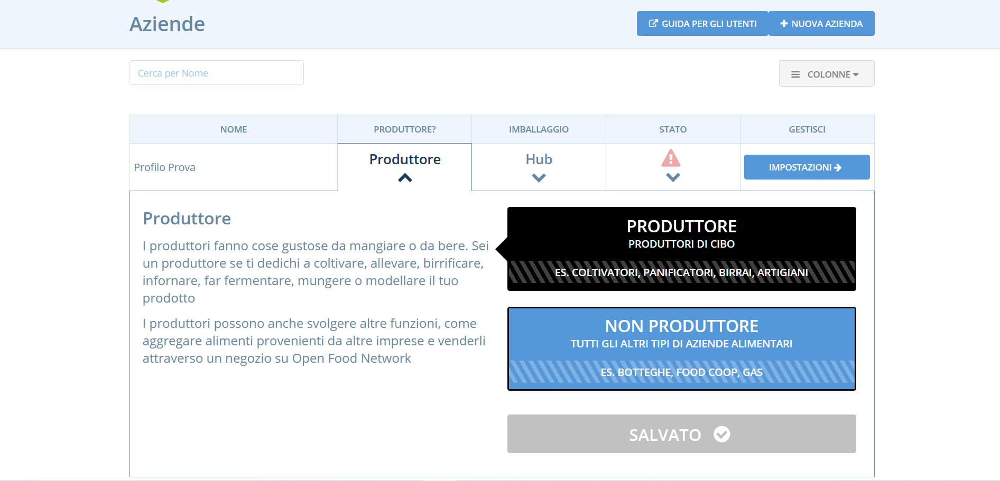

# Pacchetti / tipi di profili

Dopo aver completato la [registrazione del tuo profilo](../register-and-create-your-profile.md) puoi accedere direttamente al [pannello di controllo](enterprise-settings.md).

Qui dovrai scegliere il profilo OFN che [meglio si adatta alla tua attività](../../your-quick-start-on-ofn-given-who-you-are.md). **Senza questo passaggio, il tuo profilo aziendale non sarà creato e quindi la tua azienda non sarà visibile sulla nostra mappa.**

Open Food Network offre tre tipi di profili aziendali, che variano a seconda se sei o no un produttore e se intendi o no aprire una vetrina online per vendere tramite la piattaforma. La prima scelta che dovrai fare è se sei un produttore o no. A seconda di questa scelta iniziale, ti verranno proposte le seguenti opzioni. 

## Per Produttori

Puoi scegliere uno dei tre tipi di profili per i produttori:



Con questa opzione la tua azienda sarà visibile sulla mappa di OFN e sulla lista dei produttori. Puoi anche inserire e gestire un listino di prodotti, che potranno essere venduti attraverso la vetrina di altre aziende \(hub\) presenti su OFN. 

Come "Profilo Produttore" non potrai gestire una tua personale vetrina su OFN, ma solo consentire ad altri hub di vendere i prodotti che metterai a listino. Per maggiori informazioni puoi consultare la guida rapida per questo tipo di profilo, [qui](../../quick-start-guides/).


Se vuoi vendere i tuoi prodotti attraverso un'altra piattaforma e utilizzare OFN solo per aumentare la tua visibilità sul web, allora il "Profilo Produttore" è ciò che fa per te!   
Puoi inserire il link al tuo negozio personale nella descrizione della tua azienda.




#### Vorresti vendere su OFN SOLTANTO i tuoi prodotti

Questa opzione ti permette di mostrare nella tua vetrina solo i prodotti del tuo proprio listino. Il Negozio Produttore può anche This option allows you to run a shopfront which retails only those products in your own catalog. Note that 'Producer Shops' can conduct sales through their own shopfront and/or act as a supplier to other shopfronts \(hubs\). 

For more information on the quick setup guide for this type of profile, click [here](../../quick-start-guides/).



#### You would like to sell your products as well as those of other producers / suppliers 

This option allows you to manage a shop which retails both products made by yourself and those made by other local producers.  You can retail products from any Producer who has given you [permission](create-or-connect-with-your-supplying-producers.md) to do so. 

 For more information on the quick setup guide for this type of profile, click [here](../../quick-start-guides/).



## For Non-Producers \(Hubs\)

Two types of profiles are available to non-producers \(distributors / hubs\):



With this option your enterprise will be visible on the OFN map and to customers searching our platform. 

For more information on the quick setup guide for this type of profile, click [here](../../quick-start-guides/).


If you'd like to retail products made by a collection of producers on an existing online sales platform and just use OFN to increase your visibility then the 'Non-Producer Profile' package is for you!

You can put the link to your online shop in your enterprise description.




#### You would like to create an online shop

This option allows you to manage a shop which retails products made by others. You can retail products from any Producer who has given you [permission](create-or-connect-with-your-supplying-producers.md) to do so. 

 For more information on the quick setup guide for this type of profile, [click here](../../quick-start-guides/multi-producers-shop-hub-quick-setup-guide.md).



## Changing your profile type

You can change your profile type \(package\) at any time in the future.  ****First log in to your OFN admin account:

and then visit your [Enterprise Settings menu](enterprise-settings.md). From the table, select the correct option\(s\) from the drop down menus.  \(You will need to be the '[Owner](enterprise-settings.md#users)' of the enterprise to do this.\)

## Next step

Once you have chosen the correct profile type for your food business you can complete any missing information and further refine your setup under the [Enterprise Settings](enterprise-settings.md) menu. 

