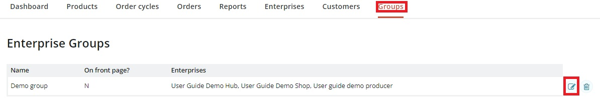

# Create and manage a Group page

**What is a group page?** Group pages are a way for a collection of businesses which exist in the real world to have their own customisable directory on OFN. Group pages are suited to:

* regional producer groups
* enterprises with a common certification
* farmer's markets
* large multi-hub enterprises.

Any collection of enterprises on the OFN can create a group page.&#x20;

**What does a group page look like?** You can see some [Group Pages on Open Food Network Australia](https://openfoodnetwork.org.au/groups).

<figure><figcaption></figcaption></figure>

**How can I create a group page?** To create and manage a group, you’ll need to [contact your local OFN ](https://www.openfoodnetwork.org/find-your-local-open-food-network/)so we can set you up as an administrator.

## Managing a Group Page

Once you’ve been set up as the administrator of a group, you’ll be able to view and edit your group by clicking on **Groups** in the horizontal blue menu. Then click on the **edit** icon next to your group.

### **Primary Details**

This is where you can enter and edit the details of your group, and change what will appear on your group's page on the Open Food Network. To see an example of an existing group page, go to [Group Pages on Open Food Network Australia](https://openfoodnetwork.org.au/groups).&#x20;

**Name:** Enter a name for your group, to appear as the title of your group page on the OFN.

**Description:** Write a brief description of your group, to appear below the title of your group page on the OFN.&#x20;

**On Front Page:** Select this check box to make your group visible on the OFN. Before you do this, make sure you have added some enterprises to your group and entered content in the About section. Do not check this box if your group page is not ready to be visible yet. &#x20;

**Enterprises:** Select the enterprises that you want to add to your group. You can search through all of the enterprises currently on the OFN and add them to your group. Please make sure you have permission to add enterprises to your group before doing so. Note, if you have already added an enterprise to your group, they will no longer appear in the search box. These enterprises will be listed on your group page on the OFN in the **Our Producers** and **Our Hubs** sections, and each listing will include a link to their OFN profile

**Permalink:** This is where you can customise the URL for your group page. What you enter here will be added to the end of the following URL: www.openfoodnetwork.org.au/groups/ For example if you enter **regional-hub** here, your group page URL will be: www.openfoodnetwork.org.au/groups/**regional-hub**

### Users

**Owner:** This is the owner of the group page. Only this user has permission to edit the page and manage the enterprises in the group. Please [contact your local OFN](https://www.openfoodnetwork.org/find-your-local-open-food-network/) if you wish to change the owner of your group.

### About

This is where you can provide more detailed information about your group to appear in the **About Us** section of your group page on the OFN. You can use the formatting buttons to add headings and paragraphs, and edit the layout and appearance of the content you enter here.

### Images

**Logo:** This is where you can add a logo for your group page. It should be a square image. It will show in the main group listing page on the OFN and to the left of the **Title** and **Description** on your group’s page on the OFN.

**Promo Image:** This is a banner style image and will sit across the top of your group page. It’s best if this image is wide and not too tall. We recommend 1200 x 260 pixels.

### Contact

This is where you can enter contact details for your group to appear on the right side of your group page on the OFN. You can enter a phone number, email address and physical address for your group.

### Web

This is where you can provide links to any websites and social media channels you may have for your group. These links will appear as either URLs or social media icons on the right side of your group page on the OFN.

## Customer view

The details added above by editing your group will appear to customers under the different tabs from your main group landing page (which has the group's location shown on a map).

<figure><figcaption></figcaption></figure>

<figure><figcaption></figcaption></figure>

If an enterprise belongs to a Group then there will be a 'Group' tab on its shop front with a link to the group.  This is a way in which a collection of online OFN 'Shops' (or hubs) can 'club' together and promote each other.  Customers might find that they can't collect from their normal 'shop' one week and hence use the fact that the shop is part of a local group to find another shop with a collection time and date that better suites them.

<figure><figcaption></figcaption></figure>


The 'Group' tab can be hidden from your Enterprise shopfront by using the [White Label function](../shopfront/white-label-site.md).

