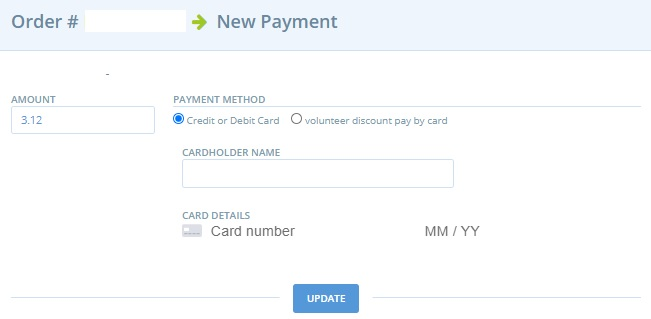

# Create orders manually

Sometimes you may wish to manually put an order into the system. This may be on behalf of a customer, or so that your reports will capture an order from a different sales stream. You can create an order by going to **Orders** and clicking on the **+ New Order** button.

You are then lead through a step-by-step process to place the order:

Firstly you will be prompted to select the distributor that the order will be placed with. \
Next you will need to select the order cycle that you want the order to be placed in. Your choice of order cycle will dictate which products will be available to be added into the order and the fees applied. Click next once you've completed these fields.

You'll then see the customer details screen where you can choose a customer from your [customer](../shopfront/customer-management-and-conditional-displays-prices/customers.md) list. Enter three or more characters in the 'choose a customer' drop down box and select your customer:

<figure><figcaption></figcaption></figure>

Selecting a customer will autofill the customer's saved shipping & billing address, saving you time. You can also enter the customer's details manually if they're not saved in your customer list by completing the fields on the screen:

<figure><figcaption></figcaption></figure>

Click 'Update' to save your progress, then go to 'Order details' from the menu on the right to start entering products:

\
You will then be redirected to the Order Details page where you can select products. You must type at least the first 3 characters of the product for it to appear as an option in the drop down list:

<figure><figcaption></figcaption></figure>

After finding the product you'd like to order, enter the quantity and click the **+** button to the right of the product to add it to the cart.

Once a product is added you can edit the quantity by selecting the pen and paper icon to the right of the item:

After editing any aspect of the cart, click **update and recalculate fees** to update the price. You will also need to select a shipping method for the customer's order:

Click the tick button to update changes and the cross button to cancel.

The final step is to add the customer’s payment method.  This is found from the bottom option of the right hand menu:


Note, if you opt for a [payment method](../shopfront/payment-methods.md) provided by **Stripe** then you will be directed to input the customer's card details.\
&#x20; &#x20;



You should NEVER write down a customer's card details.



Best practice is to complete the above form directly into a computer/tablet/mobile device while the customer reads out the numbers over the phone.



You will not be able to opt for a [Payment Method](../shopfront/payment-methods.md) provided by **PayPal** for an order created manually.

&#x20;


Clicking **update** will finalise this order and send an email confirmation to the customer.
