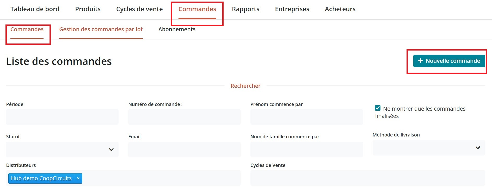
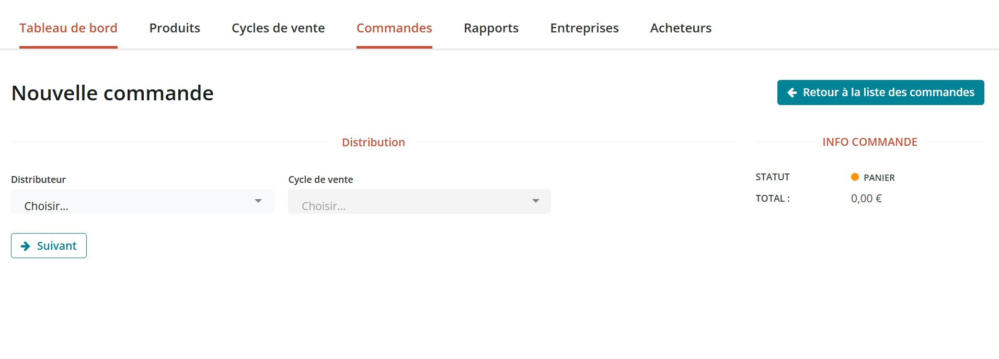
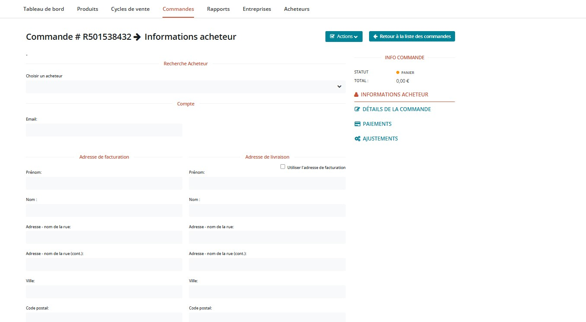
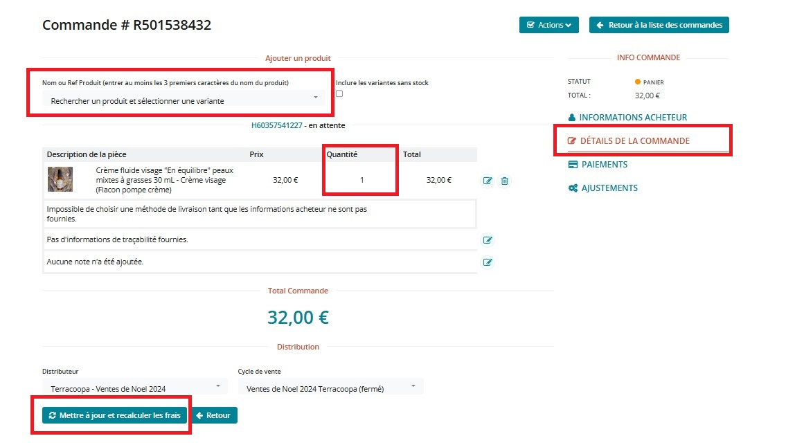

# Création de commande gestionnaire

Parfois, vous souhaitez passer vous même une commande manuellement dans le système, pour le compte d'un acheteur ou pour que vos rapports incluent une commande issue d'une autre plateforme par exemple. Rendez-vous sur **Commandes** et cliquez sur le bouton **Nouvelle Commande** : \
\

<figure><figcaption></figcaption></figure>

Suivez ensuite pas à pas le processus :&#x20;

<figure><figcaption></figcaption></figure>

Sélectionnez le distributeur sur lequel doit être enregistré la commande puis le cycle de vente. En fonction du cycle de vente choisi, les produits pouvant être ajoutés à la commande ainsi que les marges ne seront pas forcément les mêmes, selon le paramétrage du cycle de vente.&#x20;

Vous serez redirigé sur la page "Informations acheteur". Renseignez les informations demandées. Si l'acheteur fait déjà parti de vos clients, vous pouvez le sélectionner via la liste déroulante, ou alors remplir les champs et indiquer une commande invité. Pour finir, cliquez sur "mettre à jour" en bas de page.

<figure><figcaption></figcaption></figure>

Cliquez ensuite sur "Détails de la commande" dans le menu de droite. Vous pourrez ajouter  les produits souhaitez (vous devez commencez à taper les premières lettres pour que des suggestions apparaissent) :&#x20;

<figure><figcaption></figcaption></figure>

Indiquez les quantités. Une fois tous les produits ajoutés, cliquez sur **mettre à jour et recalculer les frais.**

Cliquez sur **Ajustements** ou directement sur **Paiements** (à droite de l'écran) avant de continuer et sélectionner une méthode de livraison :&#x20;

.png>)

Ensuite vous pouvez réaliser des ajustements comme l'ajout d'une commission. Continuez.

La dernière étape est le choix de la méthode de paiement : \

.png>)

Cliquez sur **mettre à jour** et envoyez un email de confirmation à l'acheteur.
