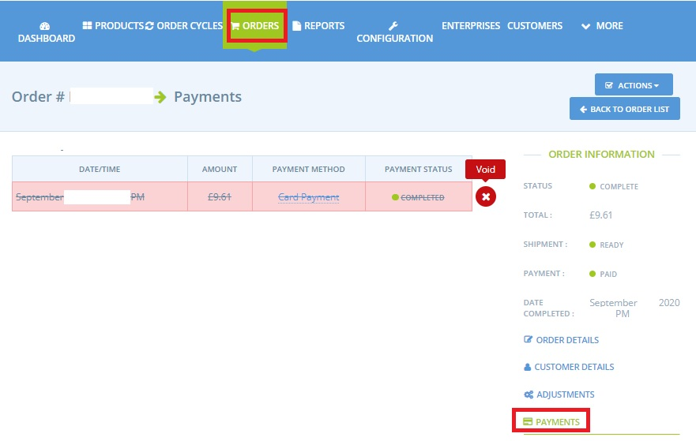
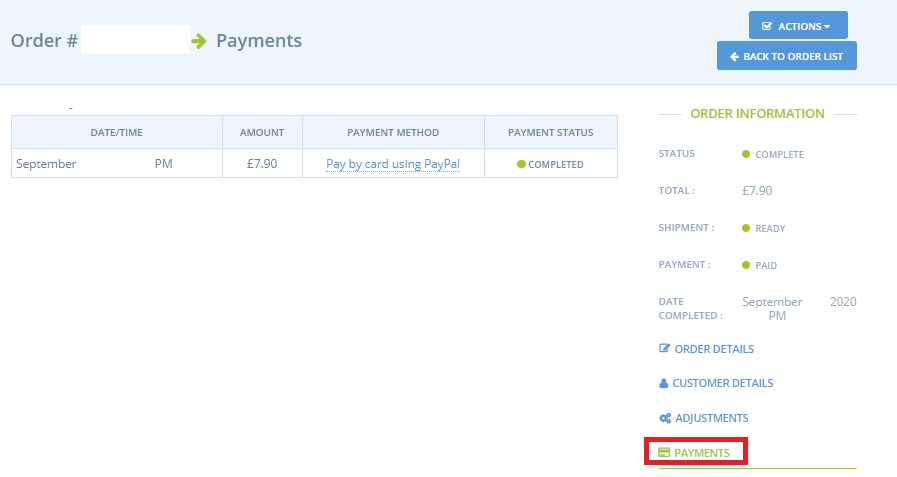
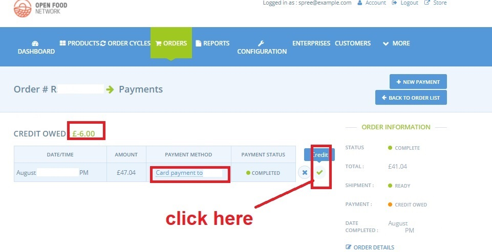

# Refunds and Adjusting Payments

From time to time, a customer may request that their order is adjusted, either to remove or add items. 

On other occasions you, as a business manager, may need to change an order. Common scenarios include:

1. A product was not delivered by a supplier
2. A product was of lower quality than expected
3. An order contains products with variable weights such as [meat or large vegetables](../products-1/pricing-irregular-items-kg.md#option-one-set-an-average-weight-price-and-reimburse) \(ie. whole items priced by weight\).

The process of issuing a refund or requesting further payment depends on the [payment method](../shopfront/payment-methods.md) employed.  


On the OFN platform, refunds and additional payments can only be taken **automatically** using the [Payment Method](../shopfront/payment-methods.md) Provider **Stripe/Stripe SCA**.


## Refunds

Using the OFN Platform, you can either process a Total refund, or make an adjustment to the order to change the balance owing, and then process a Partial refund.


 If you have integrated with Stripe as a Payment Method, you can log in to your Stripe account and issue an invoice to the customer via Stripe. The customer will be sent an email asking them to pay with a Credit or Debit Card, but be aware that OFN will not be notified of this transaction and you will still need to manually capture the payment as received in OFN.


### Total Refund

To issue a refund, select the relevant payment method from the tabs below:


For all methods it is best practice to refund the payment to the customer before you mark the order as cancelled. 




For non-automated payment methods \(such as cash on collection or BACS\), there are two scenarios:

  
**The customer has not yet paid for the item.**  
If a customer places an order, selecting a payment method such as cash on collection or BACS and the payment has not been captured on the system it will appear as:

You can [cancel the order](refunds-and-adjusting-payments.md#marking-an-order-as-cancelled) straight away following steps below.

**The customer has paid for the item.**

When [viewing orders](view-orders.md#listing-orders) the order appears as:

1. Arrange for the customer to be reimbursed independently of the OFN platform.  
2. Record this action by [**Orders -&gt; Edit**](view-orders.md#editing-an-order) and select the ‘Payments’ tab from the right hand menu.   Select the ‘X’ to the right hand side of the payment to void it.

Then [mark the order as ‘cancelled'](refunds-and-adjusting-payments.md#marking-an-order-as-cancelled) using the steps below.



Order payment is collected automatically on creation \(except for [subscriptions](../subscriptions/)\) and so in [listing Orders](view-orders.md#listing-orders) the order appears as:

Visit [**Orders -&gt; Edit**](view-orders.md#editing-an-order) and select ‘Payments’ from the right hand menu.   
Click on the ‘**X**’ to the right of the payment to void it. 

This will automatically send the payment back to the credit or debit card used by the customer.


Note that Stripe payments can take 3-5 working days to appear on a customer’s bank statement.


Once you have issued a refund, follow the steps below to [cancel the order](refunds-and-adjusting-payments.md#marking-an-order-as-cancelled). It is important to process the refund BEFORE you cancel the order! 



Payment is collected automatically on checkout from the customer and so in [listing Orders](view-orders.md#listing-orders) the order appears as:


**Orders placed and paid for via PayPal can not be refunded through the OFN platform.**


To refund the customer you will need to log into your [PayPal account](https://www.paypal.com/uk/home) and issue the money back to the customer’s account through their interface.

Once this has been done, you can [mark the order as cancelled](refunds-and-adjusting-payments.md#marking-an-order-as-cancelled) using the steps below.



#### Marking an order as cancelled

Once you have issued a refund, you can now cancel the order. [Edit the order](view-orders.md#editing-an-order) and select ‘Cancel Order’ under ‘Actions’ \(top right hand blue button\)


The customer will receive an email to state that their order has been cancelled.



Note you can not cancel an order which has been marked as ‘Shipped’


### Partial Refund

To issue a partial refund, you first need to edit the order to change the balance owing. There are two main ways to [edit an order](view-orders.md#editing-an-order) when you want to issue a partial refund. You can either remove an item, or make an adjustment \(eg. to fees\):

**1.Edit by Removing an item which is not in stock or changing the quantity of an item** by going to[ Orders -&gt; edit ](view-orders.md#adding-and-removing-products-from-an-order)order and clicking on the ‘edit’ icon to the right of the item in question, as shown below:

Select ‘Update and Recalculate Fees’ at the bottom of the page.


If the product has been deleted by the supplier from their master [product](../products-1/) list then it will not be possible to edit this page. In which case, use the ‘adjustments’ method below.


**2. Edit by Changing the Fees** in the [order](view-orders.md#modify-an-order) by visiting **Orders -&gt; Edit -&gt; Adjustments** from the right hand menu.

This will bring up a list of enterprise fees for each item in the order as well as shipping and payment method fees. You can adjust one of these fees by clicking on the ‘edit’ icon to the right of the item in question.  

**3. Edit by adding a new Adjustment** to the ****[**order**](view-orders.md#modify-an-order) ****by visiting **Orders -&gt; Edit -&gt; Adjustments** from the right hand menu and selecting **+New Adjustment** \(the top right hand button\) to make a separate adjustment that is unrelated to fees.

Add the relevant details, remembering that for **a refund**,  the value needs to be a **negative number**. When finished, click ‘continue’.


You can use ‘Adjustments’ to partially refund a customer for a substandard product.


Once the order has been amended to reflect either the missing / adjusted products, the adjusted fees, or the new adjustment, the order will appear with the payment state of ‘Credit Owing’ for the amount they no longer need to pay.

**Process the Partial Refund**  
To process a partial refund of the amount that is now owing on the order, see instructions by choosing the payment method from the following tabs:



1. Arrange for the refund to be made to the customer independently of the platform.  
2. Record this action by **Orders -&gt; Edit** and select ‘Payments’ from the right hand menu

Select **+New Payment**

A **negative value** in the ‘Amount’ field means the refund is recorded. 



Using the OFN platform you can automatically refund a customer who paid by Stripe. This will directly process the refund to their credit or debit card.

1.Visit **Orders -&gt; Edit Order** and then select ‘Payments’ from the right hand menu

2.By clicking on the tick next to the payment, any credit owed to the customer will be automatically refunded. ****


Note that Stripe payments can take 3-5 working days to appear on a customer’s bank statement.




**You can not issue a partial refund to a customer who paid by PayPal automatically via the OFN platform at present.**  

1. You will need to log into your business [PayPal account](https://www.paypal.com/uk/home) and refund the customer the correct amount through their interface.
2. To record this action you will need to set up a new [Payment Method](../shopfront/payment-methods.md) as follows: Name= ‘Paypal refunds’ Display = ‘Back Office Only’ Payment provider = ‘cash/EFT/etc’.
3. Visit **Orders - &gt; Edit Order-&gt; Payments** \(found in the right hand menu\).
4. Select **+New Payment** and select ‘Paypal refunds’:

A negative value in the ‘Amount’ field means that a refund is recorded.


If you opt to add a new payment with the payment method provider ‘Paypal’ this will not be possible:





## Collecting Additional Payments

Follow the steps above for [Partial refunds](refunds-and-adjusting-payments.md#partial-refund) to add extra items to a customer's order or make adjustments via the [Bulk Order Management](../products-1/group-buy-for-bulk-ordering.md#adjusting-orders-to-make-complete-batches) page.

Orders will now display with the Payment State = ‘Balance Due’:

To record payment of the extra monies due visit [Orders -&gt; Edit Order](view-orders.md#editing-an-order) and then ‘Payments’.   
Select **+New Payment** \(top right hand blue button\)

1. If customer has given your business the money owing in **cash or BACS** payment then record this in the same manner as detailed for a refund, but use a positive value in the ‘Amount’ field.
2. If the customer is present or on the end of the phone you can take the extra payment by **Stripe**. You will need the customer’s credit/debit card details to do this:


Note collection of the extra monies by PayPal through the platform is, at present, not possible.



If a payment method has an associated fee attached then the fee will be recorded by the system every time you collect extra money from the customer or issue them a refund.


