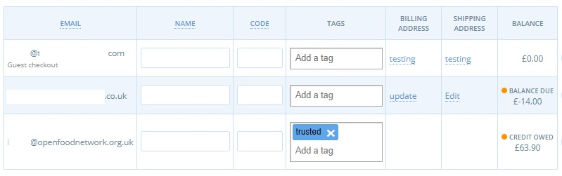

# Erstattungen und Anpassung der Zahlungen

Von Zeit zu Zeit kann ein Kunde verlangen, dass seine Bestellung angepasst wird, z. B. durch Hinzufügen oder Entfernen eines Artikels.

In anderen Fällen kann es vorkommen, dass Sie als Geschäftsleiter einen Auftrag ändern müssen. Häufige Szenarien sind:

1. Ein Produkt wurde von einem Lieferanten nicht geliefert
2. Ein Produkt war von geringerer Qualität als erwartet
3. Eine Bestellung enthält Produkte mit variablem Gewicht, wie z. B. [Fleisch oder große Gemüsesorten](../products-1/pricing-irregular-items-kg.md#option-eins-festsetzung-eines-durchschnittsgewichts-preises-und-erstattung) (d. h. ganze Artikel mit Preisangaben nach Gewicht).

Das Verfahren für die Rückerstattung oder die Aufforderung zur weiteren Zahlung hängt von der verwendeten [Zahlungsmethode](../shopfront/payment-methods.md) ab.


Auf der OFN-Plattform können Rückerstattungen und zusätzliche Zahlungen nur automatisch über den Zahlungsmittelanbieter Stripe/Stripe SCA erfolgen.


## Erstattungen

Über die OFN-Plattform können Sie eine Gesamterstattung vornehmen, bei der der gesamte Betrag der Bestellung erstattet wird, oder eine Teilerstattung, die Sie z. B. verwenden können, wenn ein Artikel nicht verfügbar war.


Wenn Sie Stripe als Zahlungsmethode integriert haben, können Sie sich in Ihr Stripe-Konto einloggen und dem Kunden über Stripe eine Rechnung ausstellen. Der Kunde erhält eine E- Mail, in der er aufgefordert wird, mit einer Kredit- oder Debitkarte zu zahlen. Beachten Sie jedoch, dass OFN nicht über diese Transaktion benachrichtigt wird und Sie die Zahlung weiterhin manuell in OFN erfassen müssen.


### Erstattung insgesamt

Um eine vollständige Rückerstattung vorzunehmen, wählen Sie die entsprechende Zahlungsmethode aus den nachstehenden Registerkarten aus:



Für nicht automatisierte Zahlungsmethoden (wie Barzahlung bei Abholung oder BACS) gibt es zwei Szenarien:

\
**Der Kunde hat den Artikel noch nicht bezahlt.**\
Wenn ein Kunde eine Bestellung aufgibt und eine Zahlungsmethode wie Barzahlung bei Abholung oder BACS auswählt und die Zahlung nicht im System erfasst wurde, wird dies angezeigt:

<figure><figcaption></figcaption></figure>

Sie können die [Bestellung sofort stornieren](refunds-and-adjusting-payments.md#marking-an-order-as-cancelled), indem Sie die nachfolgenden Schritte unter "Einen Auftrag als storniert markieren" ausführen.

**Der Kunde hat den Artikel bezahlt.**

Wenn unter [Bestellungen](view-orders.md#auflistung-der-auftraege) die Bestellung als "Zahlungsstatus: bezahlt" und "Lieferstatus: bereit" erscheint:

<figure><figcaption></figcaption></figure>

1. Veranlassen Sie, dass dem Kunden die Kosten unabhängig von der OFN-Plattform erstattet werden. &#x20;
2. Erfassen Sie diese Aktion über [Aufträge -> Bearbeiten](view-orders.md#einen-auftrag-bearbeiten) und wählen Sie im rechten Menü die Registerkarte "Zahlungen".\
   Wählen Sie das "X" rechts neben der Zahlung, um sie zu stornieren.

<figure><figcaption></figcaption></figure>

<figure><figcaption></figcaption></figure>

[Markieren Sie dann die Bestellung als "storniert",](refunds-and-adjusting-payments.md#marking-an-order-as-cancelled) indem Sie die nachfolgenden Schritte ausführen.



Die Zahlung für die Bestellung wird automatisch bei der Erstellung eingezogen (außer bei [Abonnements](../subscriptions/)), so dass die Bestellung in der [Liste der Bestellungen](view-orders.md#auflistung-der-auftraege) als solche erscheint:

<figure><figcaption></figcaption></figure>

Gehen Sie zu [**Bestellungen -> Bearbeiten**](view-orders.md#einen-auftrag-bearbeiten) und wählen Sie im rechten Menü "Zahlungen". Klicken Sie auf das "**X**" rechts neben der Zahlung, um sie zu stornieren.

Dadurch wird die Zahlung automatisch an die vom Kunden verwendete Kredit- oder Debitkarte zurücküberwiesen.


Beachten Sie, dass es 3 bis 5 Arbeitstage dauern kann, bis Stripe-Zahlungen auf dem Kontoauszug eines Kunden erscheinen.


Wenn Sie eine Rückerstattung vorgenommen haben, gehen Sie wie nachfolgend beschrieben vor, um die [Bestellung zu stornieren](refunds-and-adjusting-payments.md#marking-an-order-as-cancelled).



Die Zahlung wird automatisch an der Kasse vom Kunden eingezogen, so dass die Bestellung als "bezahlt" angezeigt wird:

<figure><figcaption></figcaption></figure>


**Bestellungen, die über PayPal aufgegeben und bezahlt wurden, können nicht über die OFN-Plattform erstattet werden.**


Um dem Kunden das Geld zurückzuerstatten, müssen Sie sich in Ihr [PayPal-Konto ](https://www.paypal.com/)einloggen und das Geld über die Schnittstelle auf das Konto des Kunden zurücküberweisen.

Danach können Sie die Bestellung mit den nachfolgenden Schritten als [storniert markieren](refunds-and-adjusting-payments.md#marking-an-order-as-cancelled).



#### Einen Auftrag als storniert markieren

Sobald Sie eine Erstattung vorgenommen haben, können Sie die Bestellung stornieren.[ Bearbeiten Sie die Bestellung](view-orders.md#einen-auftrag-bearbeiten) und wählen Sie "Bestellung stornieren" unter "Aktionen" (blaue Schaltfläche oben rechts).

<figure><figcaption></figcaption></figure>


Der Kunde erhält eine E-Mail, in der er darüber informiert wird, dass seine Bestellung storniert wurde.



Beachten Sie, dass Sie eine Bestellung, die als 'Versendet' markiert wurde, nicht stornieren können.


### Teilweise Erstattung

Um eine Teilerstattung vorzunehmen, müssen Sie zunächst die Bestellung bearbeiten, um den geschuldeten Betrag zu ändern. Es gibt zwei Möglichkeiten, [eine Bestellung zu bearbeiten](view-orders.md#einen-auftrag-bearbeiten), wenn Sie eine Teilerstattung vornehmen möchten. Sie können die Artikelmengen anpassen oder eine Anpassung vornehmen:

1. **Artikelmenge bearbeiten:** Bearbeiten Sie eine Bestellung, indem Sie einen Artikel, der nicht vorrätig ist, entfernen (grünes Rechteck) oder die Menge eines Artikels ändern (rotes Rechteck), indem Sie zu [Bestellungen -> Bestellung bearbeiten](view-orders.md#hinzufuegen-und-entfernen-von-produkten-aus-einer-bestellung) gehen und auf das Symbol "Bearbeiten" rechts neben dem betreffenden Artikel klicken, wie unten dargestellt:

<figure><figcaption></figcaption></figure>

Wählen Sie unten auf der Seite "Gebühren aktualisieren und neu berechnen".


Wenn das [Produkt](../products-1/) vom Lieferanten aus seiner Hauptproduktliste gelöscht wurde, ist es nicht möglich, diese Seite zu bearbeiten. Verwenden Sie in diesem Fall die unten stehende Methode "Anpassungen".


**2. Ändern Sie die Bestellung in dem Sie eine neue Anpassung vornehmen,** indem Sie im Menü auf der rechten Seite Bestellungen -> Bearbeiten -> Anpassungen aufrufen.

<figure><figcaption></figcaption></figure>

Fügen Sie die relevanten Details hinzu und denken Sie daran, dass der Wert für **eine Erstattung** eine **negative Zahl** sein muss. Wenn Sie fertig sind, klicken Sie auf "Weiter".

<figure><figcaption></figcaption></figure>


Sie können "Anpassungen" verwenden, um einem Kunden einen Teil der Kosten für ein minderwertiges Produkt zu erstatten.


Sobald die Bestellung geändert wurde, um entweder die fehlenden/angepassten Produkte oder die neue Anpassung zu berücksichtigen, erscheint die Bestellung mit dem Zahlungsstatus "Guthaben" für den Betrag, den der Kunde nicht mehr zahlen muss.

**Bearbeiten Sie die Teilerstattung**\
Wenn Sie eine Teilerstattung des geschuldeten Betrags vornehmen möchten, lesen Sie die Anweisungen, indem Sie die Zahlungsmethode auf den folgenden Registerkarten auswählen:



1. Veranlassen Sie, dass die Erstattung an den Kunden unabhängig von der Plattform erfolgt.&#x20;
2. Erfassen Sie diese Aktion, indem Sie zu **Aufträge -> Bearbeiten** gehen und im rechten Menü "Zahlungen" und dann "**+ Neue Zahlung**" auswählen:

Geben Sie in das Feld "Betrag" einen **negativen Wert** ein, um die Erstattung als erfolgt zu verbuchen.



Mit der OFN-Plattform können Sie einem Kunden, der mit Stripe bezahlt hat, automatisch Geld zurückerstatten. Die Erstattung wird direkt auf die Kredit- oder Debitkarte des Kunden überwiesen.

1.Gehen Sie zu **Aufträge -> Auftrag bearbeiten** und wählen Sie dann "Zahlungen" aus dem rechten Menü.

2.Da Sie die Anpassung im vorherigen Schritt vorgenommen haben, wird auf dem Zahlungsbildschirm nun "**Guthaben**" mit dem von Ihnen angegebenen Betrag angezeigt. Wenn Sie auf das Häkchen neben der Zahlung klicken, wird das dem Kunden geschuldete Guthaben automatisch zurückerstattet.


Beachten Sie, dass es 3 bis 5 Arbeitstage dauern kann, bis Stripe-Zahlungen auf dem Kontoauszug eines Kunden erscheinen.




**Sie können einem Kunden, der mit PayPal automatisch über die OFN-Plattform bezahlt hat, derzeit keine Teilerstattung gewähren.**

1. Sie müssen sich in Ihr geschäftliches [PayPal-Konto](https://www.paypal.com/) einloggen und dem Kunden den korrekten Betrag über die Schnittstelle erstatten.
2. Um diese Aktion zu erfassen, müssen Sie wie folgt eine neue [Zahlungsmethode](../shopfront/payment-methods.md) einrichten:\
   Name= 'Paypal-Erstattungen'\
   Anzeige = 'Nur Back Office'\
   Zahlungsanbieter = "bar/EFT/etc".
3. Besuchen Sie **Aufträge - > Auftrag bearbeiten-> Zahlungen** (im rechten Menü).
4. Wählen Sie **+Neue Zahlung** und wählen Sie 'Paypal-Erstattungen':

Ein negativer Wert im Feld "Betrag" bedeutet, dass eine Erstattung erfasst wird.


Wenn Sie sich dafür entscheiden, eine neue Zahlung mit dem Zahlungsmittelanbieter "Paypal" hinzuzufügen, ist dies nicht möglich:


 (1).jpg>)



## Einziehung zusätzlicher Zahlungen

Führen Sie die oben beschriebenen Schritte für [Teilerstattungen aus](refunds-and-adjusting-payments.md#teilweise-erstattung), um der Bestellung eines Kunden weitere Artikel hinzuzufügen oder Anpassungen über die Seite [Verwaltung von Großaufträgen](../products-1/group-buy-for-bulk-ordering.md#anpassung-von-auftraegen-zur-erstellung-vollstaendiger-chargen) vorzunehmen.

Bestellungen werden jetzt mit dem Zahlungsstatus = "Restbetrag fällig" angezeigt:

Um die Zahlung der zusätzlich fälligen Beträge zu erfassen, besuchen Sie [Aufträge -> Auftrag bearbeiten](view-orders.md#einen-auftrag-bearbeiten) und dann "Zahlungen". Wählen Sie + Neue Zahlung (blaue Schaltfläche oben rechts)

1. Wenn der Kunde Ihrem Unternehmen das geschuldete Geld in **bar oder als** BACS-Zahlung gegeben hat, erfassen Sie dies auf die gleiche Weise wie bei einer Rückerstattung, verwenden aber einen positiven Wert im Feld "Betrag".
2. Wenn der Kunde anwesend ist oder am Telefon ist, können Sie die zusätzliche Zahlung über Stripe abwickeln. Hierfür benötigen Sie die Daten der Kredit-/Debitkarte des Kunden:


Beachten Sie, dass der Einzug der zusätzlichen Gelder durch PayPal über die Plattform derzeit nicht möglich ist.



Wenn eine Zahlungsmethode mit einer Gebühr verbunden ist, wird diese Gebühr vom System jedes Mal aufgezeichnet, wenn Sie zusätzliches Geld vom Kunden einziehen oder ihm eine Erstattung ausstellen.


## Behalten Sie den Überblick über die Zahlungssalden Ihrer Kunden

Die fälligen Beträge (Guthaben) oder die fälligen Beträge (Lastschrift) für die einzelnen Aufträge können Sie auf der Verwaltungsseite Ihrer [Listingaufträge](view-orders.md) einsehen.


Remember that only payments for integrated payment methods (PayPal and Stripe) are automatically captured by the platform. If a customer pays your business by cash or BACS (or similar) you will need to [capture this payment](view-orders.md#capturing-a-payment) manually to keep your records up to date.

Denken Sie daran, dass nur Zahlungen für integrierte Zahlungsmethoden (PayPal und Stripe) automatisch von der Plattform erfasst werden. Wenn ein Kunde Ihr Unternehmen mit Bargeld oder BACS (oder ähnlichem) bezahlt, müssen Sie [diese Zahlung manuell erfassen](view-orders.md#payment-and-shipment-state), um Ihre Unterlagen auf dem neuesten Stand zu halten.


Vielleicht möchten Sie Ihren vertrauenswürdigen Kunden erlauben, einmal im Monat (per BACS) für alle ihre Bestellungen in diesem Zeitraum zu zahlen, oder denjenigen, die eine Woche Cashflow haben, etwas Spielraum bei ihren Zahlungen geben. Um die Salden der einzelnen Kunden Ihres Unternehmens zu verfolgen, besuchen Sie Ihre Kundenliste. Der fällige Kredit-/Lastschriftbetrag wird rechts neben dem Eintrag des jeweiligen Kunden angezeigt.

