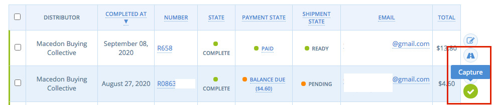
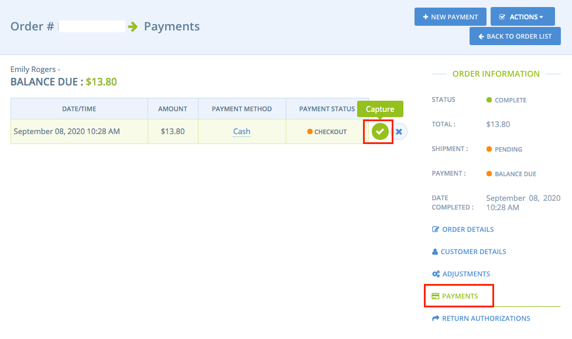
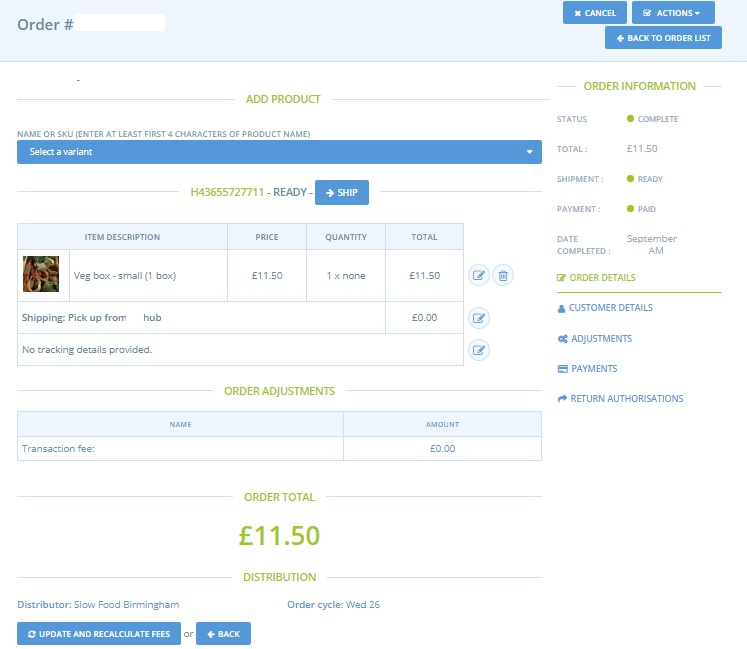
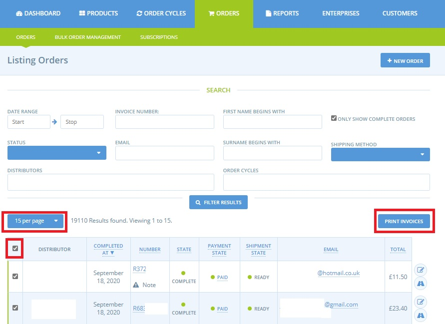

# Aufträge verwalten

Innerhalb der Verwaltungsoberfläche gibt es zwei Stellen, an denen Aufträge eingesehen und (falls erforderlich) geändert werden können:

1. die Seite "[Bestellungen](view-orders.md#listing-orders)" selbst,
2. die Seite [Verwaltung von Großaufträgen](view-orders.md#bulk-order-management).

Die Merkmale dieser beiden Seiten werden im Folgenden erläutert.

## Auflistung der Aufträge

Die Seite "Bestellungen" zeigt eine Listenansicht aller Bestellungen, die über Ihre(n) Shop(s) aufgegeben wurden. Von hier aus können Sie auf die Details der einzelnen Bestellungen zugreifen, Bestellungen bearbeiten und den Status ihrer Zahlung und ihres Versands verfolgen. Wie Sie manuell eine neue Bestellung für Ihren Kunden anlegen können, erfahren Sie [hier](create-orders-manually.md).

Die Seite verfügt über Filter, mit denen Sie auswählen können, welche Bestellungen Sie sehen möchten. Sie können nach Datum, Status oder der E-Mail und dem Namen des Kunden filtern.

**Verteilstelle:** Dies ist das Unternehmen, über dessen Shop die Bestellung aufgegeben wurde.

**Abgeschlossen am:** Dies ist das Datum, an dem der Auftrag erteilt wurde.

**Nummer:** Dies ist eine willkürlich vergebene Bestellnummer. Ein Ausrufezeichen mit dem Wort "Hinweis" links daneben wird angezeigt, wenn der Kunde seiner Bestellung an der Kasse einen Kommentar beigefügt hat. Fahren Sie mit der Maus über das Ausrufezeichen, um den Kommentar anzuzeigen.

**Status**:

* Abgeschlossen: Der Kunde hat die Kaufabwicklung abgeschlossen.
* Abgebrochen: Wenn ein Manager eines Unternehmens oder ein Kunde beschlossen hat, es zu "stornieren".
* Einkaufswagen: Der Kunde kauft gerade ein, hat aber noch nicht ausgecheckt.

**Zahlungsstatus:**

* Fälliger Saldo: Handelt es sich um Bargeld, eine Banküberweisung oder eftpos (d.h. alle nicht automatisierten Zahlungen), dann wird der Auftrag standardmäßig als "offener Betrag" eingestuft, bis Verwaltungsmitglieder des vertreibenden Unternehmens manuell den Zahlungseingang markieren, woraufhin der Zahlungsstatus in "bezahlt" geändert wird.

* Bezahlt - Bei automatisierten Zahlungen (z. B. PayPal, Stripe, PIN) markiert das Zahlungsportal eine Bestellung automatisch als "bezahlt", wenn sie bearbeitet wurde. Nicht automatisierte Zahlungen (Barzahlung, Banküberweisung usw.) werden ebenfalls als "bezahlt" gekennzeichnet, wenn sie manuell aktualisiert werden.
* Geschuldetes Guthaben: Wenn jemand seine Bestellung bezahlt hat, Sie die Bestellung aber bearbeiten und einen Artikel entfernen, werden die Kosten für diesen Artikel als "Guthaben" für den Kunden angezeigt.

**Lieferstatus:**

* Ausstehend: Wenn der Zahlungsstatus "fällig" ist, ist der Versandstatus "ausstehend", d.h. bis zum Zahlungseingang sollte der Versand nicht beginnen.
* Bereit: Wenn die Zahlung eingegangen ist (Status "bezahlt" oder "Kredit geschuldet"), wird der Versandstatus "bereit".
* Versendet: Nach der Auslieferung oder Abholung kann eine Bestellung manuell von der Shop-/Hub-Verwaltung aktualisiert werden (Bestellung bearbeiten), so dass der Versandstatus auf "Versendet" wechselt.


Sie können eine Bestellung NUR dann manuell auf "versandt" aktualisieren, wenn der Zahlungsstatus "bezahlt" oder "Kredit geschuldet" ist.


**E-Mail Adresse:** Die Kontakt-E-Mail des Kunden. Eine vollständige Liste der Kunden-E-Mails kann über den [Bericht](../reports/) "Verteilerliste" heruntergeladen werden.

**Name**: Name des Kunden.

**Gesamt:** Der Gesamtwert der Bestellung des Kunden.

### Ändern des Zahlungs- und Versandstatus einer Bestellung 

Neben jedem Auftrag in der Auftragsliste befinden sich zwei Symbole. Wenn Sie auf das Bearbeitungssymbol (ein Bleistift- und Papiersymbol) klicken, werden die Details des Auftrags geöffnet, so dass Sie die Auftragsdetails überprüfen oder bearbeiten können. Unterhalb des Bearbeitungssymbols befindet sich eines von zwei Symbolen. Diese Symbole zeigen den Zahlungs- und Versandstatus an und können angeklickt werden, um den Status zu ändern. Wenn eine Zahlung noch nicht eingegangen ist, zeigt das Symbol ein Häkchen an, das angeklickt werden kann, um die Zahlung zu erfassen. Wenn die Zahlung eingegangen ist, zeigt das Symbol eine Straße an, die angeklickt werden kann, um die Bestellung als geliefert zu markieren.

* Wenn Sie auf das Häkchen klicken, wird der Zahlungsstatus auf **Bezahlt** geändert.
* Wenn Sie auf das Straßensymbol klicken, wird der Lieferstatus der Sendung auf V**ersandt** geändert.

**Erfassen einer Zahlung**

Wenn Sie eine Zahlung erfassen, wird sie als eingegangen markiert. Dies ist hilfreich, wenn Kunden bei der Bestellung nicht bezahlen. Wenn Sie Bargeld oder eine Überweisung vom Kunden erhalten, können Sie die Zahlung in der Auftragsliste erfassen. Um eine Zahlung schnell als eingegangen zu erfassen oder zu markieren, dass eine Bestellung versandt wurde, können Sie auf das Häkchen oder das Straßensymbol rechts neben der Bestellung in der Bestellliste klicken.

Beachten Sie, dass dadurch der gesamte Betrag der Bestellung als bezahlt erfasst wird. Wenn Sie die Details der Bestellung überprüfen möchten, bevor Sie eine Zahlung erfassen, können Sie auf das Bearbeitungssymbol rechts neben der Bestellung klicken, die Sie überprüfen möchten. Klicken Sie auf dem Bildschirm Auftragsdetails auf Zahlungen, um den geschuldeten Betrag und den Zahlungsstatus für diesen Auftrag anzuzeigen. Von hier aus können Sie auf das Häkchen klicken, um die Zahlung zu erfassen. Sobald die Zahlung erfasst ist, ändert sich der Zahlungsstatus in Bezahlt.

&#x20;&#x20;


Der Zahlungs- und Versandstatus einer Bestellung kann auch bei der Bearbeitung der Bestellung aktualisiert werden (siehe unten).



Wenn ein Shop- oder Hub-Manager den "Versandstatus" auf "versandt" aktualisiert, **wird dem Kunden automatisch eine E-Mail geschickt**, die besagt, dass seine Produkte versandt wurden, unabhängig von der Versandmethode. Daher kann dies bei Bestellungen, die abgeholt (und nicht versandt) werden sollen, zu Verwirrung führen. Eine weitere Quelle potenzieller Verwirrung ist, wenn Kunden für eine Bestellung bei Abholung bezahlen. Die Aktualisierung des Zahlungsstatus (und dann des Versandstatus) der Bestellung nach der Abholung der Ware führt dazu, dass der Kunde eine E-Mail erhält, obwohl er seine Ware in der Praxis bereits hat.


### Einen Auftrag bearbeiten

Rechts neben einer Bestellung sehen Sie ein Stift- und Papiersymbol. Klicken Sie auf dieses Symbol, um die Seite für die Auftragsverwaltung aufzurufen, auf der Sie einen Auftrag bearbeiten, ändern und stornieren können.

So sieht die Seite zur Auftragsverwaltung aus:

#### Hinzufügen und Entfernen von Produkten aus einer Bestellung

Sie können ein Produkt zur Bestellung hinzufügen, indem Sie die gewünschte Variante aus einer Dropdown-Liste der verfügbaren Varianten auswählen (es müssen mindestens 3 Buchstaben in das Feld "Variante wählen" eingegeben werden, damit die Liste der Optionen erscheint). Um ein Produkt aus einer Bestellung zu entfernen, klicken Sie auf das Mülleimer-Symbol auf der rechten Seite des Produkts. Sie können auch die Menge der einzelnen bestellten Artikel ändern. Vergessen Sie nicht, auf die Schaltfläche "**Aktualisieren und Gebühren neu berechnen**" zu klicken, um die Änderungen zu speichern (dadurch werden gegebenenfalls auch die Gebühren für Unternehmen, Versand und Zahlungsart entsprechend aktualisiert).

**Zusätzliche Optionen unter "Aktionen" verfügbar**

* **Bestätigung erneut senden:** Wenn Sie die Bestellung eines Kunden bearbeitet haben, möchten Sie ihm möglicherweise eine aktualisierte Auftragsbestätigung per E-Mail zusenden.
* **Rechnung senden:** Hiermit wird dem Kunden automatisch eine Rechnung (im .pdf-Format) per E- Mail zugesandt. Das Versenden einer Rechnung dient lediglich der Dokumentation und erleichtert nicht die Zahlung.
*   **Rechnung drucken:** Damit wird die Rechnung in Form einer PDF-Datei zum Ausdrucken erstellt.

* Nachfolgend finden Sie ein Beispiel für eine Rechnung, die erstellt wird:


Bitte prüfen Sie die regionalen Vorschriften bezüglich der gesetzlich vorgeschriebenen Angaben auf einer Rechnung. Derzeit entsprechen unsere Rechnungen nicht dem französischen Recht. Rechnungen für Unternehmen, die für die Mehrwertsteuer registriert sind, entsprechen nicht dem britischen Recht. Wir hoffen auf Aktualisierungen, um diese Aspekte zu korrigieren. In der Zwischenzeit können Sie Ihre Rechnungen über ein [zusätzliches Softwarepaket erstellen](../../complementary-tools-software/).


* **Bestellung stornieren:** Stornieren Sie die Bestellung. Es ist wichtig, dass Sie alle Erstattungen oder Anpassungen einer Bestellung bearbeiten, bevor Sie sie stornieren. **Eine stornierte Bestellung kann nicht bearbeitet oder rückerstattet werden.**

#### Kundendaten anzeigen

Kundeninformationen (E-Mail, Rechnungs- und Lieferadressen sowie Telefonnummern) sind über das Menü rechts auf der Seite zugänglich:

#### Einen Auftrag ändern oder eine Teilzahlung erfassen

Klicken Sie im Menü auf der rechten Seite auf "Anpassungen" (siehe Bild oben). Auf dieser Seite können Sie zum Gesamtbetrag der Bestellung etwas hinzufügen oder davon abziehen, indem Sie auf die **Schaltfläche + Neue Anpassung klicken**.

Sie können diese Funktion nutzen, um:

* einen Rabatt auf eine Bestellung gewähren, wenn ein Produkt beschädigt ist
* das dem Kunden geschuldete Guthaben von seinem Gesamtsaldo abziehen
* einem Kunden Geld zurückerstatten
* Weitere Informationen über die Anpassung von Aufträgen finden Sie unter [Rückerstattung und Anpassung von Zahlungen](refunds-and-adjusting-payments.md).

### Mehrere Rechnungen drucken

Um Zeit zu sparen, können Sie mehrere Rechnungen auf einmal ausdrucken (anstatt jede Bestellung nacheinander aufzurufen und Aktionen-> Rechnung drucken zu wählen).\
Auf der Seite Auflistung der Aufträge markieren Sie das Kästchen links neben den Aufträgen, für die Sie eine Rechnung senden möchten. Sie können die Anzahl der Aufträge pro Seite von 15 auf 100 erhöhen und alle auf einmal auswählen, falls gewünscht.\
Klicken Sie dann oben links auf die Schaltfläche Aktionen > "Rechnungen drucken":

Während die Rechnungen erstellt werden, wird eine Ladeseite eingeblendet. Nach Fertigstellung können Sie eine Datei mit allen Rechnungen für die ausgewählten Aufträge anzeigen (und herunterladen):


Standardmäßig werden die ausgewählten Rechnungen in der Reihenfolge gedruckt, in der die Aufträge abgeschlossen wurden.



Wenn Sie nur Rechnungen für Aufträge drucken möchten, die mit einer bestimmten Versandart (oder Sammelstelle) verbunden sind, sortieren Sie vor dem Druck nach "Versandart".


## Verwaltung von Großaufträgen

Wir haben oben gelernt, dass die Registerkarte [Bestellungen](view-orders.md#auflistung-der-auftraege) eine Tabelle mit den Bestellungen pro Kunde enthält. Auf der Seite "Massenbearbeitung von Bestellungen" hingegen werden alle Produkte aufgeführt, die in Ihren Bestellungen gekauft wurden. Diese Funktion ist nützlich, um mehrere Bestellungen gleichzeitig zu ändern, die dasselbe Produkt enthalten können (Mengenänderung, Produkt nicht mehr vorrätig usw.). Die Seite sieht wie folgt aus:

**Schnellsuche:** Vor oder nach der Anwendung von Filtern können Sie Ihre Suche noch weiter eingrenzen, indem Sie nach einem Schlüsselwort suchen. Dies kann ein Name, ein Produkt, ein Hub, ein Hersteller, ein Datum, eine Bestellnummer usw. sein.

**Produzent:** Sie können nach einem bestimmten Hersteller filtern. So können Sie die Anzeige eingrenzen, wenn Sie nur an einem Produkt eines bestimmten Herstellers interessiert sind.

**Laden:** Sie können nach dem Shop filtern, bei dem die Bestellung aufgegeben wurde.

**Bestellzyklus:** Der vielleicht nützlichste Filter, der Bestellzyklusfilter, zeigt nur die Bestellungen an, die innerhalb eines ausgewählten Bestellzyklus erteilt wurden.

**Datumsbereich:** Sie können filtern, um alle Bestellungen anzuzeigen, die innerhalb eines bestimmten Zeitfensters aufgegeben wurden.

**Aktionen:** Sie können die Kontrollkästchen mehrerer Aufträge (linke Spalte) aktivieren, um für alle die gleiche Funktion auszuführen, z. B. Löschen.

**Spalten:** Sie können auswählen, welche Felder in der Tabelle angezeigt werden sollen und welche nicht:


Die Zeilen ('Name', 'Hersteller', 'Produkt: Einheit') können durch Anklicken der jeweiligen Spaltenüberschrift nach ihrem Inhalt sortiert werden: ein Klick für die Sortierung A-Z, zwei Klicks für die umgekehrte Sortierung (Z-A).



Die Spalte **Preis** gibt den Preis eines Artikels einschließlich Steuern, aber ohne Gebühren (Unternehmens-, Versand- oder Zahlungsartgebühren) an. Die Gebühren werden jedes Mal neu berechnet, wenn eine Bestellung geändert wird.


### Beispiele für die Verwendung von Massenbearbeitung von Bestellungen:

**Beispiel 1: Sie haben einen Fehlbestand und müssen die Bestellmengen für ein bestimmtes Produkt reduzieren.**

_In Ihrem aktuellen Auftragszyklus haben die Kunden 20 kg Tomaten bestellt. Leider gab es ein Unwetter, und Sie konnten nur 10 kg ernten. Sie müssen alle Kunden ausfindig machen, die Tomaten bestellt haben, und die Hälfte ihrer Bestellungen für Tomaten ermitteln._

Dies kann in der Massenauftragsverwaltung wie folgt geschehen:

1. Filtern Sie nach dem Datumsbereich oder nach dem aktuellen Auftragszyklus.
2. Suchen Sie nach 'Tomaten'. Es werden nun alle Bestellungen für Tomaten innerhalb des von Ihnen gewählten Datumsbereichs/Bestellzyklus angezeigt.
3. Klicken Sie auf das Produkt "Tomaten" in der Spalte "Produkt: Einheit".
4. Oben auf der Seite erscheint ein Feld mit der Gesamtbestellmenge (für den von Ihnen gewählten Datumsbereich/Bestellzyklus).

Sie können dann die Menge jeder einzelnen Bestellung in der Spalte Menge anpassen (oder Produkte löschen). Die Gesamtbestellmenge im oberen Feld wird automatisch aktualisiert, wenn Sie die Bestellungen anpassen.


Es wird keine automatische E-Mail an Kunden gesendet, nachdem Sie ihre Bestellungen angepasst haben. Es ist jedoch eine gute Praxis, dies manuell zu tun, da der Kunde sonst bei der Abholung/Lieferung enttäuscht sein könnte.


Hier wurde die Menge an Tomaten, die jeder Bestellung zugewiesen wird, reduziert, um die verfügbare Gesamtmenge von 10 kg zu erreichen:

#### Das Kontrollkästchen "Geteilte Ressource".

Mit diesem Kontrollkästchen können Sie Anpassungen an allen Varianten desselben Produkts gleichzeitig vornehmen. Zum Beispiel können Sie Tomaten in 1kg und 3kg Säcken verkaufen. Wenn Sie "Geteilte Ressource" auswählen, können Sie die Mengen beider Varianten auf einmal bearbeiten.

#### Beispiel 2: Aktualisierung des Endgewichts der Produkte.

Wenn Sie unteilbare Produkte wie Lammkeulen oder ganze Kürbisse verkaufen, kennen Sie das endgültige Gewicht und den Preis des Produkts möglicherweise erst, nachdem der Kunde seine Bestellung aufgegeben hat. (Lesen Sie [hier](../products-1/pricing-irregular-items-kg.md) mehr.) Mit der Massenbearbeitung von Bestellungen können Sie das genaue Gewicht des Artikels aktualisieren, sobald Sie das Produkt vor sich haben.

Für das Beispiel eines 1 kg schweren Fisches:

1. Filtern Sie nach dem gewünschten Bestellzyklus oder Datumsbereich.
2. Suchen Sie nach dem gewünschten Produkt
3. Machen Sie die Spalten **Gewicht/Volumen** und **Preis** sichtbar.
4. Geben Sie in der Spalte Gewicht/Volumen das tatsächliche Gewicht des Fisches ein, den jeder Kunde erhalten wird. Der Preis wird automatisch auf der Grundlage dieses Gewichts neu errechnet.
5. Klicken Sie auf Save Changes.

## Die Sicht eines Kunden auf seine Bestellung

Ihre Kunden können eine Liste ihrer Bestellungen einsehen, wenn sie sich im OFN anmelden und auf ihr Konto klicken (siehe unten).

Hier können Ihre Kunden die vergangenen Bestellungen und Zahlungen sowie den aktuellen Kontostand in Ihrem Shop (und in allen anderen OFN-Shops, in denen sie eine Bestellung aufgegeben haben) einsehen.


Bei nicht automatisierten Zahlungen (Barzahlung, Scheck, Überweisung usw.) wird der "Saldo" des Kunden als "ausstehend" angezeigt, bis Sie [die Zahlung manuell erfasst ](view-orders.md#einen-auftrag-bearbeiten)haben. _**Wenn die Zahlungen nicht regelmäßig von einem Shop-/Hub-Manager aktualisiert werden, kann dies für Ihre Kunden verwirrend sein, da sie vielleicht tatsächlich gezahlt haben, dies aber oben nicht dokumentiert wird.**_

