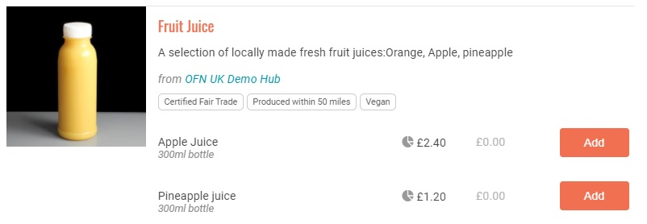

# Import von Produkten und Beständen

Mit dem Produkt- und Bestandsimport-Tool können Sie eine .csv-Datei hochladen, um Ihren Bestand hinzuzufügen und zu aktualisieren. Dies kann viel schneller und effizienter sein als das Hinzufügen oder Aktualisieren von Produkten nacheinander. Für Produzenten, die bereits einen Katalog ihrer Produkte in einer Excel-Tabelle regelmäßig aktualisieren, kann dies eine Menge Zeit sparen!

Das Tool zum Importieren von Produkten und Beständen finden Sie, indem Sie im horizontalen blauen Menü auf **Produkte** klicken und **Produktimport** im grünen Menü.

Es gibt vier Hauptmöglichkeiten, das Tool zu nutzen:

1. Neue [Produkte](./) einführen
2. Vorhandene Produktdaten aktualisieren
3. Produkte in einen neuen [Shop/Hub-Bestand](inventory-tool.md) importieren
4. Aktualisieren von Produkten in einem Shop/Hub-Inventar


Wenn Sie diese Funktion benötigen, teilen Sie dies bitte[ Ihrem örtlichen OFN ](https://openfoodnetwork.org/find-your-local-open-food-network/)mit. Wir freuen uns über Ihr Feedback.


In allen Fällen besteht das Verfahren darin, eine CSV-Vorlage herunterzuladen, die Felder auszufüllen und dann die CSV-Datei wieder in OFN hochzuladen.


**Wichtiger Hinweis zu CSV-Dateien:** Microsoft Excel kann .csv-Dateien nicht direkt öffnen. Wenn Sie die Möglichkeit haben, empfehlen wir Ihnen, das kostenlose Libre Office-Paket [https://www.libreoffice.org/download/download/](https://www.libreoffice.org/download/download-libreoffice/) herunterzuladen. Mit Libre Office Calc können Sie CSV-Dateien ganz einfach öffnen, bearbeiten und im richtigen Kodierungsformat UTF-8 speichern. Wenn Sie Libre Office nicht verwenden können, müssen Sie die folgenden Schritte ausführen, um eine CSV-Datei in Microsoft Excel zu öffnen: [https://support.office.com/en-gb/article/import- or-export-text-txt-or-csv- files-5250ac4c-663c-47ce-937b-339e391393ba](https://app.gitbook.com/s/Nv32980j4B1B2UoS6UMi/ofn-api-v0-unsupported/products)



Nicht alle Felder können mit diesem Tool erfasst und hochgeladen/aktualisiert werden. Derzeit müssen [Bilder](products.md), [Eigenschaften](product-properties.md) und [Gruppenkaufeinstellungen](group-buy-for-bulk-ordering.md) für jedes Produkt manuell hochgeladen werden.

Wir hoffen, diese in zukünftige Entwicklungen einbeziehen zu können.


## Neue Produkte importieren

Verwenden Sie diese Anweisungen, wenn Sie dem Profil eines Produzenten neue Produkte hinzufügen möchten.


Sie können mit einem einzigen CSV-Upload gleichzeitig neue Produkte hochladen und bestehende Produkte aktualisieren. Die Anweisungen in diesem Leitfaden sind der Übersichtlichkeit halber getrennt, aber Sie können neue Produkte und Aktualisierungen in derselben Tabelle kombinieren.


### Die CSV-Datei für den Import vorbereiten

Laden Sie zunächst die CSV-Datei **für die Produktlistenvorlage** von der Seite **Produktimport** herunter und öffnen Sie sie mit Libre Office, Excel oder einem ähnlichen Programm.

Sie werden sehen, dass die Vorlage alle Spaltenüberschriften enthält, die für den erfolgreichen Import eines Produkts erforderlich sind. Jede Zeile steht für ein neues Produkt oder eine neue Variante. Im Folgenden wird beschrieben, wie Sie die einzelnen Spalten ausfüllen.


**Hinweis:** Bei allen Feldern ist die Groß- und Kleinschreibung zu beachten, d.h. Sie müssen mL und Dairy verwenden, nicht ml oder dairy.


<table data-header-hidden><thead><tr><th>Titel der Kolumne</th><th>Erforderlich?</th><th width="187">Beschreibung</th><th>Example</th></tr></thead><tbody><tr><td>Column Title</td><td>Required?</td><td>Description</td><td>Beispiel</td></tr><tr><td>Hersteller</td><td>J</td><td>Der Name des Erzeugerprofils, dem dieses Produkt zugeordnet werden soll</td><td>Four Mile Farm</td></tr><tr><td>sku</td><td>N</td><td>Der SKU-Code für dieses Produkt</td><td>AD001265</td></tr><tr><td>Name</td><td>J</td><td>Der Name des Produkts</td><td>Joghurt</td></tr><tr><td>anzeige_name</td><td>N</td><td>Sie können dieses Feld verwenden, um den verschiedenen Varianten eindeutige Namen zu geben. Wenn Sie keine Variante erstellen, lassen Sie dieses Feld leer.</td><td>Himbeer-Joghurt</td></tr><tr><td>Kategorie</td><td>J</td><td>Die Produktkategorie des Artikels. Kategorien werden auf der Seite Produktimport aufgeführt</td><td>Molkerei</td></tr><tr><td>Beschreibung</td><td>N</td><td>Eine optionale Beschreibung des Produkts</td><td>Dieser Joghurt wird aus heimischen Himbeeren hergestellt</td></tr><tr><td>Einheiten</td><td>J</td><td>Das Gewicht, das Volumen oder der Mengenwert</td><td>500</td></tr><tr><td>Einheit_Typ</td><td>Vielleicht</td><td>Die Einheit, in der das Produkt verkauft wird (g, kg, T, mL, L). Wenn es als Artikel verkauft wird (z. B. Strauß), lassen Sie dieses Feld leer.</td><td>g</td></tr><tr><td>variant_unit_name</td><td>Vielleicht</td><td>Wenn das Produkt als Artikel verkauft wird (z. B. Laib, Strauß, Kürbis), geben Sie hier die Art des Artikels an.</td><td>Bündel</td></tr><tr><td>Preis</td><td>J</td><td>Der Preis des Produkts. Wenn der Artikel steuerpflichtig ist, muss dies der Preis inklusive Steuer sein.</td><td>3.70</td></tr><tr><td>on_hand (Lagerbestand )</td><td>Vielleicht</td><td>Wenn Sie einen begrenzten Lagerbestand für das Produkt haben, geben Sie hier den Lagerbestand ein. Wenn Sie einen unbegrenzten Bestand haben, lassen Sie dieses Feld leer.</td><td>40</td></tr><tr><td>verfügbar_an</td><td>N</td><td>Dieses Feld leer lassen</td><td></td></tr><tr><td>on_demand (unbegrenzter Vorrat)</td><td>J</td><td>

Wenn Sie unbegrenzten Bestand für dieses Produkt haben, geben Sie
<ol><li>Wenn Sie eine Zahl in on_hand und 1 in unlimited eingeben, wird das Produkt als unbegrenzt gekennzeichnet.</li></ol></td><td>1</td></tr><tr><td>versand_kategorie</td><td>J</td><td>Die Versandkategorie des Produkts. Kategorien werden auf der Seite Produktimport aufgeführt</td><td></td></tr><tr><td>Steuer_Kategorie</td><td>N</td><td>Die Steuerkategorie des Produkts. Die Kategorien werden auf der Seite Produktimport aufgeführt</td><td>Verringert</td></tr></tbody></table>

#### Produktvarianten importieren

Im Importprozess werden Varianten durch die Einheiten (z. B. Himbeeren in 200g- und 500g-Packungen) oder die display\_name-Felder (z. B. Äpfel in mehreren Sorten) unterschieden. Solange der Produktname derselbe ist, werden die Zeilen als Varianten importiert. Bei Produkten, die als Artikel verkauft werden, muss der unit\_type für alle Varianten gleich sein (z. B. Brötchen unten).

|                  |                  |      |     |       |
| ---------------- | ---------------- | ---- | --- | ----- |
| Himbeeren        |                  | 3.60 | 200 | g     |
| Himbeeren        |                  | 4.80 | 300 | g     |
| Äpfel            | Golden Delicious | 3.60 | 500 | g     |
| Äpfel            | Pink Lady        | 4.80 | 500 | g     |
| Vollkornbrötchen |                  | 0.40 | 2   | rollt |
| Vollkornbrötchen |                  | 1.00 | 5   | rollt |

Die folgende Abbildung zeigt, wie diese Produkte im Shop angezeigt werden. Beachten Sie, dass das Feld "Name" zur primären Überschrift und das Feld "display\_name" und/oder die Einheiten zur sekundären Überschrift werden.

.jpg>)

#### Beispiele für Einheitentypen

Im Folgenden finden Sie einige Beispiele, die zeigen, wie Produkte mit verschiedenen Einheiten (g, ml, kg und Stück) hochgeladen werden sollten.

| Hersteller           | **name**     | **Kategorie** | **Preis** | **Einheiten** | **Einheit\_Typ** | **Variante\_Einheitich** |
| -------------------- | ------------ | ------------- | --------- | ------------- | :--------------: | :----------------------: |
| Sue's Salads         | Salattasche  | Gemüse        | 3.50      | 500           |         g        |                          |
| Henry Obstgärten     | Fruchtsaft   | Getränke      | 3.50      | 300           |        ml        |                          |
| Fernwell Erzeugnisse | Kartoffeln   | Gemüse        | 9.50      | 5             |        kg        |                          |
| Tom's Bäckerei       | Vollkornbrot | Backwaren     | 3.00      | 1             |                  |           Laib           |

### Importieren Sie die CSV

Sobald Sie die **Produktlistenvorlage CSV** ausgefüllt haben, können Sie sie in OFN hochladen.

1. Gehen Sie zu **Produkte > Produktimport**.
2. Wählen Sie den Importtyp: **Produktliste**
3. **Wählen Sie eine Tabelle zum Hochladen:** Wählen Sie die CSV-Datei, die Sie mit Ihren Produktinformationen aktualisiert haben. Da Sie neue Produkte hochladen, können Sie das Kontrollkästchen "_Bestand auf Null setzen für alle Produkte, die nicht in der Datei enthalten sind_" nicht aktivieren (siehe nächster Abschnitt für eine Erklärung dieser Funktion).
4. Klicken Sie auf **Hochladen**.

Es wird eine Zusammenfassung Ihres Uploads angezeigt, einschließlich aller Fehler. Außerdem wird Ihnen angezeigt, wie viele Produkte Sie erstellen und wie viele Sie aktualisieren. Wenn Sie mit den Upload-Ergebnissen zufrieden sind, klicken Sie auf **Speichern**.


Es ist eine gute Praxis zu überprüfen, ob die Produkte wie gewünscht hochgeladen/aktualisiert wurden.


Sie können dann ein weiteres Arbeitsblatt hochladen oder zur Produktseite gehen, um Ihre neuen Produkte zu sehen.

## Vorhandene Produktdaten aktualisieren

Die folgenden Anweisungen beziehen sich auf die Aktualisierung der Details eines bestehenden Produkts. Dieses Tool ist als schnelle Möglichkeit zur Aktualisierung von Produktpreisen und Lagerbeständen gedacht.


Sie können mit einem einzigen CSV-Upload gleichzeitig neue Produkte hochladen und bestehende Produkte aktualisieren. Die Anweisungen in diesem Leitfaden sind der Übersichtlichkeit halber getrennt, aber Sie können neue Produkte und Aktualisierungen in derselben Tabelle kombinieren.


### Die CSV-Datei für den Import vorbereiten

Das Verfahren zur Aktualisierung von Produktdetails ist ähnlich wie das [Hochladen neuer Produkte](product-and-inventory-import.md#import-product-variants). Der erste Schritt besteht darin, die Produktlistenvorlage herunterzuladen und die Produkt- und Lieferantennamen einzutragen. Wenn Sie dieses Arbeitsblatt von einem früheren Upload zur Hand haben, ist es noch besser.

Das System benötigt sieben Felder, um das Produkt, das Sie aktualisieren möchten, korrekt zu identifizieren. Es gibt vier Felder, die mit diesem Tool aktualisiert werden können, und vier Felder, die nicht aktualisiert werden können.

| Erforderliche Felder (können nicht aktualisiert werden) | 
Felder, die Sie aktualisieren

können
 | Felder, die nicht aktualisiert werden und nicht erforderlich sind |
| ------------------------------------------------------- | ------------------------------------------------- | ----------------------------------------------------------------- |
| \*produzent                                             | sku                                               | ^Variante\_Einheit\_Name                                          |
| \*name                                                  | Preis                                             | ^tax\_category                                                    |
| ^Kategorie                                              | vorrätig                                          | ^versand\_kategorie                                               |
| \*Einheiten                                             | unbegrenzt                                        | ^Beschreibung                                                     |
| ^unit\_type (falls zutreffend)                          |                                                   |                                                                   |
| ^variant\_unit\_name (falls zutreffend)                 |                                                   |                                                                   |
| \*Display\_name                                         |                                                   |                                                                   |

_^_ Wenn Sie versuchen, diese Felder zu aktualisieren, erhalten Sie eine Fehlermeldung

\*Wenn Sie versuchen, diese Felder zu aktualisieren, erstellen Sie eher neue Produkte oder Varianten, als dass Sie ein bestehendes Produkt aktualisieren.

Sobald die .csv-Datei vollständig ist, kann sie auf die gleiche Weise wie bei neuen Produkten [importiert](product-and-inventory-import.md#import-the-csv) werden.


**Setzen Sie den Bestand für alle auslaufenden Produkte, die nicht in der Datei vorhanden sind, auf Null:**\
Wenn Sie dieses Kontrollkästchen aktivieren, setzt das System den Wert "Auf Lager" für alle Produkte in Ihrer Produktliste auf Null.

Wenn ein Produkt "Unbegrenzt" war, bleibt es "Unbegrenzt".

&#x20;Die Produkte in diesem Import behalten den in der .csv-Datei festgelegten Lagerbestand bei.


## Importieren Sie neues Inventar oder aktualisieren Sie Ihr Inventar

Verwenden Sie diese Anweisungen, wenn Sie neue Produkte zu Ihrem [Bestand](inventory-tool.md) hinzufügen oder aktualisieren möchten.

### Die CSV-Datei für den Import vorbereiten

Laden Sie zunächst die CSV-Datei mit der **Inventarvorlage von** der Seite **Produktimport** herunter.

Sie werden sehen, dass die Vorlage alle Spaltenüberschriften enthält, die für den erfolgreichen Import eines Produkts erforderlich sind. Jede Zeile steht für ein neues Produkt oder eine neue Variante. Im Folgenden wird beschrieben, wie Sie die einzelnen Spalten ausfüllen.


**Beachten Sie,** dass bei allen Feldern zwischen Groß- und Kleinschreibung unterschieden wird. Sie müssen z. B. mL und nicht ml verwenden, oder Molkerei und nicht molkerei.


| Titel der Kolumne       | Erforderlich?? | Beschreibung                                                                                                                                                                                                                                                                                                                                                         | Beispiel                                     |
| ----------------------- | -------------- | -------------------------------------------------------------------------------------------------------------------------------------------------------------------------------------------------------------------------------------------------------------------------------------------------------------------------------------------------------------------- | -------------------------------------------- |
| Hersteller              | J              | Dies ist der Name des Erzeugerprofils, dem dieser Bestandsposten zugeordnet werden soll                                                                                                                                                                                                                                                                              | Four Mile Farm                               |
| Verteiler               | J              | Dies ist der Name des Hub-Profils, dem der Bestandsposten zugeordnet wird                                                                                                                                                                                                                                                                                            | Demo Hub                                     |
| name                    | J              | Dies ist der Name des Produkts                                                                                                                                                                                                                                                                                                                                       | Joghurt                                      |
| Anzeigename             | N              | Dieses Feld wird verwendet, wenn Sie Varianten erstellen (siehe Anleitung unten). Wenn Sie keine Variante erstellen, lassen Sie dieses Feld leer.                                                                                                                                                                                                                    | Himbeer-Joghurt                              |
| variant\_unit\_name     | J              | Wenn das Produkt als Artikel verkauft wird (z. B. Laib, Strauß, Kürbis), geben Sie hier die Art des Artikels an.                                                                                                                                                                                                                                                     | Bündel                                       |
| Einheiten               | J              | Das Gewicht, das Volumen oder der Mengenwert                                                                                                                                                                                                                                                                                                                         | 500                                          |
| Einheit\_Typ            | J              | In welcher Einheit wird es verkauft (g, kg, T, mL, L)? Wenn als Artikel verkauft (z. B. Strauß) leer lassen                                                                                                                                                                                                                                                          | g                                            |
| Preis                   | J              | Der Preis des Produkts. Wenn der Artikel steuerpflichtig ist, muss dies der Preis inklusive Steuer sein.                                                                                                                                                                                                                                                             | 3.70                                         |
| Vorrätig (in\_stock)    | J              | Bitte prüfen Sie die nachstehenden Regeln für unbegrenzte Anzahl von Personen                                                                                                                                                                                                                                                                                        | leer lassen, da unbegrenzt auf 1 gesetzt ist |
| On\_demand (unbegrenzt) | J              | 
Wenn der Wert leer ist, wird er als "Einstellungen für den Lagerbestand des Herstellers verwenden" gelesen, daher sollte "in_stock" leer sein. Wenn Sie es auf "1" setzen - Lesen Sie als unbegrenzt von "Ja",

1

also sollte "in_stock" leer sein. WennSie es auf "0" setzen - Lesen als unbegrenzt von "Nein", also "in_stock" ist erforderlich.
 | 1                                            |
| sku                     | N              | Der SKU-Code für dieses Produkt                                                                                                                                                                                                                                                                                                                                      | AD001265                                     |

### Importieren Sie die CSV 

Sobald Sie die **Inventarvorlage CSV** ausgefüllt haben, können Sie sie in OFN hochladen.

1. Gehen Sie zu **Produkte > Produktimport**.&#x20;
2. **Wählen Sie die Importart:** Vorräte auswählen&#x20;
3. **Wählen Sie ein Arbeitsblatt zum Hochladen**&#x20;
4. Klicken Sie auf **Hochladen**.

Es wird eine Zusammenfassung Ihres Uploads angezeigt, einschließlich aller Fehler. Außerdem wird Ihnen angezeigt, wie viele Produkte Sie erstellen und wie viele Sie aktualisieren. Wenn Sie mit den Upload-Ergebnissen zufrieden sind, klicken Sie auf **Speichern**.


Es ist eine gute Praxis zu überprüfen, ob die Produkte wie gewünscht hochgeladen/aktualisiert wurden.

