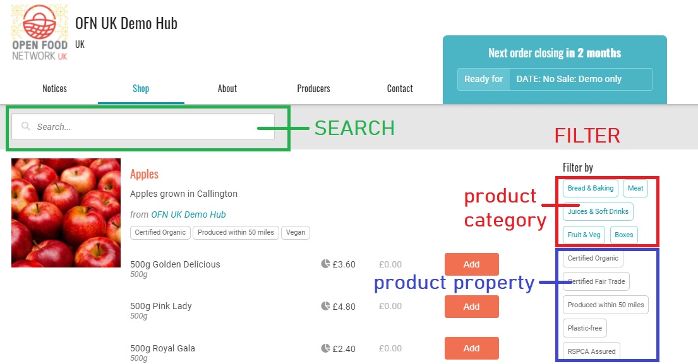

# Product properties


--&gt;​ Diese Seite ist noch nicht ins Deutsche übersetzt. Wenn du mithelfen möchtest, melde dich gerne bei uns [per E-Mail](mailto:konrad@openfoodnetwork.de) oder [im Slack](https://join.slack.com/t/openfoodnetwork/shared_invite/zt-9sjkjdlu-r02kUMP1zbrTgUhZhYPF~A)!


You can apply product properties to your products, as a way of letting your customers know more about how your products are produced and what their characteristics are. Current product properties that can be applied include:



This is a list of product and enterprise properties available in Australia:

* Free Range
* Organic - Certified
* Chem-Free
* Certified Naturally Farmed
* Grass Fed
* Biodynamic - Certified
* Organic - conv
* Fair Trade
* MSC
* Organic - Non certified
* org-C
* Organic
* Australian Certified Organic
* Biodynamic - In Conversion
* Pasture Raised
* Nitrate Free
* No Artificial Colours or Flavours
* Preservative Free
* Plastic Free
* Raw
* Vegan
* Vegetarian
* Gluten Free
* Nut Free
* Refined Sugar Free
* Dairy Free



* Organic - certified
* Organic - not certified
* Fair trade
* Local - within 100 km
* GMO free
* Gluten free
* Vegan
* Ethically sourced
* Biodegradable
* No spray
* Integrated pest management
* Rainforest alliance certified
* Fgh
* Free-range
* My Pick Verified local farmer
* Coupon 



This is a list of product and enterprise properties available in the UK:

* Certified Organic/ Fair Trade / Biodynamic
* Produced within 15 / 30 / 50 miles
* RSPCA assured
* Grown in Polycultures
* Gluten-free
* Nut-free
* Plastic-free
* Dairy-free
* Special Dietary Requirements
* Vegan
* Vegetarian
* Special Offer
* Green Coffee Shop Scheme
* Certified Kosher
* Certified Halal
* Christmas
* Imported




* AB
* Certified Organic 
* Grass Fed and Finished
* Pasture Raised 
* Biodynamic
* Certified Naturally Grown 
* Chemical-Free
* Animal Welfare Approved 
* Non-GMO 
* Verified FSMA Compliant 
* Plastic-free 
* Certified Organic Ingredients 
* Conventionally Grown 
* Organically grown or raised, not certified 
* Hand crafted



* AB
* EU bio
* Demeter
* Raisonné
* Elevé sous la mère
* Bio cohérence
* Nature & Progrès
* Paysans de nature
* Autre bio
* MSV
* Conversion
* Tinda








If you'd like to apply a property which is not listed above then please get in touch. We consider any new properties which might have widespread appeal.


There are two ways to assign properties to your products:

1\) You can assign a property to an enterprise, so that all products belonging to that enterprise will carry this property \(unless it’s manually removed, which is covered in the **“Inherited Properties”** section below\).

2\) You can assign properties to particular products, on an individual basis.

## Assigning a property to an enterprise

When you assign a property to an enterprise, all products belonging to that enterprise will, by default, carry that product property. For instance, if all of your products are ‘Certified Organic’, you can assign this property to your enterprise, to save you from needing to manually apply this property to every product. If a property only applies to a few of your products, it’s better to apply it to the product, instead of the enterprise \(instructions below\).  

You can access enterprise properties in your [Enterprise Settings](../enterprise-profile/enterprise-settings.md): in your Admin dashboard go to Enterprises -&gt; Settings -&gt; Properties


Properties only apply to [Producer](../enterprise-profile/package-types.md#for-producers) profiles, shops and hubs.  This option will not be available to Non Producer Hubs.


Next, there are 2 fields when applying an enterprise property:

**Property Name:** You can select a pre-defined product property from the drop-down list. This is the name of the property that your products will be tagged with, and which customers will be able to filter for in your shop.

**Description:** You can add a small description to give more information about your label. For example you may wish to add a certificate number.


You can add as many properties as you wish to your enterprise.



Don't forget to save your changes by clicking 'Update' in the red box, bottom right.


## Assigning a property to a product

To assign a property to a single product, rather than an enterprise’s entire product range, click on **Products** in the horizontal blue banner, and then edit an existing product \(you cannot apply a product property when you are first creating a product\).

To edit a product, click on the edit icon \(pencil and paper\) on the right hand side of the table.

Once editing the product you can add or change its properties by selecting 'Product Properties' from the right hand menu.

There are 2 fields when applying a product property:

**Property Name:**You can select a pre-defined product property from the drop-down list. This is the name of the property that your product will be tagged with, and which customers will be able to filter for in your shop.

**Description:** You can add a small description to give more information about your label. For example you may wish to add a certificate number.

You can apply multiple product properties by clicking “**+ Add Product Properties**“


Remember to click **update** when you are finished.


## Inherited Properties

As discussed [above](product-properties.md#assigning-a-property-to-an-enterprise), when an enterprise is assigned a property, all products belonging to that enterprise will ‘inherit’ this property. However, it is possible to override this automatic inheritance.

When editing a product’s properties you will see a checkbox titled **“Inherit properties from \(Enterprise Name\)\(Unless Overridden Above\)”.** By default, when an enterprise has a property, this box will be checked for all products belonging to the enterprise. Unchecking this box will remove any enterprise properties that have been inherited.


If you left the box checked and you add a property to the product, which already exists at the enterprise level, the description of the property added at the product level will be preferred to the description at the enterprise level. 

This is useful if you would like to modify only the description of a label on selected products. \(For example, if all your products are 'Certified Organic', but two products have a different certificate number to the rest then you can add the main certificate number to the enterprise property description and the other number to the two products which are different using these product property descriptions.\)


## View Product Properties in online shop

By clicking on the profile of a producer, Enterprise Properties appear on the pop out page:

Customers can also filter products in a shop based on their properties:

