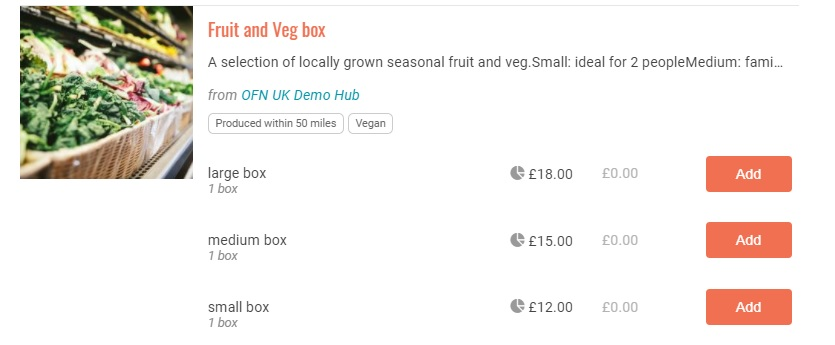

# Produktvarianten


-->​ Diese Seite ist noch nicht ins Deutsche übersetzt. Wenn du mithelfen möchtest, melde dich gerne bei uns [per E-Mail](mailto:konrad@openfoodnetwork.de) oder [im Slack](https://join.slack.com/t/openfoodnetwork/shared\_invite/zt-9sjkjdlu-r02kUMP1zbrTgUhZhYPF\~A)!


Wenn Sie zwei oder mehr Produkte anbieten, die sich sehr ähnlich sind, sich aber nur im Preis, in der Größe oder im Geschmack unterscheiden, ist es am besten, eine "Variante" für dieses Produkt zu erstellen, anstatt mehrere separate Produkte anzulegen. Dadurch wird die Auflistung für die Kunden übersichtlicher und verhindert, dass Ihr Shop unübersichtlich wird.

## Wie kann ich eine Produktvariante erstellen?&#x20;

Zunächst muss ein Produkt erstellt werden, das automatisch auch die erste Variante dieses Produkts sein wird. Für weitere Details über das Hinzufügen einfacher Produkte, klicken Sie [hier](products.md).

Gehen Sie in Ihrem Admin-Dashboard auf die Seite "Produkte", wo Sie die Liste der Produkte der von Ihnen verwalteten "Hersteller"-Firmen finden. Um **alle** mit Ihren Produkten verbundenen **Varianten zu** sehen, klicken Sie oben links in der Tabelle auf "Alle erweitern" in Rot.

Um nur die Varianten eines bestimmten Produkts zu sehen, klicken Sie auf den Winkel ">" links neben der ersten Spalte der Tabelle. Wenn Sie eine neue Variante für dieses Produkt erstellen möchten, klicken Sie auf das kleine Plus "+", das wie oben abgebildet direkt darunter angezeigt wird.

Dadurch wird eine neue Zeile eingefügt, in die Sie schnell Informationen über die zweite Variante eingeben können:

Die erste Zeile entspricht dem "Mutterprodukt", das den Kunden in Form mehrerer Varianten zum Kauf angeboten wird. Einige Informationen auf Produktebene gelten daher für alle Varianten, z. B. die Maßeinheit, der Name der Einheit, wenn das Produkt einzeln verkauft wird, die Eigenschaften, die Transportbedingungen usw.

Die 2. und 3. Zeile sind hier die 2 Varianten des Produkts. Jede Variante unterscheidet sich von den anderen durch mindestens ein Unterscheidungsmerkmal, wie z. B. die Einheit (z. B. Verpackung pro 500 g anstelle von 100 g bei der ersten Variante) und, sehr häufig, den zugehörigen Preis. Geringfügige Unterschiede in der Beschaffenheit eines Produkts (z. B. im Geschmack) können durch eine Änderung der Bezeichnung der einzelnen Varianten angegeben werden (z. B. heißt die erste Variante "Ziegenkäse- Kräuter" und die zweite Variante "Ziegenkäse-Knoblauch").


Um Fehler beim Lesen von Berichten zu vermeiden, empfehlen wir Ihnen dringend, die einzelnen Varianten immer unterschiedlich zu benennen.



Zur Zeit können die Bestände nur **auf der Ebene der Variante** definiert werden.

&#x20;Wir wissen, dass dies ein Problem sein kann, wenn Sie eine feste Menge eines Artikels haben, aber sowohl in großen Mengen als auch einzeln verkaufen möchten. (Wenn Sie z. B. insgesamt nur 5 kg Tomaten haben, diese aber in Varianten von 100 g und 1 kg verkaufen möchten, müssen Sie Ihre Lagerbestände zwischen den beiden Varianten manuell verwalten).



Es gibt keine maximale Anzahl von Varianten für ein Produkt. Sie können so viele Varianten hinzufügen, wie Sie benötigen.



Wenn Sie fertig sind, wählen Sie immer "Änderungen speichern" in dem roten Feld unten rechts auf dem Bildschirm.

