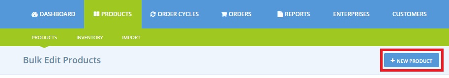
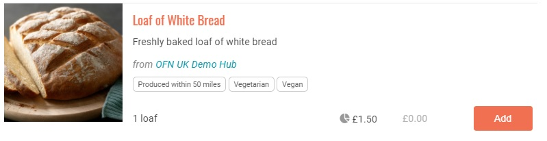
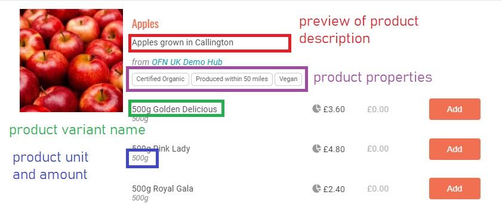
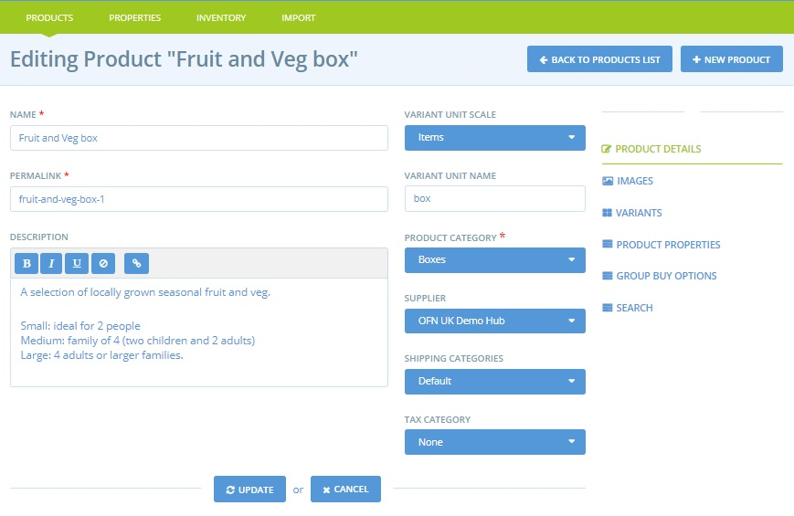
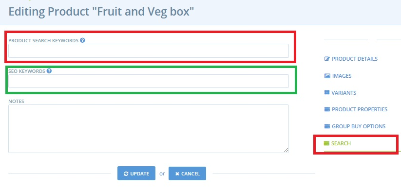

# Produkte hinzufügen

Sie können Ihrem Katalog entweder Produkte einzeln hinzufügen (siehe unten) oder per [Massenimport](product-and-inventory-import.md), wenn Sie alle relevanten Details in einer .csv-Datei haben.

## Hinzufügen von Produkten

Wenn Sie im Admin Dashboard eingeloggt sind, wählen Sie im horizontalen blauen Menü die Option **Produkte** und klicken Sie dann auf **+ Neues Produkt**.

Dadurch gelangen Sie auf die Seite Neues Produkt.

**Anbieter**&#x20;

Wählen Sie das Unternehmen, das das Produkt herstellt und liefert.


Wenn Sie ein Produzent sind, werden Sie das sein. Wenn Sie ein Hub sind, denken Sie daran, dass Sie nur Produkte zu Produzentenprofilen hinzufügen können, die Sie erstellt haben, oder wenn Sie die Erlaubnis erhalten haben, die Produkte eines Produzentenprofils zu verwalten. Siehe [hier](../enterprise-profile/create-or-connect-with-your-supplying-producers.md) für weitere Informationen.


**Produktname:** Dies ist der Titel des Produkts, der auf der Schaufensterfront angezeigt wird.


Die Produkte werden in Ihrem Schaufenster alphabetisch nach Produktnamen geordnet. Diese Standardreihenfolge kann über das Feld "Schaufenster-Kategorie-Reihenfolge" in Ihren [Unternehmenseinstellungen](../enterprise-profile/enterprise-settings.md#shop-einstellungen) außer Kraft gesetzt werden.


**Einheiten:** Wählen Sie die Einheit, in der das Produkt verkauft wird (g, oz, lb, kg, L... oder Artikel (Bündel, Beutel, Paket))

Wenn Sie g wählen und dann 1000 eingeben, wird das Produkt für den Käufer als 1 kg angezeigt. Denken Sie daran, dass einige Maßeinheiten Auswirkungen auf den Betrieb bestimmter [Unternehmensgebühren](../shopfront/enterprise-fees.md) haben.

Zum Beispiel kann eine [feste Gebühr nach Gewicht ](../shopfront/enterprise-fees.md#fee-calculators)nur auf Produkte mit der Einheit kg angewendet werden. In diesem Fall können Sie nicht-ganzzahlige Einheiten eingeben, z. B. 0,2 kg, und das Produkt wird als 200 g angezeigt, aber in den Berichten und bei der Preisberechnung in kg erfasst.

**Wert:** Geben Sie den Wert der Einheiten ein, in denen dieses Produkt verkauft wird (wenn es z. B. als 100 g verkauft wird, geben Sie hier "100" ein und wählen Sie "g" für "Einheiten"; oder wenn es als Blumensträuße verkauft wird, geben Sie hier "1" ein und "Einheiten= Stück".&#x20;

**Anzeigen als:** Dieses Feld zeigt Ihnen automatisch an, wie die Einheiten und Wertfelder angezeigt werden, sobald Sie die Einheiten und Wertfelder ausgefüllt haben. (d.h. Einheiten = kg, Wert = 2, Anzeige als = 2kg)


Hinweis: Wenn Sie "**Artikel**" als Einheit ausgewählt haben, ändert sich das Feld "**Anzeige als**" in "**Artikelname**". Geben Sie hier die Art des Artikels an. (z. B. Glas, Flasche oder Bündel)


**Produktkategorie:** Wählen Sie die am besten geeignete Kategorie für dieses Produkt. Die Zuweisung einer Produktkategorie erleichtert es den Kunden, die gewünschten Artikel zu finden; Käufer können Ihre Produktliste auf der Startseite Ihres Shops nach Kategorien filtern.

**Price:** Enter the price for the value noted above. Note, this is the base price charged by the producer and the amount they will receive for each purchase. Mark-ups and fees (for distribution admin etc) are added in [Enterprise Fees](../shopfront/enterprise-fees.md), [Shipping Fees](../shopfront/shipping-methods.md#fee-calculators) and [Payment Methods](../shopfront/payment-methods.md#fee-calculators).&#x20;

**Preis:** Geben Sie den Preis für den oben genannten Wert ein. Beachten Sie, dass dies der Grundpreis ist, den der Hersteller berechnet, und der Betrag, den er für jeden Kauf erhält. Aufschläge und Gebühren (für Vertrieb, Verwaltung usw.) werden unter "[Unternehmensgebühren](../shopfront/enterprise-fees.md)", "[Versandgebühren](../shopfront/enterprise-fees.md#fee-calculators)" und "[Zahlungsarten](../shopfront/enterprise-fees.md#fee-calculators)" angegeben.


Wenn Ihr Unternehmen als steuerpflichtig registriert ist oder Sie auswählen, dass dieses Produkt steuerpflichtig ist, dann ist der Preis, den Sie hier eingeben, inklusive der Steuer. Wenn Sie auswählen, dass dieses Produkt steuerfrei ist, ist der Preis, den Sie eingeben, der steuerfreie Preis.


**Vorrätig:** Geben Sie an, wie viel Sie von diesem Produkt vorrätig und zum Verkauf bereit haben.&#x20;

Verwenden Sie dieses Feld, wenn Sie Ihre Lagerbestände verfolgen möchten. Wenn Kunden Bestellungen aufgeben, verringert sich der Lagerbestand, und wenn der Lagerbestand Null erreicht, wird das Produkt nicht mehr in Ihrem Shop angezeigt. Wenn Sie den Bestand nicht auf diese Weise verfolgen möchten, klicken Sie auf "auf Anfrage".

**Auf Anfrage:** Wenn Sie dieses Kontrollkästchen aktivieren, wird angezeigt, dass dieses Produkt immer verfügbar ist. Die Software verfolgt dann nicht mehr die Lagerbestände der Produkte, sondern zeigt immer an, dass das Produkt auf Lager ist.

**Bild:** Laden Sie ein Foto von diesem Produkt hoch.


Die Produktbilder werden auf dem Schaufenster im **quadratischen (1:1) Format** angezeigt. Wir empfehlen, Fotos mit diesen Abmessungen hochzuladen. Fotos im Quer- und Hochformat werden automatisch auf ein quadratisches Format beschnitten.



Hochauflösende Bilder werden automatisch verkleinert, wenn sie in Ihrer Produktliste angezeigt werden, abhängig vom Gerät des Kunden.



Wir empfehlen, Fotos von guter Qualität zu verwenden, vorzugsweise ein echtes Foto Ihrer Produkte und nicht ein Standardbild aus dem Internet. Das macht das Produkt für den Verbraucher attraktiver. Machen Sie Ihre Fotos immer bei gutem Licht. Wenn Sie ein Bild aus dem Internet verwenden, prüfen Sie, ob es frei von Rechten ist.


**Steuerkategorie:** Wählen Sie die zutreffende Steuerkategorie aus der Dropdown-Liste. Die Steuer (MwSt. im Vereinigten Königreich) hängt von der Art des Produkts und dem Land ab, in dem Sie den Einzelhandel betreiben.


Die Steuer wird nur erhoben, wenn Unternehmen in ihren Unternehmenseinstellungen -> Unternehmensdetails die Option "Mehrwertsteuer erheben = ja" gewählt haben.


**Beschreibung des Produkts:** Erzählen Sie Ihren Kunden ein wenig über dieses Produkt. Vielleicht möchten Sie eine Geschichte über die spezielle Tomatensorte erzählen, Hyperlinks zu eventuellen Zertifizierungen einfügen usw.


Vergessen Sie nicht, auf die Schaltfläche "Erstellen" oder "Erstellen und neu hinzufügen" am unteren Ende der Seite zu klicken, sobald alle Pflichtfelder ausgefüllt sind (die mit einem roten Sternchen gekennzeichnet sind).


Eine kurze Demonstration der oben beschriebenen Schritte:

Wenn Sie die Erstellung eines Produkts abgeschlossen haben, werden Sie auf die Seite "Produkte" weitergeleitet, auf der Sie alle Ihre Produkte finden:


Die in Ihrem Verwaltungsbereich aufgelisteten Produkte können alphabetisch nach Namen sortiert werden (klicken Sie in der Tabelle auf 'NAME', um dies zu aktivieren).


So werden Ihre Produkte den Kunden auf der Ladenfront präsentiert:

## Auflistung ähnlicher/Variationen eines Produkts&#x20;

Wenn Sie ein Produkt anbieten, das in verschiedenen Varianten erhältlich ist (z. B. in verschiedenen Größen oder Geschmacksrichtungen, von denen jede einen anderen Preis haben kann oder auch nicht), ist es am besten, eine "Variante" für dieses Produkt zu erstellen, anstatt mehrere separate Produkte anzulegen. Die Erstellung von Produktvarianten wird auf der [nächsten Seite](product-variants.md) ausführlich behandelt.


Varianten sind nützlich, wenn Sie z. B. Zitronen sowohl einzeln als auch in 5er-Packungen verkaufen. Anstatt zwei Produkteintragungen zu haben, können die beiden Optionen für dasselbe Produkt verfügbar sein.


Wenn Sie ein GLEICHARTIGES Produkt erstellen möchten, können Sie Produkte duplizieren, indem Sie das Doppelseiten-Symbol rechts neben einem Artikel (roter Kasten) auswählen. Durch anschließendes Auswählen des Bleistift- und Papiersymbols (grüner Kasten) kann das kopierte Produkt bearbeitet und die Details für den zweiten Artikel geändert werden.

## Bearbeiten Sie Ihre Produkte

Sobald ein Produkt erstellt ist, können Sie seine Attribute, wie z. B. Menge, Preis und Lagerbestand, am besten über die oben gezeigte Seite "Produkte auflisten" schnell bearbeiten.

Um Bilder, Produktbeschreibungen, Kategorien und mehr zu bearbeiten, können Sie auf das Bearbeitungssymbol (Stift auf Papier) rechts neben dem betreffenden Produkt in der Tabelle klicken. Daraufhin wird die folgende Seite angezeigt:

Im Menü auf der rechten Seite können Sie etwas hinzufügen:

* **Eigenschaften oder Etiketten** für Ihre Produkte. Auf diese Weise können Kunden Ihre Artikel finden, wenn sie nach bestimmten Kriterien suchen (z. B. "Bio-zertifiziert"), und bestimmte Eigenschaften Ihrer Produkte hervorheben. Mehr dazu erfahren Sie [hier](product-properties.md).
* **Gruppenkauf:** Damit können Sie den Verkauf von Produkten in großen Mengen verwalten und organisieren. Lesen Sie [hier](group-buy-for-bulk-ordering.md) mehr darüber.
* **Search** terms described [below](products.md#search-keywords).
* [Nachstehend](products.md#search-keywords) beschriebene Suchbegriffe.

Tipps für die Verwaltung des Verkaufs "unregelmäßiger" Produkte wie Fleisch oder großes Gemüse, das in Einheiten verkauft, aber nach Gewicht berechnet wird, finden Sie [hier](pricing-irregular-items-kg.md).


**Bearbeiten Sie nicht** das Feld **Permalink**. Dies verbindet Ihr Produkt intern mit einem Eintrag in der OFN-Datenbank. Eine Bearbeitung kann den Produkteintrag beschädigen.


### Suchbegriffe

Kunden können Ihre Produkte filtern, um anhand ihrer Produktkategorie und ihrer Produkteigenschaften herauszufinden, was sie kaufen möchten. Die Filter befinden sich auf der rechten Seite der Shop-Seite.

Einige Kunden werden das Suchfeld oben links auf der Seite verwenden, um ihre Produkte zu finden. Die folgenden Felder werden über dieses Feld durchsucht:

* Produktname
* Variantenname
* Herstellername
* Suchbegriffe

Schlüsselwörter können unter **Produkt bearbeiten -> Suche** hinzugefügt werden. Schlüsselwörter, die in das oberste Feld (unten in rot) eingegeben werden, werden von der Plattform überprüft, wenn der Kunde das Feld "Suchen" auf Ihrer Shopseite verwendet. Die in das zweite Feld (unten in grün) eingegebenen Stichwörter werden von externen Suchmaschinen im Internet (z. B. Google) durchsucht.

Der Abschnitt "Anmerkungen" ist kein aktives Feld. Es ist ein praktisches Feld, in dem Sie einen saisonalen Suchbegriff notieren können, der in einem Jahr sehr wirksam/unwirksam sein kann, damit Sie ihn nicht vergessen.
