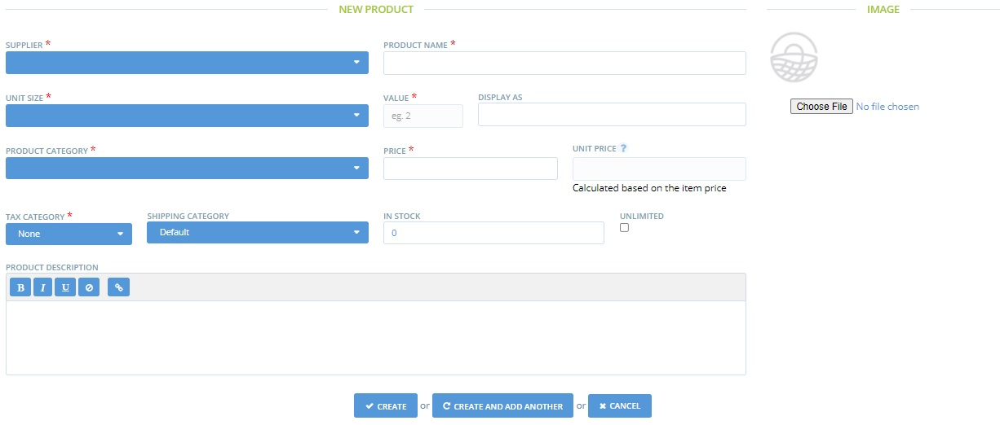
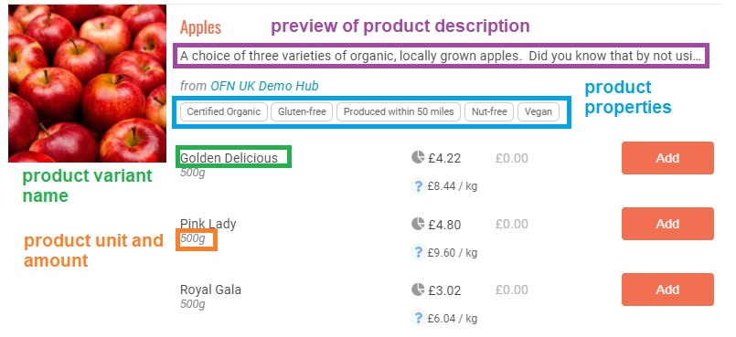

# Ajouter des produits

Vous pouvez ajouter des produits à votre catalogue un par un (voir ci-dessous) ou par importation en masse, si vous disposez de tous les détails pertinents dans un fichier .csv.

## Comment Ajouter des Produits

Une fois connecté au tableau de bord de l'administrateur, sélectionnez **Produits** dans le menu bleu horizontal, puis cliquez sur **+ Nouveau produit**.

Vous arriverez à la page Nouveau Produit.

**Fournisseur**

Sélectionnez l'entreprise qui produit et fournit.


Si vous êtes un producteur, ce sera vous. Si vous êtes un hub, rappelez-vous que vous ne pourrez qu'ajouter des produits aux profils de producteurs que vous avez créés, ou si vous avez été autorisé à gérer les produits d'un profil de producteur. Voir ici pour plus d'informations.


**Nom du produit** : il s'agit du titre du produit lorsqu'il est affiché sur la façade du magasin.


Les produits sont répertoriés sur votre vitrine dans l'ordre alphabétique de leur nom. Ce classement par défaut peut être modifié en utilisant le champ "Classement par catégorie de la vitrine" dans les paramètres de votre entreprise.


**Unités** : Choisissez l'unité dans laquelle le produit est vendu (g, oz, lb, kg, L... ou article (grappe, sac, paquet)).

Si vous choisissez g et entrez ensuite 1000, le produit sera affiché comme 1kg pour l'acheteur. N'oubliez pas que certaines unités de mesure auront un impact sur le fonctionnement de certains frais d'entreprise.&#x20;

Par exemple, une redevance fixe au poids ne peut être appliquée qu'aux produits dont l'unité est le **kg**. Dans ce cas, vous pouvez saisir des nombres d'unités non entiers, comme 0,2 kg, et le produit sera affiché comme 200 g mais sera enregistré en kg sur les rapports et lors du calcul des prix.

**Valeur** : Entrez la valeur des unités dans lesquelles ce produit est vendu (par exemple, s'il est vendu en 100 g, entrez '100' ici et choisissez 'g' pour 'unités' ; ou s'il est vendu en bouquets de fleurs, entrez '1' ici et 'unités= articles'.&#x20;

**Afficher sous** : Ce champ vous montre automatiquement comment les champs d'unités et de valeurs s'afficheront, une fois que vous les aurez remplis. (par exemple, unités = kg, valeur = 2, s'affichera comme = 2kg).


Si vous avez sélectionné "articles" comme unité, le champ "Afficher sous" devient "Nom de l'article". Remplissez ce champ avec le type d'article dont il s'agit. (par exemple, un pot, une bouteille ou un bouquet).


**Catégorie du produit** : Sélectionnez la catégorie la plus appropriée pour ce produit. L'attribution d'une catégorie de produit permet aux clients de localiser plus facilement les articles qu'ils souhaitent acheter ; les acheteurs peuvent filtrer votre liste de produits par catégorie sur votre vitrine.&#x20;

**Prix** : Saisissez le prix de la valeur indiquée ci-dessus. Notez qu'il s'agit du prix de base facturé par le producteur et du montant qu'il recevra pour chaque achat. Les majorations et les frais (pour l'administration de la distribution, etc.) sont ajoutés dans les rubriques Frais d'entreprise, Frais d'expédition et Méthodes de paiement.


Si votre entreprise est enregistrée pour la taxe ou si vous sélectionnez que ce produit est soumis à la taxe, le prix que vous indiquez ici est TTC. Si vous sélectionnez que ce produit est hors taxe, le prix que vous saisissez sera le prix hors taxe.


**Prix unitaire** : Il sera automatiquement calculé pour vous à partir de l'unité et du prix fournis. Si les unités sont en poids ou en volume, le prix unitaire sera le coût par kg/L, etc. Si les unités sont des "articles", le prix unitaire sera le coût par article.&#x20;

**En stock** : Indiquez la quantité de ce produit dont vous disposez et qui est prête à être vendue.

Utilisez ce champ si vous souhaitez suivre vos niveaux de stock. Au fur et à mesure que les clients passent des commandes, le niveau de stock diminue, et lorsque le montant en stock atteint zéro, le produit n'est plus visible dans votre boutique. Si vous ne souhaitez pas suivre les stocks de cette manière, cliquez sur "à la demande".&#x20;

**À la demande** : Si vous sélectionnez cette case, cela indiquera que ce produit est toujours disponible. Cela empêche le logiciel de suivre les niveaux d'inventaire des produits et indique toujours que le produit est en stock.&#x20;

**Image** : Téléchargez une photo de ce produit.


Les images des produits seront affichées sur la vitrine au format carré (1:1). Nous vous recommandons de télécharger des photos ayant ces dimensions. Les photos en format paysage et portrait seront automatiquement recadrées au format carré.



Les images haute résolution sont redimensionnées (réduction de la dimension en pixels) automatiquement lorsqu'elles sont affichées dans votre liste de produits, en fonction de l'appareil du client.



Nous vous recommandons d'utiliser des photos de bonne qualité, de préférence une photo réelle de vos produits plutôt que l'image standard du web. Cela rend le produit plus attrayant pour le consommateur. Prenez toujours vos photos dans une bonne lumière.&#x20;

Néanmoins, si vous utilisez une image du web, vérifiez qu'elle est libre de droits.


**Catégorie de taxe** : Sélectionnez la catégorie de taxe applicable dans la liste déroulante. La TVA dépend de la nature du produit et du pays dans lequel vous vendez au détail.


La taxe ne sera collectée que si les entreprises ont sélectionné 'charges TVA = oui' dans leurs paramètres d'entreprise -> Détails de l'entreprise.


**Description du produit** : Dites à vos clients quelques mots sur ce produit. Vous pouvez inclure une histoire sur la variété spécifique de tomate, inclure des liens vers toute certification qu'elle peut avoir, etc.


N'oubliez pas de cliquer sur le bouton "créer" ou "créer et ajouter" en bas de la page une fois que tous les champs obligatoires ont été saisis (ceux indiqués par un astérisque rouge).


Voici une courte démonstration des étapes décrites ci-dessus :

Lorsque vous avez terminé de créer un produit, vous êtes redirigé vers la page "produits" où vous trouverez la liste complète de vos produits :


Les produits figurant dans votre panneau d'administration peuvent être triés par ordre alphabétique de leur nom (cliquez sur "NOM" dans le tableau pour mettre en œuvre cette fonction).


C'est ainsi que vos produits seront présentés à vos clients sur la façade de la boutique :

## Lister les variantes d'un produit&#x20;

Si vous mettez en vente un produit qui existe en plusieurs options (par exemple, différentes tailles ou différents parfums, dont le prix peut varier ou non), il est préférable de créer une "variante" pour ce produit, plutôt que de créer plusieurs produits distincts. La création de variantes de produits est abordée en détail à la page suivante.


Les variantes sont utiles si, par exemple, vous vendez des citrons à l'unité ainsi que par "paquets" de cinq. Plutôt que d'avoir deux listes de produits, les deux options peuvent être disponibles pour le même produit.


Si vous souhaitez créer un produit **similaire**, vous pouvez dupliquer des produits en sélectionnant l'icône de double page à droite d'un article (encadré rouge). En sélectionnant ensuite l'icône du crayon et du papier (encadré vert), le produit copié peut être édité et les détails modifiés pour le deuxième article.

## Modifier un Produit

Une fois qu'un produit est créé, le meilleur endroit pour modifier rapidement ses attributs, tels que la quantité, le prix et le niveau de stock, est la page de liste des produits illustrée ci-dessus.&#x20;

Pour modifier les images, les descriptions de produits, les catégories et autres, vous pouvez sélectionner le symbole de modification (icône représentant un stylo sur du papier) à droite du produit en question dans le tableau. La page suivante s'affiche alors :

Dans le menu de droite, vous pourrez ajouter

* **Les propriétés ou les étiquettes de vos produits**. Cela permet aux clients de trouver vos articles lorsqu'ils recherchent des critères spécifiques (par exemple, certifié biologique) et met en évidence les qualités spécifiques que vos produits peuvent avoir. Pour en savoir plus, cliquez ici.&#x20;
* **Achat groupé** : Cette fonction vous permet de gérer et d'organiser la vente de produits par lots. Pour en savoir plus, cliquez ici.&#x20;
* Les **termes de recherche** décrits ci-dessous.

Pour des conseils de gestion des ventes de **produits "irréguliers"** tels que la viande ou les gros légumes vendus à l'unité dont le coût est calculé au poids, veuillez lire ici.


Ne modifiez pas le champ "**Permalink**". Celui-ci relie votre produit en interne à une entrée dans la base de données OFN. Toute modification peut corrompre l'entrée du produit.


### Mots-clés de Recherche

Les clients peuvent filtrer vos produits pour identifier ce qu'ils souhaitent acheter en fonction de la catégorie et des propriétés du produit. Les filtres se trouvent sur le côté droit de la page de la boutique.

.jpg>)

Certains clients utiliseront la boîte de recherche en haut à gauche de la page pour trouver leurs produits. Cette boîte permet d'effectuer des recherches dans les champs suivants :

* Nom du produit
* Nom de la variante
* Nom du producteur
* Mots-clés de recherche

Les mots-clés peuvent être ajoutés en visitant la page **Modifier le Produit -> Recherche**. Les mots-clés saisis dans la case supérieure sont examinés par la plate-forme si le client utilise le champ "Recherche" sur la façade de votre boutique. Ceux qui sont saisis dans la deuxième case sont recherchés par les moteurs de recherche externes sur Internet (par exemple Google).&#x20;

La section "Notes" n'est pas un champ actif. Il s'agit d'une case pratique qui vous permet de "noter" un terme de recherche saisonnier qui peut être très efficace ou inefficace une année, afin de ne pas l'oublier.
