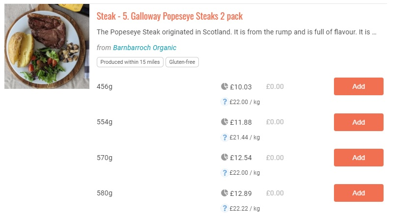

# Fixation des prix de viande et autres produits au poids irrégulier

Un produit dit "irrégulier" est un produit dont on ne connaît pas le poids final à l'avance (c'est le cas des pièces de viande par exemple ou morceaux de fromage à la coupe, dont le prix varie en fonction du poids, selon un prix au kg). Cette section du guide indique différentes façons de saisir et commercialiser ce type de produits.

## Option 1 : Fixer un prix/poids moyen et gérer l'écart à la livraison

Vous pouvez faire payer un prix moyen à l'acheteur et ensuite rembourser la différence ou la facturer, ou ne faire payer le produit qu'à réception pour collecter directement le montant juste.

Lorsque vous connaissez le vrai poids des produits (à la préparation de la commande ou au moment du retrait du colis par l'acheteur), connectez-vous au menu "Gestion des commandes par lot" et ajoutez la colonne Poids/volume au tableau de la page. Vous pouvez ainsi modifier le poids indiqué pour chaque acheteur pour une commande donnée et un produit donné. Le prix se recalculera automatiquement en fonction de la quantité saisie.&#x20;

 (1) (1) (1) (1) (1).png>)


N'oubliez pas de renvoyer un e-mail de confirmation de commande au client pour l'informer de la différence de prix et de toute somme à payer en plus par la suite.


## Option 2 : Affichez des fourchettes de prix

Même logique que dans le précédent paragraphe, simplement au lieu d'afficher un prix moyen initialement, indiquez une fourchette de prix. Cette solution à l'avantage de bien préciser à l'acheteur que le prix final est susceptible d'être modifié. Les [variantes](https://guide.openfoodnetwork.org/v/fr/basic-features/products-1/product-variants) peuvent également être l'opportunité de créer des fourchettes différentes.&#x20;

Exemple 1 : Produit = Poulet (entre 8 et 12€ selon poids, 10€kg) \
Exemple 2 : Produit = Poulet (10€/kg), Variante 1 = Petit poulet (entre 8 et 12€ selon poids réel), Variante 2 = Gros poulet (entre 13 et 20€ selon poids réel)

## Option 3 : Créer des variantes par tranche de calibre à prix fixe

Une version un peu plus simple de la deuxième option consiste à créer des [variantes](https://guide.openfoodnetwork.org/v/fr/basic-features/products-1/product-variants) pour vos produits sur la base de fourchettes de poids, mais à facturer un **prix fixe** pour tous les articles qui entrent dans la fourchette. Par exemple, si la courge coûte 1 €/kg, vous pouvez lister les variantes avec les prix fixes suivants :

* Petite (0.7 - 0.9 kg) 0,80€.&#x20;
* Moyenne (0.9 - 1.1 kg) 1,00€.&#x20;
* Grande (1,1 - 1,3 kg) 1,20€&#x20;
* Extra grande (1.3 - 1.5 kg) 1,40€

## Option 4 : Créer une variante par poids possible&#x20;

Si vous connaissez à l'avance le poids de tous vos steaks, par exemple, vous pouvez utiliser la fonctionnalité de [variante](https://guide.openfoodnetwork.org/v/fr/basic-features/products-1/product-variants) pour afficher directement le prix précis de chaque article. Par exemple :

## Modifier des commandes / offre irrégulière

Il peut être difficile pour les producteurs de viande de connaître à l'avance la disponibilité des produits ou de préparer leurs emballages en conséquence. (Jusqu'à l'abattage, le poids d'un poulet ou d'un gigot d'agneau peut être inconnu).&#x20;

Ce n'est pas un problème puisque les commandes peuvent être modifiées (en ajoutant, modifiant ou supprimant des produits) si nécessaire. Pour plus d'informations, voir [Commandes](https://guide.openfoodnetwork.org/v/fr/basic-features/orders).

## Rembourser ou réclamer aux acheteurs la différence : comment ça fonctionne ?

Si un client **paie ses marchandises à la collecte ou à la livraison**, le gestionnaire du hub aura pu modifier la commande avant le paiement en fonction du poids réel et des produits livrés. Dans ce cas, il ne sera donc pas nécessaire de rembourser ou de facturer à nouveau le client.&#x20;

Si une commande **est payée en ligne avant la livraison**, alors vous devez rembourser ou facturer la différence entre la somme déjà reçue et celle due pour les produits précis à livrer. [Cliquez ici](https://guide.openfoodnetwork.org/v/fr/basic-features/orders/refunds-and-adjusting-payments) pour voir comment procéder.

## Informez l'acheteur de votre politique de prix&#x20;

Vous pouvez indiquer à vos acheteurs votre politique de prix, notamment le cas des produits non calibrés comme la viande, en utilisant le message d'accueil de votre boutique, dans les[ paramètres ](https://guide.openfoodnetwork.org/v/fr/basic-features/enterprise-profile/enterprise-settings)de votre entreprise.

La description de la [méthode de paiement ](https://guide.openfoodnetwork.org/v/fr/basic-features/shopfront/payment-methods)peut aussi être un endroit pertinent pour un rappel du type "Souvenez-vous que le prix final peut varier de 10% en fonction du poids effectivement reçu pour les produits à la pièce non calibrés".
