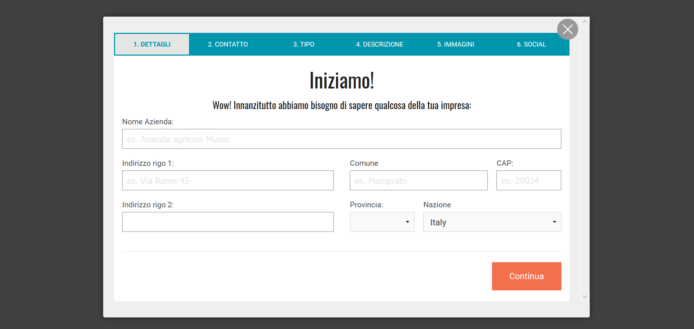
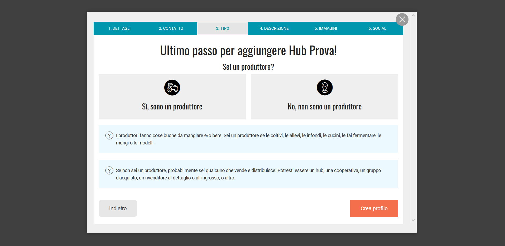

# Registrati e Crea un Profilo Aziendale

### Crea il tuo profilo

* Dall'homepage, clicca su "Login" nell'angolo in alto a destra, poi su "Iscriviti"&#x20;

* Inserisci la tua email e scegli una password.
* Riceverai una mail entro qualche minuto con un link di conferma. Cliccando sul link verrai indirizzato alla pagina di accesso.  &#x20;
* Accedi


Se non ricevi subito la mail di conferma, potrebbe essere finita nelle spam.&#x20;


### Crea il tuo primo profilo "aziendale"

* Una volta effettuato l'accesso, clicca sulla striscia grigia in basso "Interessato a vendere attraverso Open Food Network? **Registrati qui**."

* Spunta la casellla "Accetto i Termini di Servizio" e clicca si "Cominciamo!"

* Inserisci il nome dell'azienda ed i dettagli di contatto.&#x20;


Il tuo indirizzo sarà utilizzato per aggiungere la tua attività sulla mappa di OFN aumentando così la tua visibilità.&#x20;


* Scegli tra "Produttore" (se coltivi/allevi/trasformi prdotti tu setesso) o "Non Produttore" (se distribuisci prodotti altrui).

* Clicca su "Crea profilo". \
  Riceverai una mail di conferma. Puoi fermarti qui e compilare più tardi le informazioni mancanti, o continuare e seguire i passaggi per completare il tuo profilo ora.&#x20;
* Inserisci la descrizione della tua azienda, aggiungi immagini, sito e profili social, dettagli, ecc..
* Quando avrai finito, sarai indirizzato al [Pannello di controllo per le aziende](enterprise-profile/).

**Hai ora creato la tua prima "azienda" e hai iniziato a compilare il tuo profilo, ma non hai finito!**

**Il prossimo passo è** [**scegliere il "pacchetto OFN"**](enterprise-profile/package-types.md) **(= tipo di profilo) che meglio rappresenta la tua** [**attività**](../your-quick-start-on-ofn-given-who-you-are.md)**.** &#x20;

**Dopo questo passaggio, la tua azienda sarà inserita nella mappa di OFN!**

**Un breve video per la registrazione di un'azienda (in inglese):**

### Accedi al Pannello di controllo della tua azienda

Una volta creata un'impresa, puoi gestire il tuo profilo usando il Pannello di controllo. Per accedervi, effettua il login e clicca su Profilo > Amministrazione nell'angolo in alto a destra. Vedi [Pannello di controllo ](dashboard.md)per maggiori informazioni.
