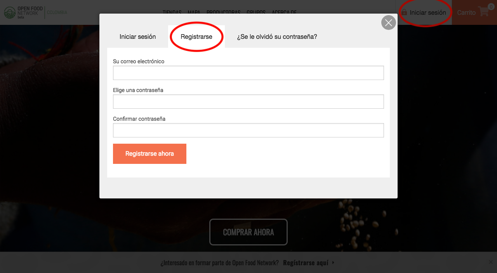
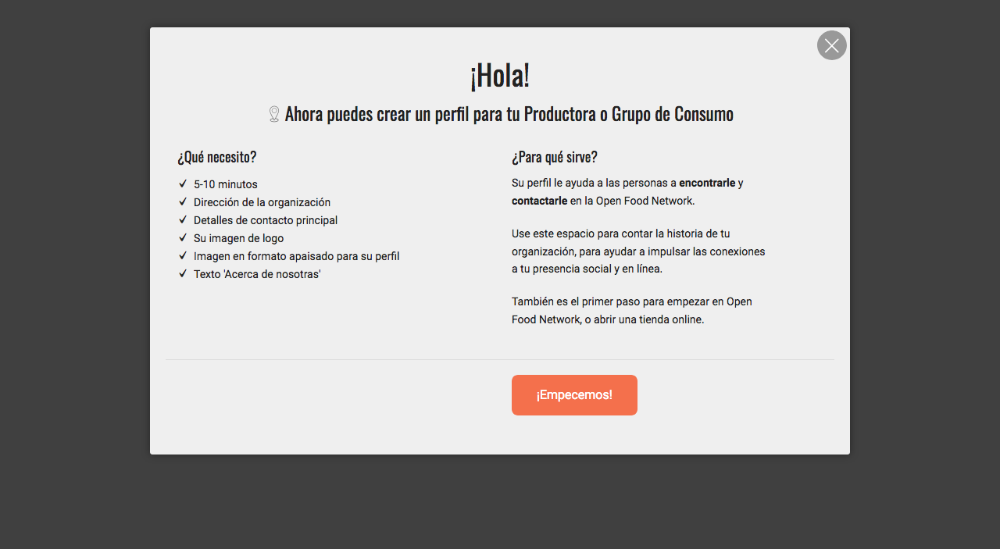
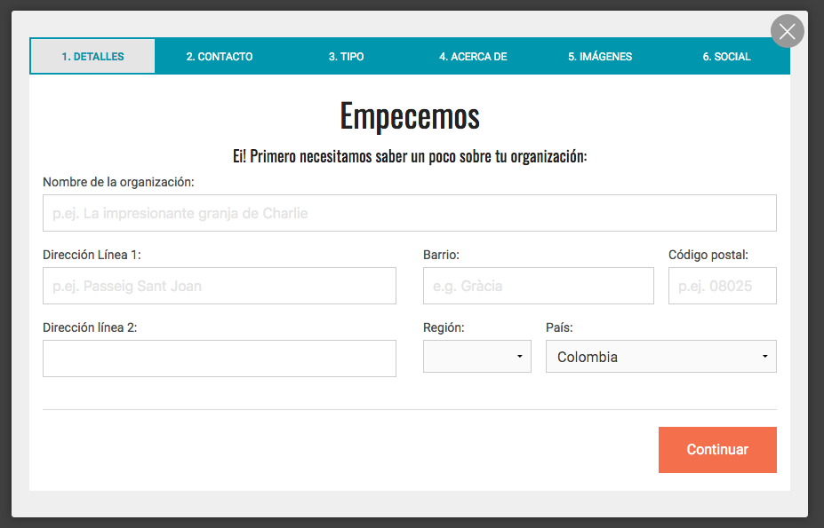

# Regístrese y cree una Cuenta de Organización

### Cree su cuenta de usuario

* Desde la página de inicio, haga clic en "Iniciar sesión" en la esquina superior derecha, luego "Registrarse" 

* Ingrese su dirección de correo electrónico y elija una contraseña.
* Recibirá un correo electrónico en los próximos minutos con un enlace de confirmación. Haga clic en él y será redirigido a la página de inicio de sesión.
* Iniciar sesión


Si no recibe un correo electrónico de confirmación de nuestra parte de inmediato, es posible que haya ido a su casilla de correo no deseado.


### Cree su primera cuenta "organizacional"

* Una vez que haya iniciado sesión, haga clic en el banner gris inferior "¿Está interesado en vender a través de Open Food Network? **Regístrese aquí**".
* Once logged in, click on the top grey banner "Interested in selling through the Open Food Network? **Register here**."

* Haga clic en el cuadro "Acepto las Condiciones de servicio anteriores" y seleccione "¡Empecemos!"

* Complete el nombre de su organización y los datos de contacto.


Su dirección se utilizará para agregar su negocio a nuestro mapa de organizaciones OFN y, por lo tanto, aumentar su visibilidad.


* Elija entre 'Productor' \(usted mismo hace / hornea / cultiva productos\) o 'No productor' \(distribuye y vende alimentos hechos por otros\).

* Haga clic en el botón "crear perfil".
* Recibirás un correo electrónico confirmando que se creó el perfil. Puede detenerse aquí y completar la información que falta más tarde, o continuar y seguir los pasos para completar su perfil ahora.
* Complete la descripción de su organización, agregue imágenes, enlaces a sitios web / redes sociales, detalles comerciales, etc.
* Cuando haya terminado, será redirigido al [menú de perfil de empresa](enterprise-profile/).

**Su primera "organización" ya está creada y ha comenzado a completar su perfil, ¡pero no está terminado!**

**El siguiente paso es** [**elegir el paquete OFN**](enterprise-profile/) **\(= tipo de perfil\) que mejor represente su** [**modelo de negocio**](../quick-start-guides/)**.**   

**¡Después de hacerlo, su organización se agregará al mapa OFN!**

**Un breve clip del registro de su organización en OFN:** 

### Acceda al panel de administración de su organización

Una vez que haya creado una organización, puede administrar su perfil usando el Panel de administración. Para acceder al Panel de Administración de su Organización, inicie sesión en Open Food Network y haga clic en "Perfil&gt; Administración" en la esquina superior derecha. Consulte [Panel de administración](dashboard.md) para obtener más información.

