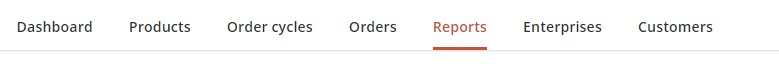
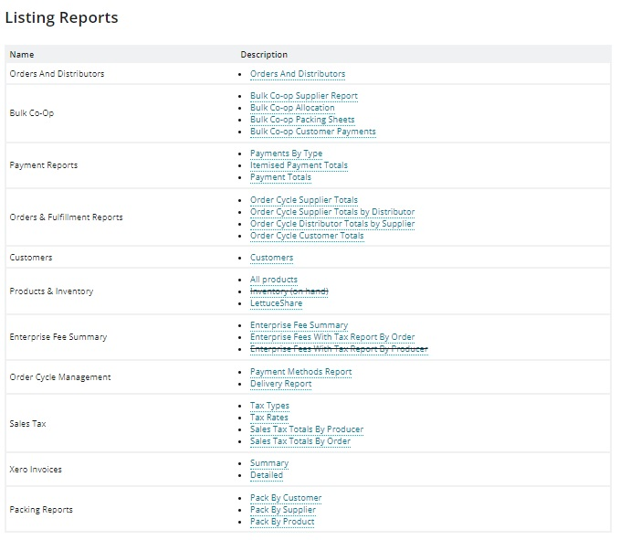

# Reports

If you have opened an [Order Cycle](../shopfront/order-cycle/), you will be able to run reports to help with managing **packing,** **processing your orders**, and meet your **financial reporting** needs.

You can access your reports by clicking on **Reports** on the main horizontal menu. &#x20;

This brings up a list of all the different options.  For most reports you are able to filter data by date range, hub name, producer name and order cycle name.&#x20;


Reports written with ~~a line through them~~ are no longer maintained and will be removed from the platform in future updates.


In this section of the User Guide you can find:

* An [explanation of the common format and options](general-tips.md) available for all Reports.
* A summary of the data included in each report type.
* [OFN invoices](view-orders.md) and integrating with Xero invoices.

