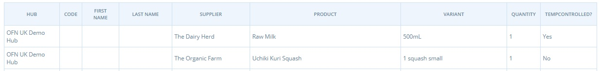

# Berichte verpacken


-->​ Diese Seite ist noch nicht ins Deutsche übersetzt. Wenn du mithelfen möchtest, melde dich gerne bei uns [per E-Mail](mailto:konrad@openfoodnetwork.de) oder [im Slack](https://join.slack.com/t/openfoodnetwork/shared\_invite/zt-9sjkjdlu-r02kUMP1zbrTgUhZhYPF\~A)!


## Berichte verpacken

Some enterprises use their order confirmation emails as packing sheets, or download and modify the Order Cycle Customer Totals report to suit their specific needs. The two Packing Reports offer additional options for managing the packing process.

### Verpackung nach Lieferant

This report lists each supplier and their products. Next to each product is the name of the customers who ordered the product, and the quantity they ordered.&#x20;


This reports is helpful to check in items delivered by suppliers- keeping track of goods which may have been missed or are supplied damaged.


### Packen nach Kunde&#x20;

This report lists each customer who placed an order and shows each item ordered by the customer, including the quantities of each item.&#x20;


This report is useful for packing all of a customer's shopping in a crate/bag/box so it is ready for them to collect or for you to deliver.


