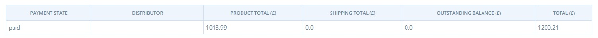
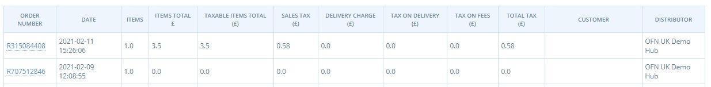
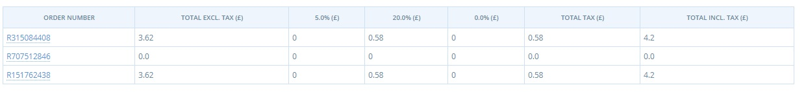

# Payment and Tax Reports


--&gt;​ Diese Seite ist noch nicht ins Deutsche übersetzt. Wenn du mithelfen möchtest, melde dich gerne bei uns [per E-Mail](mailto:konrad@openfoodnetwork.de) oder [im Slack](https://join.slack.com/t/openfoodnetwork/shared_invite/zt-9sjkjdlu-r02kUMP1zbrTgUhZhYPF~A)!


## Payment Reports


The three Payment reports are good for keeping track of total incoming and outgoing revenue for your food hub within a time frame.


### Payment by Type

The simplest payment report. This documents the total of paid, balance due and credit owing for each different type of payment a hub may employ \(ie. a total for Stripe payments, a total for cash/EFT payments and one for PayPal\).

### Itemised Payment Totals

Listed by payment status \(paid, balance due, credit owing\) rather than payment provider, this report gives a breakdown of revenue \(product costs, shipping fees\) as well as the total.  The Outstanding balance column will be 0.0 for the payment status of 'paid'

### Payment Totals

In addition to the Itemised Payment Totals this report states revenue coming from EFT \(cash or bank transfer\) and Paypal separately.

## Sales Tax

There are two sales tax reports: Tax Types and Tax Rates.


The **Tax Type** report is useful for separating total tax per order into its different component elements: tax on products, tax on shipping method fee and tax on payment method fee.


The **tax rate** report gives an order-by-order break down of tax by it's tax rate \(full, reduced or zero-rated\).  Order totals inclusive and exclusive of tax are also given.

## Xero Invoices

This report creates CSV files which can be imported into the accounting package ‘Xero’ to generate invoices for customers.

### Generating the report

**Date range:** You can filter orders by the date the order was placed.

**Report type:** You can select to download a ‘detailed’ report, which includes a line item for each item the customer purchased, including any fees and adjustments to their order.

**Hub and order cycle:** You can specify which Hub and Order Cycle, the orders were placed through.

**Initial invoice number:** To ensure compatibility with your Xero invoice numbering system, enter the first invoice number you would like new invoices to be allocated. All subsequent invoices will be numbered from this point.

**Invoice date:** You can select the date that you want the invoices to be marked with in Xero. This is editable once you have the invoice in Xero, but doing it here allows you to batch date all the invoices in a single report. 

**Due date:** You can select the due date to be marked on Xero invoices. Again this is editable in Xero.

**Account code:** If you place a Xero account code here, all items in the invoice will be assigned to this account. This it editable in Xero.

**Download as CSV:** When you are ready to download the file for import check the box and click **search**.

### Data Available

* Customer name, email, billing address \(no phone number\)
* Invoice number and date of purchase. Due date is one month after invoice date.  Reference number is the same as invoice number.
* Product name, quantity, cost, tax rate, SKU, fee
* Payment status \(paid or balance due\)
* currency of transaction.

### Importing the report into Xero

In Xero go to **Accounts**, **Sales** and click Import.

Next you will select your downloaded OFN Xero report for upload. The settings you should select are shown below.

Selecting **Ignore contact address detail**s will ensure your Xero customer data is unaltered. 

Selecting **Tax Exclusive** will ensure that products you have set to include tax in the Open Food Network will include tax, but your tax free items will remain tax free.

