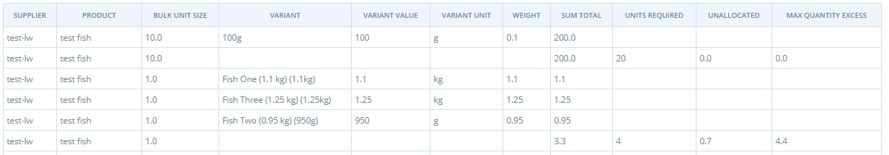
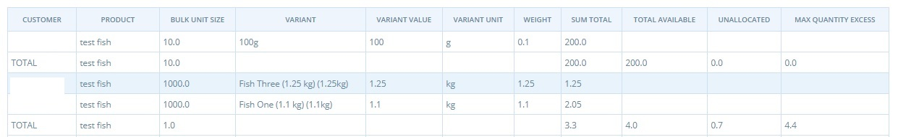
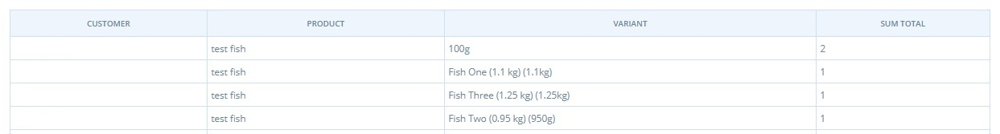
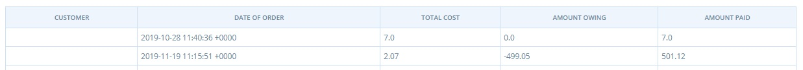

# Berichte für die Verwaltung von Großaufträgen

Die im Bereich Bulk Coop verfügbaren Berichte sind ideal für Unternehmen auf der OFN-Plattform, z. B. Einkaufsgemeinschaften, die die [Funktion Group Buy](../products-1/group-buy-for-bulk-ordering.md) nutzen.

Es gibt vier Berichte in diesem Abschnitt sind:

|                    | Verwenden Sie                                                                                                                                                                                                                                      |
| ------------------ | -------------------------------------------------------------------------------------------------------------------------------------------------------------------------------------------------------------------------------------------------- |
| Lieferantenbericht | Produkte nach Anbieter auflisten. Ein guter Ort, um zu sehen, ob genug von einem Produkt bestellt wurde bestellt wurde, um die Größe des Lieferanten zu rechtfertigen Größe zu rechtfertigen.                                                      |
| Zuteilung          | Listet die Produkte nach Kunden auf. Ein guter Ort, um zu prüfen sicherzustellen, dass Sie über/unter Artikel des Großeinkaufs den Kunden Kunden gleichmäßig verteilen (d.h. eine Person hat nicht zu wenig von allen Artikel in ihrer Bestellung) |
| Packungsbeilage    | Umpacken der gelieferten Produkte einem Lieferanten in loser Schüttung für den Kunden Abholung                                                                                                                                                     |
| Summen der Kunden  | Dokumente Erstattungen an/zusätzliche vom Kunden geforderte Zahlung nach Anpassung der Lagerbestände zur Zusammenstellung einer Großbestellung                                                                                                     |

## Daten

Die Daten in jedem Bericht sind wie folgt:

|                                               | Lieferantenbericht | Zuteilung | Verpacken | Kunde Summen |
| --------------------------------------------- | ------------------ | --------- | --------- | ------------ |
| Kunde                                         | N                  | J         | J         | J            |
| Anbieter                                      | J                  | N         | N         | N            |
| Name des Produkts                             | J                  | J         | J         | N            |
| Details zur Variante                          | J                  | J         | J         | N            |
| Schüttguteinheit                              | J                  | J         | N         | N            |
| Gekaufte Menge                                | J                  | J         | J         | N            |
| Erforderliche Einheiten                       | J                  | J         | N         | N            |
| Nicht zugewiesene                             | J                  | J         | N         | N            |
| Maximale Überschussmenge                      | J                  | J         | N         | N            |
| Date of order                                 | N                  | N         | N         | J            |
| Gezahlter, geschuldeter Betrag & Gesamtkosten | N                  | N         | N         | J            |


Produkte, die von einem Hub gelagert werden und bei denen der Großeinkauf nicht aktiviert ist, werden mit Bulk Unit = 0 angezeigt.


## Beispiel: Bulk Co-op Suppliers Bericht

Dieser Bericht enthält die folgenden Informationen:

* Haben die Kunden genug von einem Produkt bestellt, um die Bestellung der Großpackung beim Lieferanten zu rechtfertigen?
* Wie viele zusätzliche Produkte sind die Kunden bereit zu kaufen, damit die Gruppe die Mengenschwelle erreicht (wenn [Gruppenkauf](../products-1/group-buy-for-bulk-ordering.md#aktivieren-des-gruppenkaufs-fuer-ein-produkt) aktiviert ist)
* Wie viele Bulk-Größen werden benötigt, um die Kundennachfrage zu befriedigen?
* Wenn die Großpackung bestellt wird, wie viel Bestand bleibt dann noch übrig?
* Wie viele Kunden werden enttäuscht sein, wenn dieses Produkt nicht bestellt wird?

Das nachstehende Beispiel veranschaulicht, wie der Bericht "Bulk Co-op Totals by Supplier" verwendet werden kann:

Beispiel 1: Wenn die Großbestellmenge erreicht ist:

Beispiel 2: Die Menge der Großbestellung ist noch nicht erreicht:

* Beachten Sie, dass der Bericht "Co-op-Großzuteilungen" eine ähnliche Funktion wie dieser Bericht hat, aber die Bestellungen jedes einzelnen Kunden anzeigt und nicht die kumulierte Summe aller Kunden.
