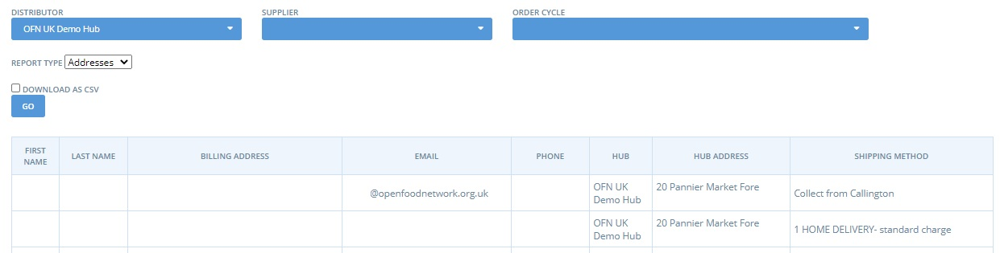

# Berichte für das Hub-Management


-->​ Diese Seite ist noch nicht ins Deutsche übersetzt. Wenn du mithelfen möchtest, melde dich gerne bei uns [per E-Mail](mailto:konrad@openfoodnetwork.de) oder [im Slack](https://join.slack.com/t/openfoodnetwork/shared\_invite/zt-9sjkjdlu-r02kUMP1zbrTgUhZhYPF\~A)!


## Verwaltung der Auftragszyklen

There are two reports in the Order Cycle Management section: Payment Methods and Delivery Report.&#x20;


A **Customer's Balance** (ie. the sum of monies paid and owed across all orders they have placed with your food enterprise) is listed in both the Payment Method and Delivery reports. These are a good place to see at a glance if a customer is running up a big debt.


At a glance, the data contained in these reports can be summarised:

|                       | Payment Method | Delivery Report |
| --------------------- | -------------- | --------------- |
| Customer name         | Y              | Y               |
| Customer phone no     | Y              | Y               |
| Customer email        | Y              | N               |
| Hub                   | Y              | Y               |
| Shipping Method       | Y              | Y               |
| Delivery Address\*    | N              | Y               |
| Shipping Category\*\* | N              | Y               |
| Payment Method        | Y              | Y               |
| Order Notes           | N              | Y               |
| Order Total           | Y              | Y               |
| Customer Balance      | Y              | Y               |

\*Delivery Address is either the hub/distributor address (for pick up) or an address submitted by the customer (for delivery)

\*\*Shipping Category = default, frozen, refrigerated

## Produktmanagement

Under Products & Inventory you will find three reports which are useful if you wish to review items stocked by your hub from different producers.

The **All Products and Inventory** reports differ only in that the latter (Inventory) contains only data for products with stock levels greater than zero. &#x20;

The data they contain for each product is:

* Supplier name and city/suburb of supplier's address
* Product name, variant name and SKU
* Product property and category (taxon)
* price
* Group buy unit quantity (if applicable)

Below is an example of the All Products Report:

The **Lettuce Share** report gives more details about each product: It's name, variant name (listed under 'Description'), unit (g, l, item name etc), pack size (ie. for a product of '500g tomatoes' the unit = g, pack size = 500), price, tax included in cost, producer properties (not product properties) and product category (taxon).

## Kundenmanagement

### Mailing List&#x20;

The mailing list report shows the names and email addresses of customers who have placed orders in your shopfront. This report can help you contact customers who have purchased items from your shopfront.  For example, you may need to notify a customer (or set of customers) if a product they bought is not available or if you are unable (say, due to illness) make the delivery schedule they requested.&#x20;

See below for an example of the Mailing List Report:

### Addresses

The Addresses report includes Customer contact details, Hub and Shipping Method, and can be filtered by Order Cycle, Shopfront (**Distributor**) and **Supplier.**&#x20;

## Gebühren für Unternehmen

Enterprises can set up [Enterprise Fees](../shopfront/enterprise-fees.md) to identify and control allocation of costs / prices for different purposes. These fees enable price transparency to customers when they visit your shopfront.&#x20;


The Enterprise Fee Summary report is used to summarise the amounts of fees that were charged, and to whom.&#x20;


The report can be filtered by Shopfront (**Hub**), **Producer** and **Order** **Cycle**, as well as Fee Names and Shipping and Payment methods.

.png>)

**Example 1**: a Shop includes a 2% fundraising fee on every order. They can use the Enterprise Fee Summary report to identify the total funds raised within a particular order cycle.&#x20;

**Example 2**: a Hub charges a transport fee which they pay to a Producer for picking up produce from other farmers and bringing it into the Hub. This fee is calculated as a percentage on every product in the order cycle. They can use the Enterprise Fee Summary report to calculate how much to pay that Producer for transport in each Order Cycle.

**Example 3:** a Hub includes a fee to show customers the amount they pay to Open Food Network for their use of the platform. This fee is calculated as a percentage of all orders placed. The below screenshot is an example of this scenario:

.png>)

### Data

The data which found in an Enterprise Fee Summary Report includes:

* Fee type (Enterprise fee types are admin, packing, transport, fundraising, sales), name and tax rate of the fee.
* Customer name
* Where in the order cycle the fee is placed (incoming/outgoing products or order cycle coordinator fee)
* Name of enterprise who set the fee ('Fee Calc on Transfer though')
* Total value of enterprise fee collected for the sale of the line item.

