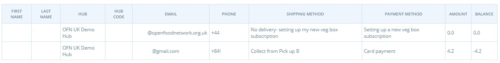
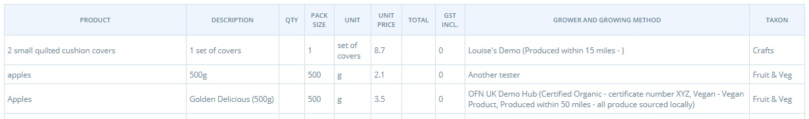

# Berichte für das Hub-Management

Verwaltung der Bestellzyklen

Im Bereich Bestellzyklusverwaltung gibt es zwei Berichte: Zahlungsarten und Lieferungen.


**Der Saldo eines Kunden** (d.h. die Summe der gezahlten und geschuldeten Beträge aller Bestellungen, die er bei Ihrem Lebensmittelunternehmen aufgegeben hat) wird sowohl in den Berichten zur Zahlungsart als auch zur Lieferung aufgeführt. Hier können Sie auf einen Blick sehen, ob ein Kunde hohe Schulden hat.


Die in diesen Berichten enthaltenen Daten lassen sich auf einen Blick zusammenfassen:

|                            | Zahlungsarten | Lieferungen |
| -------------------------- | ------------- | ----------- |
| Name des Kunden            | J             | J           |
| Telefon-Nr. des Kunden     | J             | J           |
| Kunden-E-Mail              | J             | N           |
| Hub                        | J             | J           |
| Versandart                 | J             | J           |
| Lieferadresse\*            | N             | J           |
| Versandkategorie\*\*       | N             | J           |
| Zahlungsmethode            | J             | J           |
| Anmerkungen zur Bestellung | N             | J           |
| Bestellung Gesamt          | J             | J           |
| Kundenbilanz               | J             | J           |

\*Lieferadresse ist entweder die Adresse des Hubs/Vertriebspartners (bei Abholung) oder eine vom Kunden angegebene Adresse (bei Lieferung)

\*\*Versandkategorie = Standard, gefroren, gekühlt

## Produktmanagement

Unter Produkte und Katalog finden Sie drei Berichte, die nützlich sind, wenn Sie die von Ihrem Hub gelagerten Artikel verschiedener Hersteller überprüfen möchten.

Die Berichte "**Alle Produkte**" und "**Lagerbestand**" unterscheiden sich nur dadurch, dass der letztere (Lagerbestand) nur Daten für Produkte enthält, deren Lagerbestand größer als Null ist.

Die Daten, die sie für jedes Produkt enthalten, sind:

* Name des Lieferanten und Stadt/Vorort der Adresse des Lieferanten
* Produktname, Variantenname und SKU
* Produkteigenschaft und Kategorie (Taxon)
* Preis
* Stückzahl des Gruppenkaufs (falls zutreffend)

Nachfolgend sehen Sie ein Beispiel für den Bericht _Alle Produkte_:

Der Bericht "**LettuceShare**" enthält weitere Einzelheiten zu jedem Produkt: Name, Variantenname (aufgeführt unter "Beschreibung"), Einheit (g, l, Artikelbezeichnung usw.), Packungsgröße (z. B. bei einem Produkt "500 g Tomaten" die Einheit = g, Packungsgröße = 500), Preis, in den Kosten enthaltene Steuer, Erzeugereigenschaften (nicht Produkteigenschaften) und Produktkategorie (Taxon).

## Kundenberichte

Der Kundenbericht zeigt die Namen und E-Mail-Adressen der Kunden, die in Ihrem Schaufenster Bestellungen aufgegeben haben, sowie deren Lieferoption. Dieser Bericht kann Ihnen helfen, Kunden zu kontaktieren, die Artikel in Ihrem Schaufenster gekauft haben. Sie müssen beispielsweise einen Kunden (oder eine Gruppe von Kunden) benachrichtigen, wenn ein von ihm gekauftes Produkt nicht verfügbar ist oder wenn Sie (z. B. aufgrund von Krankheit) nicht in der Lage sind, den von ihm gewünschten Liefertermin einzuhalten.

Nachstehend finden Sie ein Beispiel für einen Kundenbericht:

<figure><figcaption></figcaption></figure>

## Gebühren für Unternehmen

Unternehmen können [Unternehmensgebühren](../shopfront/enterprise-fees.md) einrichten, um die Zuweisung von Kosten/Preisen für verschiedene Zwecke zu ermitteln und zu kontrollieren. Diese Gebühren ermöglichen eine Preistransparenz für Kunden, wenn sie Ihr Geschäft besuchen.


Der Bericht "Unternehmensgebühren" gibt einen Überblick über die Höhe der Gebühren, die erhoben wurden, und an wen.


Der Bericht kann nach **Hub**, **Produzent** und **Bestellzyklus** sowie nach Gebührennamen und Versand- und Zahlungsarten gefiltert werden.

**Beispiel 1:** Ein Shop erhebt bei jeder Bestellung eine Gebühr von 2 % für die Mittelbeschaffung. Mit dem Bericht "Unternehmensgebühren" kann er die in einem bestimmten Bestellzyklus gesammelten Mittel ermitteln.

**Beispiel 2:** Ein Hub erhebt eine Transportgebühr, die er einem Erzeuger dafür zahlt, dass er Produkte von anderen Landwirten abholt und sie zum Hub bringt. Diese Gebühr wird als Prozentsatz für jedes Produkt im Bestellzyklus berechnet. Mit dem Bericht "Enterprise Fee Summary" kann er berechnen, wie viel er dem Produzenten für den Transport in jedem Auftragszyklus zahlen muss.

**Beispiel 3:** Ein Hub enthält eine Gebühr, um den Kunden den Betrag anzuzeigen, den sie an Open Food Network für die Nutzung der Plattform zahlen. Diese Gebühr wird als Prozentsatz aller aufgegebenen Bestellungen berechnet. Der folgende Screenshot ist ein Beispiel für dieses Szenario:

 (1).png>)

### Daten

Die Daten, die in einem zusammenfassenden Bericht über Unternehmensgebühren enthalten sind, umfassen:

* Gebührenart (Unternehmensgebührenarten sind Verwaltung, Verpackung, Transport, Fundraising, Verkauf), Name und Steuersatz der Gebühr.
* Name des Kunden
* An welcher Stelle des Bestellzyklus wird die Gebühr erhoben (eingehende/ausgehende Produkte oder Gebühr des Koordinators des Bestellzyklus)
* Name des Unternehmens, das die Gebühr festgelegt hat ("Fee Calc on Transfer though")
* Gesamtwert der für den Verkauf der Position erhobenen Unternehmensgebühr.

