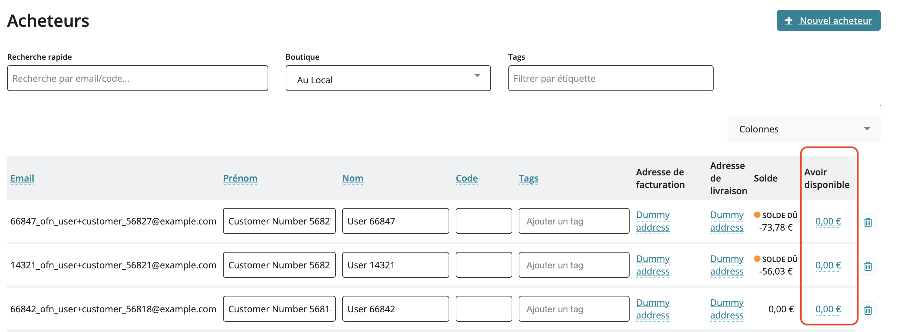
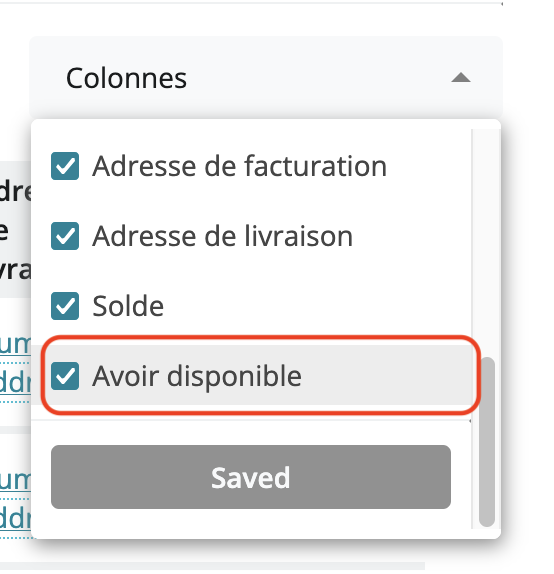

# Avoirs


Cette fonctionnalité facilite la gestion des commandes dont le montant a été réduit après le paiement, par exemple si un produit n’était pas disponible dans la quantité souhaitée, ou si l’acheteur change d’avis et modifie sa commande. Elle permet d’éviter d’avoir à faire le remboursement d’un trop perçu.\
Dans ce cas, la boutique peut maintenant procéder à la création d’un avoir, qui sera automatiquement utilisable par l’acheteur lors de la commande suivante.


### Création d’un avoir par le gestionnaire de boutique

Un avoir peut être créé à partir d’une commande avec un statut de commande « payée » suite à un paiement au retrait des produits par exemple, ou lorsque le gestionnaire indique qu’une commande est payée via ce bouton :

<figure><figcaption></figcaption></figure>

Si le gestionnaire modifie cette commande en retirant des articles, cela conduit à une réduction du montant de la commande, le statut de paiement de cette facture devient « avoir ».

<figure><figcaption></figcaption></figure>

Le gestionnaire peut alors sélectionner les commandes de ce statut et utiliser l’action « Créer des avoirs » pour transformer le trop perçu en avoir pour chaque commande sélectionnée.

L’avoir sera ensuite automatiquement déduit de la prochaine commande du client.


Astuce : utilisez le filtre « Statut du paiement » pour faciliter la sélection des commandes.


<figure><figcaption></figcaption></figure>


Autre astuce : En allant sur l’onglet de vos acheteurs, vous pouvez consulter les avoirs disponibles pour chacun (vérifiez que la colonne est affichée dans la liste déroulante)


<figure><figcaption></figcaption></figure>

<figure><figcaption></figcaption></figure>


Avertissement : La création des avoirs est facultative, vous pouvez continuer à faire des remboursements plutôt que créer des avoirs si ce mode de fonctionnement vous convient mieux.



A noter que si le client avait payé par CB, la création d’un avoir vous permet d’économiser les frais Stripe ou Paypal sur le montant de l’avoir. Tandis qu’au contraire, en cas de remboursement sur le compte de la personne, les frais bancaires qui avaient été payés sur le montant total de la commande, ne sont pas remboursés.


### Utilisation des avoirs pour gérer des pré-paiements

Certains circuits courts fonctionnent grâce à des pré-paiements des mangeurs (modèle proche de celui des AMAP). La fonctionnalité Avoirs peut être utilisée pour gérer les pré-paiements.\
A partir d’une commande réalisée, le gestionnaire enregistre un sur-paiement et ensuite il peut créer un avoir disponible dont seront déduits les achats ultérieurs.

### Utilisation d’un avoir par le client mangeur

Les clients qui bénéficient d’un avoir verront le montant de l’avoir s’afficher lors du paiement de la commande suivante et automatiquement déduit du coût total de la commande :

* Si le montant à payer est inférieur à l’avoir, l’avoir est déduit du montant à payer, et le reste est disponible pour une commande ultérieure. Le client n’aura pas à saisir un moyen de paiement. Ainsi si vous avez un avoir de 20 €, et une commande de 15 €, l’avoir sera ensuite de 5€, et la commande sera intégralement payée par l’avoir.
* Si le montant à payer est supérieur à l’avoir, la somme à payer sera le montant de la commande moins le montant de l’avoir. Le client procèdera au paiement de cette somme restante. L’avoir sera entièrement utilisé par cette commande. Ainsi, si la commande est de 20 €, et l’avoir de 5 €, l’avoir sera entièrement utilisé et la somme restant à payer sera de 15€.

