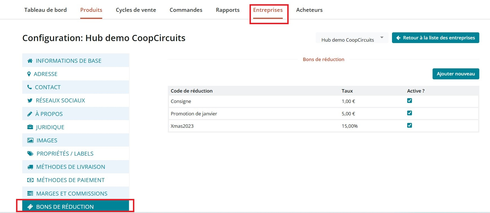
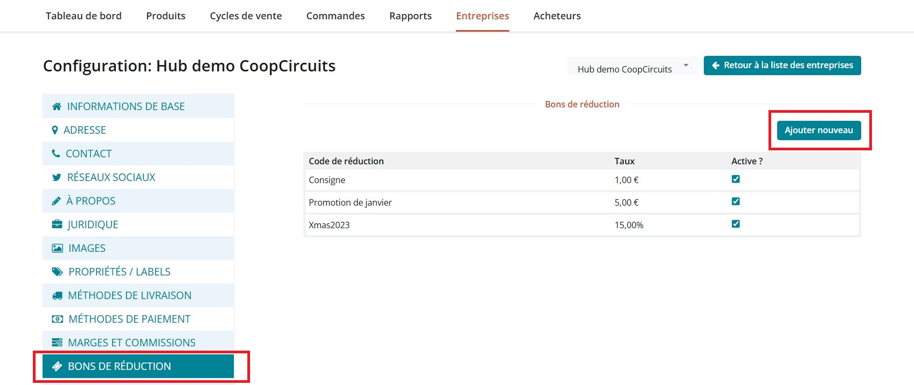
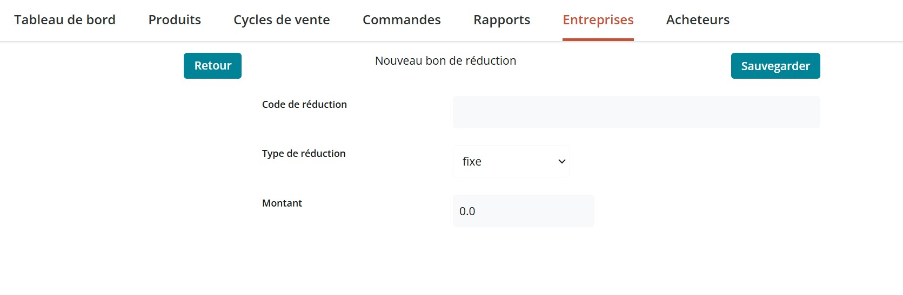
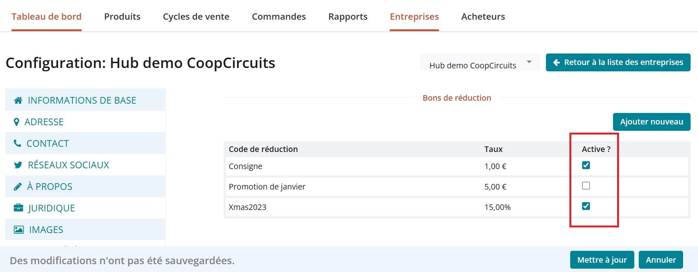

# Bon de réduction


La fonction bon de réduction est une fonction "béta", ce qui signifie qu'il s'agit d'une nouvelle fonctionnalité qui peut encore évoluer et rencontrer des anomalies. Contactez-nous si vous souhaitez nous faire part de vos avis, recommandations ou commentaires !&#x20;


Des bons de réductions peuvent être créés afin de faire bénéficier vos clients de remises et promotions. Cette fonction est encore relativement limitée, nous vous invitons à lire l'intégralité de cette page du guide avant d'implémenter des bons de réduction dans votre boutique.&#x20;

Vous pouvez configurer des bons de réduction depuis l'espace [Paramètres de l'Entreprise](https://guide.openfoodnetwork.org/v/fr/basic-features/enterprise-profile/enterprise-settings).

<figure><figcaption></figcaption></figure>

## Créer un bon de réduction

* Cliquez sur "Bon de réduction" depuis le menu de gauche de l'espace paramètres d'entreprise
* Cliquez sur le bouton "Ajouter Nouveau" qui se situe en haut à droite de la page

<figure><figcaption></figcaption></figure>

<figure><figcaption></figcaption></figure>

* **CODE PROMO** - Le code que vous allez saisir ici bénéficiera d'une réduction. Le code correspond à une chaine de caractère alors vérifiez l’orthographe, les majuscules/minuscules et les espaces avant l'enregistrement.&#x20;
* **TYPE DE PROMO** - Vous allez pouvoir ici choisir entre un mode de calcul de la remise en pourcentage ou en montant fixe.
  * **fixe ou pourcentage** - En fonction du choix, le bon ajoutera un montant fixe de réduction ou un pourcentage de réduction à l'ensemble de la commande à laquelle le bon sera appliqué.
* **MONTANT** - Saisissez ici le montant souhaité (pourcentage ou montant fixe) .
* Cliquez sur **SAUVEGARDER** pour enregistrer votre bon de réduction .


Les bons de réduction sont automatiquement actifs dès leur création, si vous souhaitez les désactiver, suivez les étapes suivantes


## Gérer les bons de réduction

Les bons de réduction peuvent être activés ou désactivés de manière illimitée par l'administrateur de la boutique. Un bon restera actif tant que l’administrateur de la boutique ne l'aura pas manuellement désactivé. Un bon actif peut être utilisé sur plusieurs commandes par un seul ou plusieurs clients. Les clients sont limités à l'usage d'un unique bon de réduction par commande.&#x20;


Les bons de réduction ne se désactivent pas automatiquement après utilisation par le.s client.s


Depuis la page bon de réduction de l'espace paramètres d'entreprise, utilisez la checkbox à droite de chaque bon pour le désactiver ou l'activer.&#x20;

Pensez à cliquer sur "Mettre à jour" pour enregistrer les modifications apportées.

<figure><figcaption></figcaption></figure>

## Utilisation client&#x20;

Afin de bénéficier du bon de réduction, les clients devront se munir du code exact défini par l'administrateur.&#x20;


L'usage du bon de réduction est limité à un par commande


Le client sera invité à saisir le code du bon de réduction à l'étape 2 du processus de validation de commande.

<figure><figcaption></figcaption></figure>


Si le bon de réduction appliqué ramène la valeur de la commande à un montant inférieur ou égal à zéro, le client ne sera pas facturable, donc non invité à saisir un moyen de paiement.


<figure><figcaption></figcaption></figure>


Si seulement une partie du bon de réduction est utilisé et que le montant de la commande devient négatif, le crédit restant ne sera pas crédité sur le compte client et donc, sera perdu.&#x20;

