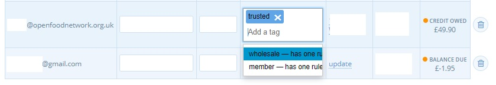

# Kundenmanagement

Eine Liste aller Kunden, die eine Bestellung bei Ihrem Unternehmen aufgegeben haben, können Sie im Menü Kunden im Admin-Dashboard einsehen.

Sie können einen Kunden auch manuell über die Schaltfläche **+Neuer Kunde** hinzufügen.

.jpg>)


Nur Personen, die sich in Ihrer Kundenliste befinden, können mit einem Stichwort versehen werden und somit einer Kategorie zugeordnet werden.\
Wenn Sie also eine [private Shopfront](../private-shopfront.md) haben, müssen Sie alle neuen Kunden manuell hinzufügen und ihnen das richtige Stichwort zuweisen, bevor sie einkaufen können.


## Rechnungs- und Lieferadresse des Kunden

Jeder Kunde kann eine Standard-Rechnungs- und Lieferadresse haben. Wenn ein Kunde ein registriertes OFN-Konto hat und seine Daten vollständig ausgefüllt hat, werden seine Adressen automatisch in diesen Bereich kopiert. Die Speicherung einer Standard-Rechnungs- und Lieferadresse kann den Online-Einkauf für den Kunden beschleunigen.

## Stichwörter (um Kunden in Kategorien zu gruppieren)

Sie können Ihre Kunden Gruppen zuordnen und dann [gruppenspezifische Preise und/oder Produktlisten anbieten.](tags-and-tag-rules.md#customer-specific-pricing)

Auf der OFN-Plattform wird dies dadurch erreicht, dass alle Kunden, die zu einer gemeinsamen Gruppe gehören (z.B. alle Ihre Großhandelskunden), mit demselben Stichwort versehen werden.\
Um ein Stichwort hinzuzufügen, geben Sie einfach einen Begriff in die Spalte "Stichwörter" auf der Seite "Kunden" ein. Ein Kunde kann mehrere Stichwörter haben und natürlich kann dasselbe Stichwort mit mehreren Personen verknüpft werden.


Achten Sie beim Hinzufügen desselben Stichworts für mehrere Kunden (damit sie zu einer gemeinsamen Gruppe gehören) darauf, dass Sie das gleiche Wort (Groß- und Kleinschreibung wird unterschieden) aus dem angebotenen Dropdown-Menü auswählen.


Stichwörter erscheinen auch in Berichten. Sie können sie bei CSV-/Excel-Exporten verwenden, um Daten schnell zu filtern.
