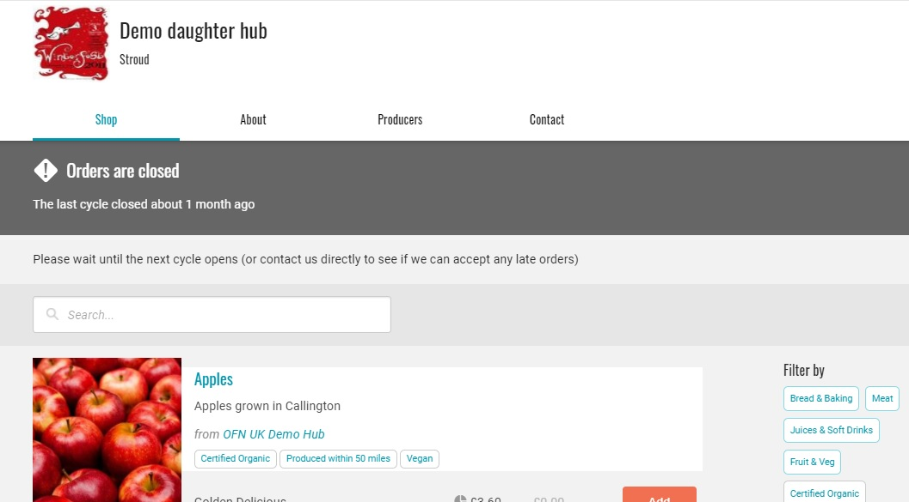

# Nur Schaufenster

In manchen Fällen möchten Ladenbesitzer zwar Produkte in ihrem Geschäft anzeigen, den Kunden aber nicht die Möglichkeit geben, zur Kasse zu gehen. Zum Beispiel, um ihr gesamtes Produktsortiment zu zeigen (das saisonal variieren kann) oder um potenziellen Kunden eine Vorstellung von den Produkten zu geben, die im nächsten Bestellzyklus angeboten werden, bevor dieser eröffnet wird.

So richten Sie einen Bestellzyklus nur für die Anzeige ein:

* Eröffnen Sie wie gewohnt einen [Bestellzyklus](order-cycle/order-cycles-for-hubs.md) mit den Produkten, die Sie anzeigen möchten und dem Datumsbereich, in dem der Auftragszyklus geöffnet bleiben soll.
* Ändern Sie den "Anzeige"-Status aller Ihrer [Zahlungsarten](payment-methods.md) auf "Nur Back Office". Dies kann über Unternehmen -> Einstellungen -> Zahlungsarten -> Bearbeiten erfolgen:

Ihr Shop befindet sich nun im Zustand "Nur anzeigen".\
Unten sehen Sie ein Beispiel dafür, wie der Laden für Kunden aussieht. Er ist eindeutig als geschlossen gekennzeichnet, aber die Kunden können die Produktpalette sehen.


Wenn Sie das nächste Mal einen Live->Bestellzyklus öffnen, aus dem Sie Produkte verkaufen möchten, müssen Sie den Anzeigestatus von mindestens einer [Zahlungsart](payment-methods.md) auf "Kasse und Back Office" oder "Nur Kasse" ändern.

