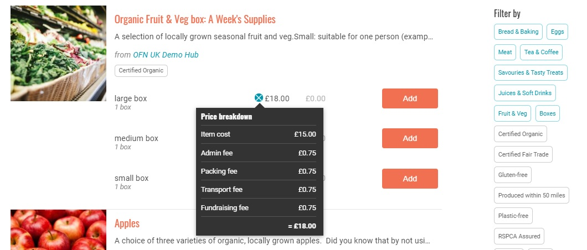

# Frais d'entreprises

Les frais d'entreprise sont utiles pour les producteurs et les plateformes qui travaillent ensemble : ils permettent de répartir les coûts associés à l'administration, à l'emballage, au transport, aux ventes et à la collecte de fonds entre les différentes parties.&#x20;

Par exemple, un hub peut choisir d'ajouter des frais d'entreprise de 10% à tous les produits qu'il vend, pour couvrir ses coûts administratifs (stockage des produits avant leur distribution, salaires des personnes qui gèrent et coordonnent les ventes...).&#x20;

Pour les producteurs qui vendent directement leurs propres produits, ces coûts sont déjà présents dans le prix du produit, donc l'application de frais d'entreprise ne devrait pas être nécessaire.&#x20;

L'un des nombreux avantages pour les clients d'OFN est la transparence des prix. Les acheteurs peuvent voir le pourcentage du prix d'un article affecté à l'administration, à l'emballage, etc. Cette information est affichée en cliquant sur le graphique circulaire situé à côté du prix d'un produit sur la devanture de la boutique :

Avant de continuer, voici une démonstration rapide de la mise en place de votre premier frais d'entreprise :

## Configurer un frais d'entreprise

* Accédez à la page des frais d'entreprise en cliquant sur **Entreprises** dans le menu horizontal bleu, puis cliquez sur **Paramètres** à côté de votre entreprise. La page **Frais d'entreprise** se trouve dans le menu de gauche.&#x20;
* Cliquez sur **Créer maintenant** (ou sur **Gérer les frais d'entreprise** si vous en avez déjà créé un et que vous souhaitez le modifier). Vous serez dirigé vers une page comme celle-ci :

**Entreprise** : Dans la première colonne, sélectionnez l'entreprise à laquelle les frais s'appliquent.&#x20;

**Type de frais** : Sélectionnez le service auquel ces frais s'appliquent. Les options sont les suivantes : frais d'emballage, frais de transport, frais d'administration, frais de vente ou frais de collecte de fonds.&#x20;

**Nom** : Choisissez un nom pour ces frais.&#x20;

**Catégorie de taxe** : Sélectionnez le taux de taxe approprié. Dans la plupart des cas, le taux de TVA pour les frais d'entreprise sera hérité du produit. Si les frais d'entreprise sont associés à un service ajouté au produit, les frais peuvent être soumis à la TVA mais pas le produit lui-même. Dans ce cas, choisissez entre "taux zéro", "taux plein" et "taux réduit" de TVA à appliquer aux frais d'entreprise.&#x20;

**Calculateur** : Les frais peuvent être calculés de plusieurs façons. Sélectionnez le calculateur qui convient le mieux.&#x20;

Cliquez sur Mettre à jour, pour créer la redevance d'entreprise.


Vous ne pourrez spécifier des taux ou des valeurs (dans la colonne "valeurs de calcul") qu'après la création de l'honoraire d'entreprise.


## Calculateurs de frais

**Pourcentage net** - Ces frais sont facturés en pourcentage du montant total de la commande.&#x20;

**Poids (par kg)** - ces frais sont appliqués aux produits sur une base par kg. Ces frais ne seront appliqués _qu'aux produits dont le prix est calculé par kg_, et non aux produits répertoriés comme articles (par exemple, un produit répertorié comme "1 botte de persil" ne sera pas associé à des frais d'entreprise avec cette option).&#x20;

**Montant fixe (par commande)** - Ces frais sont appliqués comme frais standard à toutes les commandes, quelle que soit la taille de la commande.&#x20;

**Montant flexible** - Ce calculateur de frais est particulièrement utile si vous souhaitez encourager les clients à passer des commandes importantes : l'entreprise peut être réduite ou nulle lorsque le nombre seuil d'articles a été atteint.

* Coût du premier article : Les frais facturés pour le premier article de la commande.&#x20;
* Coût article supplémentaire : Les frais facturés pour les articles au-delà du premier article.&#x20;
* Maximum d'articles : Le nombre maximum d'articles sur lesquels les frais seront appliqués. Les articles achetés au-delà de ce nombre ne seront pas facturés.

> Par exemple : si le "Coût du premier article" est fixé à 0,20 €, le " Coût article supplémentaire " à 0,10 € et le " Maximum d'articles " à 3, un client qui achète 5 articles se verra facturer 0,40 € de frais d'entreprise (0,20 € pour le premier article, 0,10 € pour les articles deux et trois, et 0,00 € pour les articles quatre et cinq).

**Montant fixe par article** : Ce tarif est un tarif constant, appliqué aux produits répertoriés comme "articles". (Elle n'est pas appliquée aux produits vendus au poids ou au volume. Il n'y aura donc pas de frais d'entreprise associés facturés à un client qui, par exemple, achète du riz au kg).&#x20;

**Montant variable selon la commande** : Il s'agit d'une méthode flexible de redevance d'entreprise facturée en fonction du montant total de la vente, plutôt que du nombre d'articles achetés (tarif flexible ci-dessus).

* Montant minimum : Valeur monétaire du seuil entre la redevance d'entreprise normale et la redevance d'entreprise réduite.&#x20;
* Montant normal : Frais de mode de paiement appliqués aux ventes inférieures au seuil indiqué dans "Montant minimum".&#x20;
* Montant réduit : Frais de mode de paiement appliqués aux ventes supérieures au seuil indiqué dans "Montant minimum".


Maintenant que vous avez créé vos frais d'entreprise, n'oubliez pas qu'**ils ne sont applicables dans votre boutique que s'ils sont ajoutés à un cycle de commande**. Pour plus de détails, consultez les pages relatives aux cycles de commande des producteurs ou des hubs.

