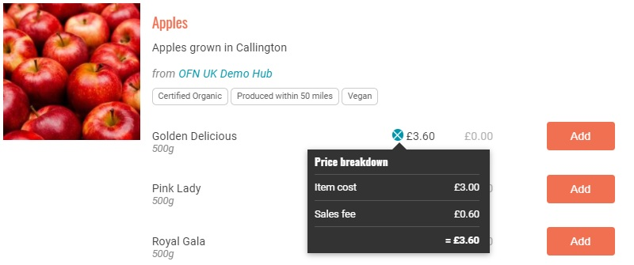

# Unternehmensgebühren

Unternehmensgebühren sind für Erzeuger und Drehscheiben, die zusammenarbeiten, nützlich: Sie ermöglichen es, die Kosten für Verwaltung, Verpackung, Transport, Verkauf und Fundraising verschiedenen Parteien zuzuordnen.

Eine Drehscheibe kann beispielsweise eine Unternehmensgebühr von 10 % auf alle von ihr verkauften Produkte erheben, um ihre Verwaltungskosten zu decken (Lagerung der Produkte vor dem Vertrieb, Gehälter der Mitarbeiter, die den Verkauf verwalten und koordinieren...).

Für Erzeuger, die ihre eigenen Produkte direkt verkaufen, sind diese Kosten bereits im Produktpreis enthalten, so dass die Anwendung von Unternehmensabgaben nicht unbedingt notwendig erscheint.

Einer der vielen Vorteile für OFN-Kunden ist die Preistransparenz. Die Kunden können sehen, wie viel Prozent des Preises eines Artikels auf Verwaltung, Verpackung usw. entfallen. Diese Information wird durch Anklicken des Tortendiagramms neben dem Preis eines Produkts auf der Shopfront angezeigt:

Bevor Sie weitermachen, möchten Sie sich vielleicht eine kurze Demonstration der Einrichtung Ihrer ersten Unternehmensgebühr ansehen:

## Einrichtung einer Unternehmensgebühr

* Rufen Sie die Seite "Unternehmensgebühren" auf, indem Sie im blauen horizontalen Menü auf "**Unternehmen**" und dann auf "**Einstellungen**" neben Ihrem Unternehmen klicken. Die Seite "**Unternehmensgebühren**" befindet sich im Menü auf der linken Seite.
* Klicken Sie auf **Jetzt erstellen** (oder **auf** **Unternehmensgebühren verwalten**, wenn Sie bereits eine eingerichtet haben und diese bearbeiten möchten). Sie werden auf eine Seite wie diese weitergeleitet:

**Unternehmen:** Wählen Sie in der ersten Spalte das Unternehmen aus, für das die Gebühr gilt.

**Gebührenart:** Wählen Sie die Dienstleistung aus, für die diese Gebühr gilt. Die Optionen sind Verpackungsgebühr, Transportgebühr, Verwaltungsgebühr, Verkaufsgebühr oder Fundraising-Gebühr.

**Name:** Wählen Sie einen Namen für diese Gebühr.

**Steuerkategorie:** Wählen Sie den entsprechenden Steuersatz. In den meisten Fällen wird der Mehrwertsteuersatz für die Unternehmensgebühr vom Produkt übernommen. Wenn die Unternehmensgebühr mit einer zum Produkt hinzugefügten Dienstleistung verbunden ist, unterliegt die Gebühr möglicherweise der Mehrwertsteuer, das Produkt selbst jedoch nicht. In diesem Fall wählen Sie zwischen "Nullsatz", "Voller Satz" und "Ermäßigter Satz" für die auf die Unternehmensgebühr anzuwendende Mehrwertsteuer.

**Rechner:** Die Gebühr kann auf verschiedene Weise berechnet werden. Wählen Sie den Rechner, der am besten passt.

Klicken Sie auf Aktualisieren, um die Unternehmensgebühr zu erstellen.


Sie können erst dann Sätze oder Werte (in der Spalte "Rechnerwerte") angeben, wenn die Unternehmensgebühr erstellt wurde.


## Gebührenberechnungen

**Pauschaler Prozentsatz** - Diese Gebühr wird als Prozentsatz des Gesamtbetrages der Bestellung berechnet.

**Gewicht (pro kg)** - diese Gebühr wird auf Produkte pro kg angewendet. Die Gebühr wird nur auf Produkte angewandt, deren Preis pro kg angegeben ist, nicht auf Produkte, die als Artikel aufgeführt sind (z. B. wird für ein Produkt, das als "1 Bund Petersilie" aufgeführt ist, mit dieser Option keine Unternehmensgebühr erhoben).

**Pauschale (pro Auftrag)** - Diese Gebühr wird als Standardgebühr für alle Aufträge erhoben, unabhängig vom Umfang des Auftrags.

**Flexibler Tarif** - Dieser Tarifrechner ist besonders nützlich, wenn Sie Ihre Kunden zu Großbestellungen ermutigen möchten: Das Unternehmen kann reduziert werden oder auf Null gesetzt werden, wenn eine bestimmte Anzahl von Artikeln erreicht wird.

* Kosten für den ersten Artikel": Die Gebühr, die für den ersten Artikel im Auftrag erhoben wird.
* Kosten für zusätzliche Artikel": Die Gebühr, die für die über den ersten Artikel hinausgehenden Artikel erhoben wird.
* Max Items": Die maximale Anzahl von Artikeln, auf die die Gebühr erhoben wird. Für Artikel, die über diese Anzahl hinaus gekauft werden, wird die Gebühr nicht erhoben.

> Beispiel: Wenn die "Kosten für den ersten Artikel" auf 0,20 £, die "Kosten für zusätzliche Artikel" auf 0,10 £ und die "Maximale Artikelanzahl" auf 3 festgelegt sind, werden einem Kunden, der 5 Artikel kauft, 0,40 £ an Unternehmensgebühren berechnet (0,20 £ für den ersten Artikel, 0,10 £ für die Artikel zwei und drei und 0,00 £ für die Artikel vier und fünf).

**Pauschalgebühr (pro Artikel):** Diese Gebühr ist eine konstante Gebühr, die auf Produkte angewendet wird, die als "Artikel" aufgeführt sind. (Sie wird nicht auf Produkte angewandt, die nach Gewicht oder Volumen verkauft werden. Daher wird einem Kunden, der z. B. Reis pro kg kauft, keine entsprechende Unternehmensgebühr berechnet).

**Preissack:** Hierbei handelt es sich um eine flexible Unternehmensgebührenmethode, die nach dem Gesamtumsatz und nicht nach der Anzahl der gekauften Artikel berechnet wird (siehe oben).

* ‘Mindestbetrag": Geldwert des Schwellenwerts zwischen normaler Unternehmensgebühr und ermäßigter Unternehmensgebühr.
* 'Normaler Betrag': Die Gebühr für die Zahlungsmethode wird für Verkäufe unter dem in "Mindestbetrag" angegebenen Schwellenwert erhoben.
* Mindestbetrag'.'Rabattbetrag': Gebühr für die Zahlungsmethode, die auf Verkäufe oberhalb des unter "Mindestbetrag" angegebenen Schwellenwerts angewendet wird.


Nachdem Sie nun Ihre Unternehmensgebühr erstellt haben, denken Sie daran, **dass sie nur dann in Ihrem Shop gilt, wenn sie einem Bestellzyklus hinzugefügt wird**. Weitere Informationen finden Sie auf den Seiten zum Bestellzyklus für [Produzenten](order-cycle/order-cycles-for-producers.md) oder [Hubs](order-cycle/order-cycles-for-hubs.md).

