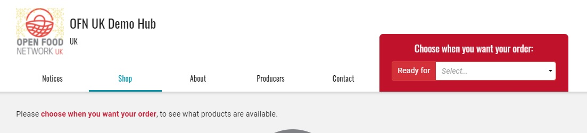
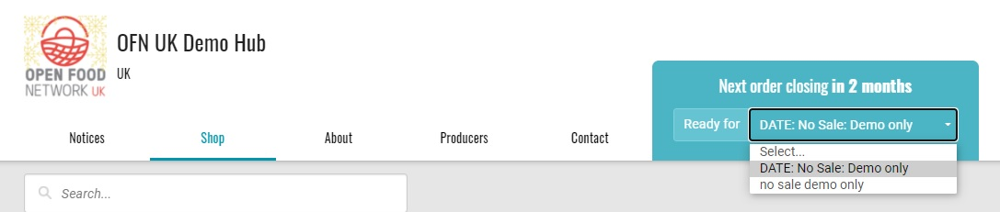

# Eröffnung von mehr als einem Auftragszyklus

Es ist möglich, mehr als einen Bestellzyklus gleichzeitig offen zu haben. Dies hat den Effekt, dass zwei (oder mehr) offene Schaufenster entstehen, zwischen denen der Kunde über die eine Website-Adresse (URL) wählen kann.\
Diese Funktion ist hilfreich, wenn Sie unterschiedliche "Bedingungen" in den beiden Schaufenstern haben möchten, wie z. B. unterschiedliche Produkte (Groß- oder Einzelhandel), unterschiedliche Unternehmensgebühren (z. B. Aufschläge für Nicht-Mitglieder) oder unterschiedliche Öffnungs- und Schließungsdaten für den Auftragszyklus (für unterschiedliche Lieferläufe).

Wenn der Kunde das erste Mal auf Ihrer Shopseite landet, wird er aufgefordert, einen Bestellzyklus auszuwählen, bevor die Produkte sichtbar sind:

Wenn der Kunde einen Bestellzyklus auswählt, wird das Schaufenster mit den spezifischen Produkten, Gebühren und Eröffnungs- und Abschlussdaten dieses Bestellzyklus geladen.


**Es ist nicht möglich, für verschiedene Bestellzyklen unterschiedliche** [**Versand**](../shipping-methods.md)**- oder** [**Zahlungsmethoden**](../payment-methods.md) **anzubieten;** für alle Bestellzyklen stehen alle Ihre Versand-/Zahlungsmethoden zur Verfügung. Anstatt gleichzeitige Bestellzyklen einzurichten, verwenden Sie [Tags](../customer-management-and-conditional-displays-prices/tags-and-tag-rules.md), um unterschiedliche Tarife für bestimmte Kunden anzubieten.



[**Tags**](../customer-management-and-conditional-displays-prices/tags-and-tag-rules.md) können auch verwendet werden, um Bestellzyklen für bestimmte Kunden sichtbar oder unsichtbar zu machen. Wenn Sie z. B. Ihre Großhandelskunden als "pro" kennzeichnen, können Sie einen Auftragszyklus mit Großhandelspreisen nur für "pro" sichtbar machen.


## Bestellung Ihrer Auftragszyklen

Sie können wählen, ob Ihre Auftragszyklen im Dropdown-Menü nach Abschlussdatum (frühestes Abschlussdatum) oder nach Eröffnungsdatum (frühestes Eröffnungsdatum) aufgelistet werden sollen.

Dies wird in Ihren [Unternehmenseinstellungen](../../enterprise-profile/enterprise-settings.md) -> Shop-Einstellungen -> Sortierreihenfolge Zyklen auf der Schaufensterfront nach

Die Kunden können zwischen den Bestellzyklen navigieren:

