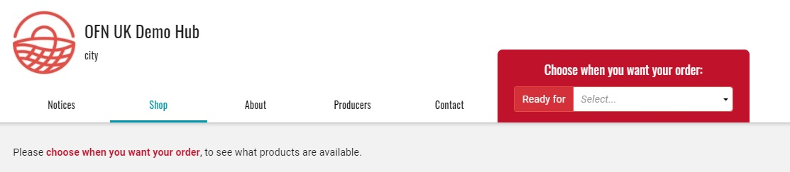
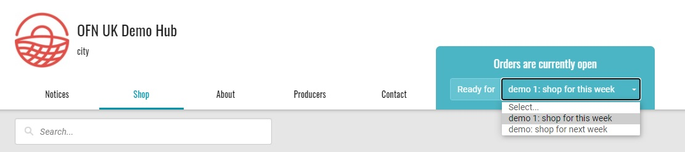

# Opening more than one order cycle

It is possible to have more than one order cycle open at the same time. This has the effect of creating two (or more) open shopfronts, which the customer can choose between from the one website address (URL). \
This feature is helpful when you want to have different ‘conditions’ in the two shopfronts such as different products (wholesale or retail), different enterprise fees (such a non-member mark-ups) or different order cycle opening and closing dates (for different deliver runs).

When the customer first lands on your shopfront page they will be requested to choose an order cycle before products are visible:

When the customer selects an order cycle, the shopfront will load with the specific products, fees and opening and closing dates of that order cycle.


[Tags](../customer-management-and-conditional-displays-prices/tags-and-tag-rules.md) can also be used to make order cycles visible or invisible to specific customers. For example, if you tag your wholesale customers as 'pro', then you can make an order cycle with wholesale pricing visible only to 'pro'.&#x20;


## **Ordering your order cycles**

You can choose whether you want your order cycles to be listed in the dropdown menu by closing date (closing soonest first) or by opening date (opened earliest first).&#x20;

This is setup in your [enterprise settings](../../enterprise-profile/enterprise-settings.md) -> Shop Preferences -> Sort Order Cycles On Shopfront By

.jpg>)

Customers can navigate between order cycles:

