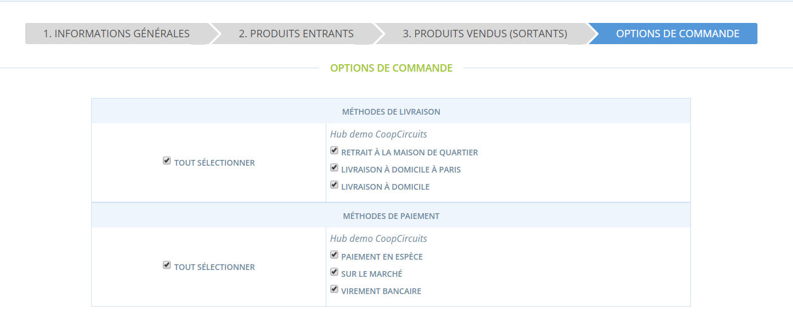

# Cycle de vente géré par un hub

_\*Vous êtes un producteur et avez choisi un type de profil "Boutique producteur" ? Rendez-vous sur_ [_Cycle de vente géré par un producteur_](https://guide.openfoodnetwork.org/v/fr/basic-features/shopfront/order-cycle/order-cycles-for-producers)_._

En créant un cycle de vente, vous définissez les périodes d'ouverture des commandes sur votre boutique. Les produits seront affichés aux achteurs. Vous pouvez définir des marges et commissions pour couvrir les frais liés à la distribution.

Certaines entreprises choisissent d'avoir un cycle de vente  ouvert en continu et répondre à chaque commande au fil de l'eau. D'autres fonctionnent par périodes de commande correspondant à un jour de livraison donné. Par exemple, les ventes seront ouvertes pendant deux semaines (un cycle de vente de deux semaines) : à la fin de ces deux semaines, toutes les commandes seront emballées et livrées en même temps le mercredi suivant. Une fois que ce lot de commandes a été livré, un nouveau cycle de vente redémarre. Cela permet d'optimiser la préparation des commande et le transport, réduisant aussi les frais associés grâce à une logique de massification.

## Créer un nouveau cycle de vente

Dans l'onglet "Cycles de vente", cliquez sur "Nouveau cycle de vente" :&#x20;

<figure><figcaption></figcaption></figure>


**Attention !** Vos cycles de vente seront inactifs tant que vous n'aurez pas créé au moins une [méthode de livraison](https://guide.openfoodnetwork.org/v/fr/basic-features/shopfront/shipping-methods) et une [méthode de paiement](https://guide.openfoodnetwork.org/v/fr/basic-features/shopfront/payment-methods)


### Choix du coordinateur

La première chose à faire est de sélectionner un coordinateur pour votre cycle de vente.&#x20;

<figure><figcaption></figcaption></figure>

Cette entreprise aura toutes les permissions pour modifier et gérer le cycle de vente. Les autres entreprises impliquées dans le cycle de vente (les fournisseurs ou les autres hubs) auront des accès restreints. Pour plus d'informations sur les gestions des droits entre entreprises dans le contexte des cycles de vente, cliquez [ici](https://guide.openfoodnetwork.org/v/fr/basic-features/enterprise-profile/enterprise-settings#gestionnaires).

Une fois le coordinateur choisi vous êtes redirigé vers un écran en 4 étapes :

### Étape 1. Informations générales

<figure><figcaption></figcaption></figure>

**1/ Nom :** Choisissez un nom pour le cycle de vente. Il sera visible uniquement de vous, donc indiquez quelque chose qui vous permettra de le retrouver facilement ensuite. Par exemple vous pouvez écrire "_Semaine 36"._

**2/ Commandes à partir de :** La date à laquelle votre boutique commencera à accepter des commandes pour ce cycle de vente.  Si vous n'êtes pas prêt à ouvrir tout de suite, indiquez des dates dans le futur, que vous pourrez changer ensuite.

**3/ Commandes jusqu'au :** La date à laquelle votre boutique arrêtera d'accepter des commandes pour ce cycle de vente. Si vous souhaitez laisser votre boutique ouverte en continu, indiquer une date dans un futur très lointain - attention, l'utilisation d'un cycle de vente continu vous empêchera d'utiliser [la fonctionnalité d'envoi automatique des commandes aux producteurs](order-cycles-for-hubs.md#notifier-les-producteurs).

**4/ Ajouter commission coordinateur :** Si vous souhaitez appliquer une marge ou commission sur tous les produits et tous les distributeurs figurant dans ce cycle de vente, vous pouvez choisir ici la marge souhaitée parmi les marges et commission prédéfinies (voir page [Marges et commissions](https://guide.openfoodnetwork.org/v/fr/basic-features/shopfront/enterprise-fees)).

### Étape 2. Produits entrants (fournisseurs)

Cette section vous permet de sélectionner les produits des fournisseurs qui seront vendus durant le cycle de vente. Les producteurs visibles dans la liste déroulante sont uniquement les producteurs vous [ayant autorisé à vendre leurs produits](https://guide.openfoodnetwork.org/v/fr/basic-features/enterprise-profile/enterprise-to-enterprise-permissions-e2es).&#x20;

<figure><figcaption></figcaption></figure>

**1/ Le bouton** **"Ajouter un fournisseur"** vous permet de sélectionner les produits associés à ce fournisseur.&#x20;

**2/ La sélection des produits** vous permet de cocher les produits que vous souhaitez ajouter au cycle de vente (vous pouvez aussi les sélectionner tous).&#x20;


Les produits qui sont en rupture de stock s'afficheront également dans la liste. Pas d'inquiétude, ils n'apparaîtront pas dans la boutique.


**3/** **Les détails de livraison produits (facultatif)** sont affichés dans l'email envoyé aux producteurs à la fin du cycle de vente, ou quand vous les notifiez (voir la section [Notifier les producteurs](order-cycles-for-hubs.md#notifier-les-producteurs)). Il s'agit donc de précisions que le hub adresse au producteur concernant les conditions de livraison.

**4/ Le bouton marge et commission** vous permet d'appliquer une marge différenciée selon le producteur. Par exemple, le producteur de farine achemine ses produits d'assez loin et les coûts de transport sont particulièrement élevés sur ces produits. Le hub souhaite refléter ce coût de manière transparente sur les produits de ce producteur : il va pouvoir ajouter une marge spécifique pour ce producteur, qui s’additionnera aux autres marges figurant au niveau du coordinateur ou des distributeurs (étape 3). Sélectionnez le nom de l'entreprise, puis le nom de la marge comme dans l'exemple ci-dessous:

<figure><figcaption></figcaption></figure>

Cette marge s'appliquera à tous les produits du fournisseur. La marge sera calculée en fonction du calculateur sélectionné au moment de sa création (voir page [marges et commissions](https://guide.openfoodnetwork.org/v/fr/basic-features/shopfront/enterprise-fees)).

### Étape 3. Produits sortants (distributeurs)

Cette étape permet de définir les distributeurs qui vont vendre les produits du cycle de vente, et d'affiner la sélection produits selon ces distributeurs.

<figure><figcaption></figcaption></figure>

**1/ Ajouter un distributeur** Vous pouvez ici sélectionner un ou plusieurs hubs-distributeurs, dont les boutiques respectives seront ouvertes à la commande pour ce cycle de vente. Dans un modèle simple, il n'y a qu'un seul hub-distributeur. Dans un modèle plus complexe avec plusieurs distributeurs, vous avez la possibilité de sélectionner des produits différents pour chacun et de paramétrer des dates de livraison différentes.

**2/ Sélectionner les produits :** Cochez les cases des produits que vous souhaitez sélectionner pour le cycle de vente. Pour sélectionner tous les produits, cochez la case "Sélectionnez toutes les variantes".

**3/** **Tags (facultatif) :** ils vous permettent de taguer le cycle de vente pour qu'il ne soit visible que par certains acheteurs (voir page [Affichages relatifs aux catégories d'acheteurs (tags)](https://guide.openfoodnetwork.org/v/fr/basic-features/shopfront/customer-management-and-conditional-displays-prices/tags-and-tag-rules#les-regles-de-tags)).

**4/ Prêt pour = date de distribution / livraison :** La date à laquelle cette commande sera distribuée (ou livrée) aux acheteurs, par exemple _"Distribution du 6 septembre",_ ou "_Vendredi prochain"_ ou _"Commande viande pour 23 juillet"_. Ce texte sera affiché dans l'encart bleu sur votre boutique :

<figure><figcaption></figcaption></figure>

**5/ Modalités de retrait/livraison (facultatif) :** Les indications précisées ici seront incluses dans l'e-mail de confirmation de commande envoyé au client. Elles apparaîtront juste en-dessous de la méthode de livraison. Ils seront les seuls à obtenir cette information donc vous pouvez y inclure des informations comme des adresses ou numéros de téléphone.

**6/ Ajouter une commission** **:** Une marge ou commission peut être spécifiée. Elle s'appliquera sur tous les produits proposés à la vente par ce distributeur. Se référer aux [explications sur les commissions](https://guide.openfoodnetwork.org/v/fr/basic-features/shopfront/enterprise-fees).

Cliquez sur "Sauvegarder" pour créer le cycle de vente.

## Tableau de bord des cycles de vente&#x20;

Les cycles de vente sont présentés en :

:thumbsup: **vert** lorsqu'ils sont **actifs**

:thumbsup: **jaune** lorsqu'ils sont **en attente d'ouverture** (date de début de commandes pas encore passée)

:thumbsup: **gris** lorsqu'ils sont **fermés**.&#x20;

<figure><figcaption></figcaption></figure>

**1/ Nom de votre cycle de vente**. Ce nom n'est visible que par vous, il n'est pas affiché au consommateur. Vous pouvez le modifier directement.

**2/** **Dates d'ouverture et fermeture du cycle de vente**. Vous pouvez les modifier directement.

**3/** Le **bouton d'édition** vous permet de retourner dans les étapes du cycle de vente, si vous avez d'autres modifications à faire.

**4/** Le **bouton dupliquer** est très pratique pour cloner un cycle de vente. Par exemple, si votre cycle de vente se répète de manière périodique et régulière, vous pouvez dupliquer un cycle de vente passé afin d'aller plus vite.

**5/** Le **bouton supprimer** vous permet de supprimer un cycle de vente. Notez que dès qu'il y a eu des visites sur la page de votre boutique au niveau de ce cycle de vente, ce bouton est désactivé et il n'est plus possible de supprimer le cycle de vente.


A noter qu'un mois après sa fermeture, un cycle de vente n’apparaît plus directement dans cette liste : il faudra cliquer sur les boutons "Montrer +30 jours" ou "Montrer +90jours" pour le faire apparaître.


### Etape 4. Options de commande 

<figure><figcaption>
Personnaliser vos méthodes de paiement et de livraison par cycle de vente
</figcaption></figure>

La dernière étape vous permet de sélectionner les méthodes de livraison ou de paiement qui doivent s'afficher lors du parcours d'achat du cycle de vente. Par défaut, toutes vos méthodes sont sélectionnées.

## Notifier les producteurs des commandes / récapitulatif des produits à préparer 

Lorsque les commandes sont passées à travers un hub, les producteurs ne reçoivent pas d'email avec la commande. Seul le hub reçoit cette information. Cela permet au hub de décider du moment où les producteurs seront notifiés, afin notamment de pouvoir modifier les commandes entre temps.&#x20;

&#x20;Pour notifier les producteurs des commandes en cours, vous avez deux choix :

:thumbsup: **Notification immédiate** : pour envoyer immédiatement un email aux producteurs, cliquez sur le bouton "Notifier les producteurs" dans la page d'édition d'un cycle de vente :

<figure><figcaption></figcaption></figure>

En utilisant ce bouton, tous les producteurs liés à ce cycle de vente recevront un email contenant une liste des produits commandés pour ce cycle de vente avec les instructions éventuelles de livraison si elles ont été renseignées dans le cycle de vente (produits entrants).

:thumbsup:**Notification automatique à la fin du cycle de vente :**

L'email sera envoyé automatiquement à la fin du cycle de vente (dernier jour de la prise de commandes). Cliquez sur "Paramètres avancés", puis cochez la case "Notifications automatiques", et cliquez sur "Sauvegarder" :

<figure><figcaption></figcaption></figure>

Le mail envoyé ressemble à ceci :

<figure><figcaption></figcaption></figure>


Attention, si vous avez un cycle de vente continu, vous ne pourrez pas utiliser cette fonctionnalité, puisque la fin du cycle de vente sera très lointaine..

