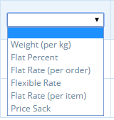

# Modes de Paiement


Il vous faut créer **au moins un** mode de paiement avant de pouvoir ouvrir votre boutique.


Avant de poursuivre votre lecture, nous vous proposons une démonstration rapide de la manière de configurer votre premier mode de paiement :

## Configurer un Mode de Paiement

* Accédez à la page des modes de paiement en cliquant sur **Entreprises** dans le menu horizontal bleu, puis cliquez sur **Paramètres** à côté de votre entreprise. La page des modes de paiement se trouve dans le menu de gauche.&#x20;
* Cliquez sur **Créer un nouveau mode de paiement +** . Vous serez dirigé vers une page comme celle-ci :

* Cochez votre entreprise, dans la case située à droite de la page intitulée "Hubs". Cela indique à quelle entreprise s'appliquera le mode de paiement que vous êtes sur le point de créer. Vous pouvez sélectionner plusieurs entreprises.&#x20;
* **Nom** : Choisissez un nom pour ce mode de paiement. (par exemple, "Payer par carte de crédit"). Ce nom sera affiché à la caisse et sur les e-mails de confirmation de commande des clients.

* **Description** : fournissez des détails supplémentaires sur le mode de paiement. Par exemple, pour un virement bancaire, vous indiquerez dans ce champ les coordonnées du compte bancaire sur lequel vous souhaitez que le client effectue le paiement BACS. Cette description est affichée à la caisse et dans les e-mails de confirmation de commande.&#x20;
* **Affichage** : Choisissez entre "visible par l'administration uniquement" et "visible par l'acheteur sur la boutique".


Si vous souhaitez désactiver un mode de paiement pendant un certain temps, mais que vous souhaitez le proposer à nouveau à l'avenir (peut-être en raison d'une épidémie de COVID, vous devez temporairement cesser de proposer des encaissements), changez-le en "visible par l'administration uniquement".



Si vous changez tous les modes de paiement de votre entreprise en "visible par l'administration uniquement", vous obtiendrez une vitrine à affichage unique pour les cycles de commande actifs.


* **Actif** : Indiquez si ce mode de paiement est actuellement visible et disponible, ou non.&#x20;
* **Étiquettes** : Utilisez des étiquettes si vous souhaitez rendre certains modes de paiement disponibles ou non pour des clients spécifiques (par exemple, vous pouvez autoriser uniquement les clients en gros à payer par BACS mais "obliger" les clients nationaux à payer par carte de crédit ou PayPal). Pour plus d'informations, lisez ici.&#x20;
* **Fournisseurs de paiement** : Sélectionnez l'option correspondant au mode de paiement que vous créez. Il existe cinq options :
*
  * MasterCard Internet Gateway Service (MIGS)&#x20;
  * PayPal Express&#x20;
  * Stripe SCA
  * Espèces, chèques ou virements bancaires. Ces paiements ne passent pas par un portail de paiement en ligne et n'impliquent pas de validation automatique.


N'oubliez pas ! Si votre entreprise a activé l'option "_**Les clients peuvent modifier ou annuler des commandes pendant qu'un cycle de commande est ouvert**_" (dans Entreprises -> Paramètres -> Préférences de la boutique), le seul fournisseur de paiement recommandé compatible avec cette fonctionnalité est "Espèces, TEF, ...".)


* **Calculatrice** : Sélectionnez comment vous souhaitez que les frais associés au mode de paiement s'appliquent à une commande. Notez que les frais liés au mode de paiement peuvent être fixés à zéro. Voir ci-dessous pour plus d'informations sur les frais de mode de paiement.

En cliquant sur **Créer**, le mode de paiement sera créé et vous disposerez de nouveaux champs pour définir les frais du mode de paiement. Ces champs visibles dépendent de la "calculatrice" que vous avez sélectionnée.


Si vous modifiez le champ "Calculatrice" du mode de paiement, vous devez d'abord enregistrer vos modifications (Mettre à jour) pour que les nouveaux champs associés deviennent visibles.


## Prestataires de paiement intégrés

Voici les instructions pour configurer les modes de paiement tierces Paypal, Mastercard (MIGS) et Strip



Pour configurer un mode de paiement PayPal, vous avez besoin d'un compte professionnel ou marchand PayPal. Vous pouvez en créer un ici. Une fois que vous l'avez, vous pouvez configurer un "accès API" dans PayPal, ce qui permettra à OFN de connecter les clients directement à votre compte PayPal.

1. Connectez-vous à votre compte PayPal.
2. Sous le nom de votre compte, en haut à droite, se trouve un menu déroulant intitulé "Paramètres du compte".

3\. Sélectionnez " Mettre à jour " dans Accès API

4\. Sélectionnez "Gérer les informations d'identification de l'API" dans l'option de paiement personnalisé.

De là, vous pourrez accéder à votre nom d'utilisateur, votre mot de passe et votre signature de l'API.

Dans OFN, assurez-vous que vous êtes connecté en tant qu'utilisateur de l'entreprise. Allez dans une entreprise et créez une méthode de paiement. Sélectionnez PayPal et remplissez les détails à partir du site PayPal.&#x20;

**Serveur** : Remplacez le champ " serveur " par " en ligne " - ce champ est sensible à la casse.&#x20;

**Identifiant** : saisissez le nom d'utilisateur de l'API.&#x20;

**Mot de passe** : saisissez le mot de passe de l'API.&#x20;

**Signature** : saisissez la signature de l'API dans ce champ.

**Solution** : Solution détermine si un utilisateur a besoin ou non d'un compte PayPal pour passer à la caisse.&#x20;

Tapez "Marque" si vous voulez que les utilisateurs aient un compte Paypal, ou " Sole " s'ils peuvent passer à la caisse sans compte Paypal (avec une carte de crédit).&#x20;

**Page d'atterrissage** : Vous pouvez sélectionner la page à afficher aux clients une fois qu'ils sont redirigés vers PayPal.&#x20;

Tapez "Connexion" pour diriger le client vers le formulaire de connexion à PayPal (si vous avez sélectionné "Marque" ci-dessus). Ou tapez "Facturation" pour afficher aux clients un formulaire où ils peuvent saisir les données de leur carte de crédit et éventuellement ouvrir un compte PayPal (si vous avez sélectionné "Sole" ci-dessus).



&#x20;MasterCard Internet Gateway Service (MIGS)

La configuration de ce service doit être effectuée par votre banque.



Stripe est une plateforme de paiement en ligne similaire à Paypal. Elle vous permettra d'accepter les paiements par carte de crédit de vos clients. Stripe est une plateforme mondiale, mais n'est disponible que sur certaines instances OFN. Contactez votre équipe OFN locale pour savoir si elle est disponible sur votre OFN.

**Pourquoi utiliser Stripe ?**&#x20;

Stripe est simple à configurer pour les propriétaires de boutiques et son prix est raisonnable. Les frais facturés par Stripe varient selon les pays.&#x20;

Stripe est également facile à utiliser pour les clients. Contrairement à Paypal, lorsque le client passe à la caisse, il n'a pas besoin de se connecter à Paypal pour passer sa commande, il lui suffit d'entrer les détails de sa carte et de terminer sa commande.&#x20;

Stripe est la méthode de paiement recommandée pour les boutiques qui souhaitent utiliser les abonnements sur OFN, car Stripe permet aux clients d'autoriser une boutique à facturer automatiquement leur carte de crédit pour les commandes d'abonnement. Cette possibilité n'est pas offerte par les plateformes de paiement Paypal, Pin ou MIGS.

#### Configuration

**Connexion avec Stripe**&#x20;

Avant de pouvoir configurer un mode de paiement utilisant Stripe, vous devez vous connecter à Stripe. Pour ce faire, cliquez sur le bouton "Connecter avec Stripe".

Vous serez dirigé vers un formulaire pour remplir vos coordonnées. Si vous avez déjà un compte Stripe, vous pouvez vous connecter, sinon, remplissez le formulaire pour créer un compte Stripe.&#x20;

Les informations qui vous seront demandées sont les suivantes : le pays, une description de votre activité, l'adresse et le numéro d'immatriculation de votre entreprise, vos coordonnées personnelles et votre compte bancaire (où les paiements reçus seront déposés).

**Créer un nouveau mode de paiement**&#x20;

Une fois que vous vous êtes connecté à Stripe, vous pouvez créer un mode de paiement qui fonctionnera avec votre compte connecté.&#x20;

Remplissez les champs **Nom**, **Description**, **Actif** et **Balises** comme vous le feriez avec n'importe quel mode de paiement.&#x20;

**Opérateur** : Sélectionnez Stripe.&#x20;

Une fois que vous avez sélectionné Stripe, "Paramètres du fournisseur" s'affiche.&#x20;

**Propriétaire du compte Stripe** : Sélectionnez l'entreprise qui a un compte Stripe connecté.&#x20;

Si vous sélectionnez une entreprise qui n'est pas connectée à Stripe (voir ci-dessus), vous obtiendrez l'erreur suivante. Cliquez sur "Connectez-vous" ou retournez à l'onglet Méthodes de paiement pour vous connecter à Stripe. Voir les instructions ci-dessus.

**Paiements Stripe pour les clients**&#x20;

Lorsque les clients passent à la caisse dans une boutique et paient avec un mode de paiement Stripe, ils ont la possibilité de cocher une case autorisant le stockage des détails de leur carte de crédit dans leur compte (s'ils sont connectés).&#x20;

Le client peut également enregistrer une carte de crédit dans son compte, ou supprimer celles qui ont été enregistrées.

Lors de son prochain achat dans une boutique OFN proposant Stripe comme méthode de paiement, le client pourra choisir parmi ses cartes de crédit enregistrées.

**Consulter et encaisser vos paiements via Stripe**&#x20;

Lorsqu'un client paie sa commande avec Stripe, les fonds (moins les frais de Stripe) sont versés sur votre compte Stripe. En fonction de vos paramètres dans Stripe, les fonds seront transférés automatiquement et périodiquement sur le compte bancaire de votre choix.

**Accepter un paiement supplémentaire**&#x20;

Si vous devez demander un paiement supplémentaire à un client parce qu'il a un solde à payer, vous pouvez créer une facture dans Stripe. Le client recevra un e-mail lui demandant de payer par carte de crédit/débit. Ceci ne sera pas communiqué à OFN, vous devrez donc marquer le paiement manuellement.

.png>)



## Les Frais des Modes de Paiement

Vous pouvez associer des frais aux méthodes de paiement. Le plus souvent, cela sert à répercuter les frais d'un portail de paiement sur le client. Par exemple, vous pouvez faire payer le client pour le service de paiement par PayPal afin de couvrir les frais facturés par PayPal.


Les frais du mode de paiement ne comprennent pas la taxe (TVA).


### Calculateur de frais

**Pourcentage net** : Ces frais sont facturés en pourcentage du montant total de la commande.


Tous les **frais en pourcentage** sont calculés sur un pourcentage du **coût des produits** uniquement.



Si votre entreprise ajoute un pourcentage net de frais d'entreprise à tous les produits, alors pour obtenir le **montant** du "pourcentage net", le pourcentage souhaité du panier d'un client est le suivant:

&#x20;$$= (100 + Frais)*Pourcentage/100$$&#x20;

Par exemple, pour une entreprise dont les frais d'entreprise sont de 20 % et qui souhaite facturer des frais de 5 % du panier total d'un client pour le paiement, le montant à saisir dans le pourcentage fixe de ce mode de paiement est le suivant :

$$= (100 + 20) *5/100 = 6$$&#x20;


**frais fixe :** Ces frais sont appliqués comme un montant standard à toutes les commandes, quelle que soit la taille de la commande.

**frais flexible** – Ce calculateur de frais est particulièrement utile si vous souhaitez encourager les clients à passer des commandes importantes : le coût du paiement peut être réduit ou nul lorsque le nombre seuil d'articles a été atteint.

* Coût du premier article : Les frais facturés pour le premier article de la commande.&#x20;
* Coût de l'article supplémentaire : Les frais facturés pour les articles au-delà du premier article.&#x20;
* Maximum d'articles : Le nombre maximum d'articles sur lesquels les frais seront appliqués. Les articles achetés au-delà de ce nombre ne seront pas facturés.

> Par exemple : si le "Coût du premier article" est fixé à 0,20 €, le "Coût de l'article supplémentaire" à 0,10 € et le " Maximum d'articles " à 3, un client qui achète 5 articles se verra facturer 0,40 € de frais de paiement (0,20 € pour le premier article, 0,10 € pour les articles deux et trois, et 0,00 € pour les articles quatre et cinq).

**Frais fixe (par article)** : un frais constant, appliqué aux produits listés comme "articles". (Il ne s'applique pas aux produits vendus au poids ou au volume. Par conséquent, aucun frais de mode de paiement associé ne sera facturé à un client qui, par exemple, achète du riz au kilo).&#x20;

**Montant variable selon total commande** : Il s'agit d'un mode de paiement flexible facturé en fonction du montant total de la vente, plutôt que du nombre d'articles achetés (tarif flexible ci-dessus).

* Montant minimum : Valeur monétaire du seuil entre les frais du mode de paiement normal et les frais du mode de paiement réduit.&#x20;
* Montant normal : Frais de mode de paiement appliqués aux ventes inférieures au seuil indiqué dans "Montant minimum".&#x20;
* Montant de la remise : Frais de mode de paiement appliqués aux ventes supérieures au seuil indiqué dans "Montant minimum".


Le **montant minimum** correspond au _coût total des produits_ contenus dans le panier d'un client et ne comprend pas les frais d'entreprise.



Par exemple, si une entreprise ajoute des frais d'entreprise de 20 % à tous ses produits et qu'elle souhaite définir le seuil entre l'absence de frais de paiement (Montant de la remise = 0) et, par exemple, des frais de 0,50 € (= Montant normal) pour un panier de 30 €, le Montant minimum est le suivant

$$= 30 * 100 /(100+20) = 25€$$&#x20;



Les portails de paiement facturent souvent aux entreprises un montant fixe par transaction plus un petit % du coût total. Ainsi, les frais encourus par un Hub ou une boutique pour les clients qui achètent le même montant total en plusieurs petites ventes seront plus élevés que si le client faisait tous ses achats en une seule fois.&#x20;

Les calculateurs de taux flexible et de sac de prix, appliqués aux frais de méthode de paiement, peuvent s'avérer utiles pour compenser cela.


## Remboursements

L'émission et la gestion des remboursements dépendent de la manière dont le client a payé sa commande à l'origine. Vous trouverez plus de détails ici.
