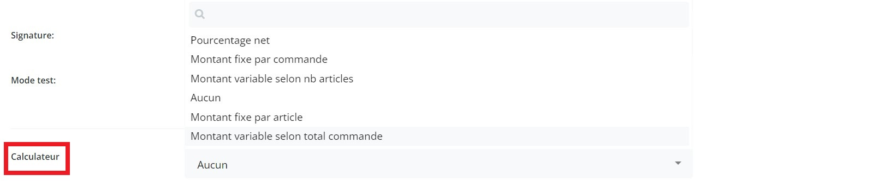
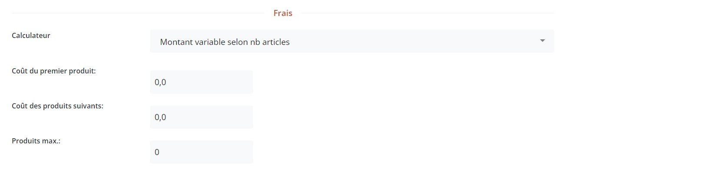

# Méthodes de paiement


La définition d'au moins une méthode de paiement est obligatoire avant l'ouverture d'une boutique !


## Définir une méthode de paiement

Dans l'espace administration, allez dans l'onglet **Entreprises** puis cliquez sur "**Paramètres",** puis  sur l'onglet "**Méthodes de paiement"** dans le menu vertical de gauche. Cliquez sur le bouton "En créer une maintenant".

<figure><figcaption></figcaption></figure>

Vous serez redirigé sur la page suivante :

<figure><figcaption></figcaption></figure>

**1) Nom :** Choisissez un nom pour la méthode de paiement (par exemple : "chèques ou espèces", ou  "Paiement en ligne par carte bancaire"). Ce nom sera affiché au client durant son processus d'achat et sur les emails de confirmation de commande.&#x20;

**Le nom de la méthode est le seul champ obligatoire. Toutes les autres options peuvent être laissées par défaut (pensez tout de même à changer le Fournisseur (point numéro 6) si vous proposez du paiement en ligne) :**&#x20;

_**2) Description :** ajoutez les détails associés la méthode de paiement. Par exemple, pour un virement, vous pouvez indiquez les détails du RIB. Cette description s'affichera au moment du paiement pour l'acheteur, ainsi que dans les emails de confirmation qui lui seront envoyés._

_**3) Afficher :** cette option est utile seulement si vous souhaitez masquer cette méthode de paiement à l'utilisateur·ice, mais la garder active pour les achats en back-office_

_**4) Actif :** vous permet de désactiver la méthode de paiement sans la supprimer_

_**5) Tags :** Utilisez les tags si vous souhaitez restreindre certaines méthodes de paiements à certains types d'acheteurs (voir le détail de la fonctionnalité_ [_ici_](https://guide.openfoodnetwork.org/v/fr/basic-features/shopfront/customer-management-and-conditional-displays-prices/customers#tags-association-dun-acheteur-a-une-categorie-donnee)_)._

_**6)**_ _**Fournisseurs** : Sélectionnez celui qui concerne la méthode que vous êtes en train de créer. Vous pouvez accepter les paiements de 5 "fournisseurs" de systèmes de paiement :_

* _Espèces / chèques / virements / autres (il s'agit de liquide ou chèque ou virement bancaires ou tout autre option ne nécessitant pas de passer par un portail de paiement en ligne et n'impliquant pas de validation automatique)_
* _PayPal Express_
* _Stripe_

_**7) Calculateur :** à utiliser si vous souhaitez ajouter des frais de paiement qui vont s'appliquer sur la commande. Ces frais sont à zéro par défaut. Voir plus de détail sur les_ [_options du calculateur_](https://guide.openfoodnetwork.org/v/fr/basic-features/shopfront/enterprise-fees#le-calculateur)_._

**Cliquez sur le bouton "Créer" en bas de page.** Bien joué, vous avez défini votre première méthode de paiement ! 🎉

* Vous pouvez en créer d'autres en cliquant sur le bouton "+ Nouveau"
* Et vous pouvez retrouver toutes les méthodes créées en cliquant sur le bouton "Retour à la liste des méthodes de paiement".

<figure><figcaption></figcaption></figure>

## Proposer le paiement en ligne

Si vous souhaitez proposer à vos client·e·s de payer par carte bancaire lors de la finalisation de la commande en ligne, vous pouvez utiliser les prestataires bancaires Stripe ou Paypal, qui permettent de gérer les transactions bancaires en ligne. Il vous faudra créer un compte chez l'un de ces prestataires :


L'utilisation de ces prestataires bancaires a un coût.

Les frais prélevés par Stripe sont par exemple de 1,5% + 0,25 cts par transaction (attention, Stripe modifie régulièrement cette commission - vous pouvez vérifier [sur leur site](https://stripe.com/fr/pricing) que ce sont bien les chiffres actualisés.)

Vous pouvez appliquer une commission sur la méthode de paiement si vous souhaitez faire absorber ce coût aux consommateur·ices.


### Stripe

[Stripe](https://stripe.com/fr) est une plateforme de paiement en ligne similaire à PayPal. Cette plateforme accepte les paiements par carte bleue. Contrairement à Paypal, l'acheteur final n'a pas besoin de compte.&#x20;

**Configurer les paiements CB avec Stripe**

Il faut d'abord connecter votre entreprise à un compte marchand Stripe. Si vous n'avez pas encore de compte, il faudra le créer. Pour commencer, cliquez sur le bouton "Connecter avec Stripe" (dans l'onglet Entreprises > Paramètres >  Méthodes de paiements).

<figure><figcaption></figcaption></figure>

Vous serez redirigé vers un formulaire : si vous avez déjà un compte Stripe, il suffit de vous connecter, sinon vous devez vous créer un compte. Les informations demandées incluent votre pays, votre activité, votre numéro SIREN, de TVA, votre adresse...

**Créer une nouvelle méthode de paiement**

Une fois connecté avec Stripe, créez votre méthode de paiement comme indiqué dans la section précédente. Pensez bien à sélectionner Stripe dans la liste des fournisseurs.

#### Le paiement via Stripe pour les acheteurs

Quand les acheteurs paient en ligne via Stripe, il peuvent cocher une case pour que leur carte de crédit soit enregistrée pour leurs prochains paiements (seulement s'ils sont connectés à leur compte). Dans leur profil, ils peuvent également ajouter une carte ou en supprimer une (Profil > Compte).


Si vous souhaitez utiliser la fonctionnalité [d'abonnement](https://guide.openfoodnetwork.org/v/fr/basic-features/subscriptions), Stripe est la seule méthode de paiement en ligne utilisable


### PayPal Express

Pour permettre un paiement par Paypal, vous devez avoir créé au préalable un compte Paypal professionnel. Vous pouvez en créer un [ici](https://www.paypal.com/fr/home). Ensuite il est nécessaire de paramétrer l'API. C'est elle qui vous permettra de connecter votre compte Paypal à votre boutique en ligne.

1. Connectez-vous à votre compte Paypal
2. Rendez-vous sur account settings:

 (1).png>)

3\. Cliquez sur "mettre à jour" l'accès API:

 (1) (1).png>)

4\. Sélectionnez "Manage API credentials":

 (1).png>)

De là vous pouvez accéder au username de l'API, le mot de passe et la signature :&#x20;

 (1).png>)

5\. Sur Open Food Network, assurez-vous d'être connecté en tant que gestionnaire de l'entreprise concernée. Allez dans l'interface d'administration, puis dans le menu **Entreprises** et créez un méthode de paiement (voir ci-dessus). Sélectionnez Paypal et intégrer les informations :&#x20;

<figure><figcaption></figcaption></figure>

**Les champs suivants sont à renseigner, les autres peuvent rester vides :**

**Server :** Indiquez " live "sans les guillemets à la place de "sandbox".

**Se connecter** **:** Indiquez le nom de l'API "API Username".

**Mot de passe :** Indiquez le mot de passe de l'API  "API Password".

**Signature :** Indiquez le contenu du champ Signature.

**Solution :** Ce champ détermine si les utilisateurs devront avoir un compte paypal pour payer ou non. Laissez "Mark" si l'utilisateur doit avoir un compte paypal, indiquez "Sole" si vous souhaitez le contraire.

**Page d'accueil :** vous pouvez sélectionner la page d'accueil une fois les utilisateurs redirigés vers paypal pour leur achat. Si vous avez sélectionné "Mark" avant, il vaut mieux indiquer "Login". Si non, "Billing" les renverra directement vers un écran leur permettant d'indiquer leur numéro de carte bleue.

## Associer des frais aux méthodes de paiements

<figure><figcaption></figcaption></figure>

Vous pouvez associer des frais aux méthodes de paiement.


Les frais du mode de paiement ne comprennent pas les taxes (TVA).


### Le calculateur

**Pourcentage net** – Cette commission correspond à un pourcentage pris sur le montant total de la commande.

**Montant fixe par commande** – La commission correspond à un montant fixe pris pour l'ensemble de la commande, quelle que soit sa taille ou le nombre d'articles commandés.

**Montant variable selon nb article** – La marge/commission correspond à un montant donné par commande, mais qui varie selon le nombre d'articles commandés. Il peut s'agir par exemple d'une remise promotionnelle pour des achats en grosses quantités, "si l'acheteur commande plus de X articles les frais de gestion passent de Y à Z euros".

* ‘Coût du premier produit’ : Le montant de commission pris au premier article commandé
* ‘Coût des produits suivants’ : Le montant de commission pris pour les articles suivants
* 'Produits max’ : Le nombre maximum d'articles dans le panier sur lesquels la commission va s'appliquer. Aucune commission ne sera prise sur les articles suivants.

<figure><figcaption></figcaption></figure>

Exemple :  Si la marge du premier est de 2€, celle de l'objet supplémentaire 1 € et le nombre maximum d'objet est de 3. Si un client en commande 5, il paiera 2 € pour le premier, 1€ pour le second et aucune commission pour les objets 3 et 4.

**Montant fixe par article** – Cette commission est un montant fixe qui s'applique pour chaque article commandé, mais uniquement aux articles vendus à la pièce (et non ceux vendus au poids/volume).

**Montant variable selon total commande** – Cette marge/commission est utilisée pour appliquer une marge réduite à partir du moment où la commande atteint un certain montant.

* ‘Montant minimal’ : Si la commande est en-dessous de ce montant, l'acheteur devra payer le ‘Montant normal'.
* ‘Montant de la réduction’ : Si la commande est égale ou supérieure au montant minimal, le consommateur devra payer le ‘Montant de la réduction’.
* 'Devise' : La monnaie utilisée (généralement "EUR").

## Gestion des remboursements

Selon la méthode de paiement choisie, la gestion des remboursements ne sera pas la même. [Consultez la page dédiée à ce sujet](/broken/pages/-LZjpwl6ufULWgTSgIfC).
