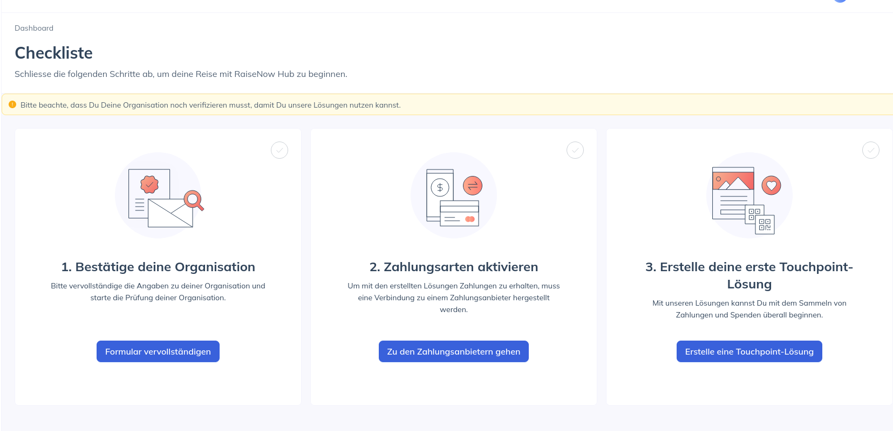
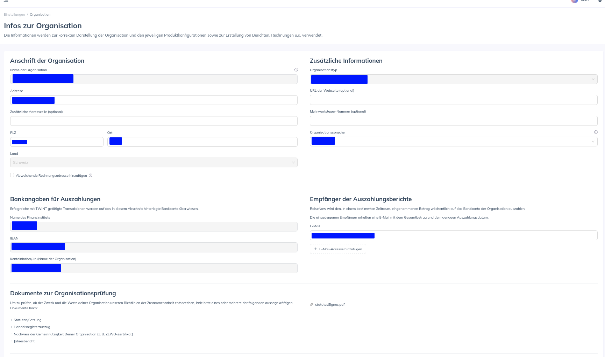
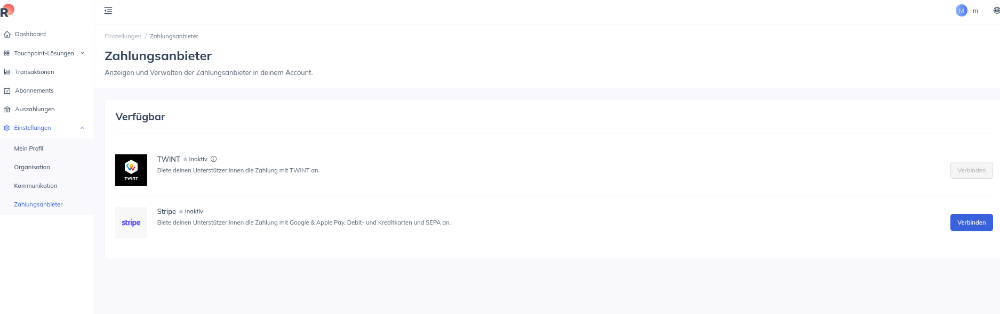
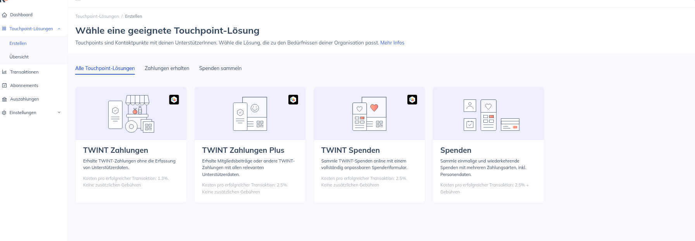
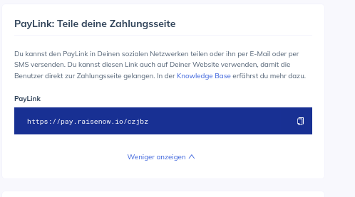
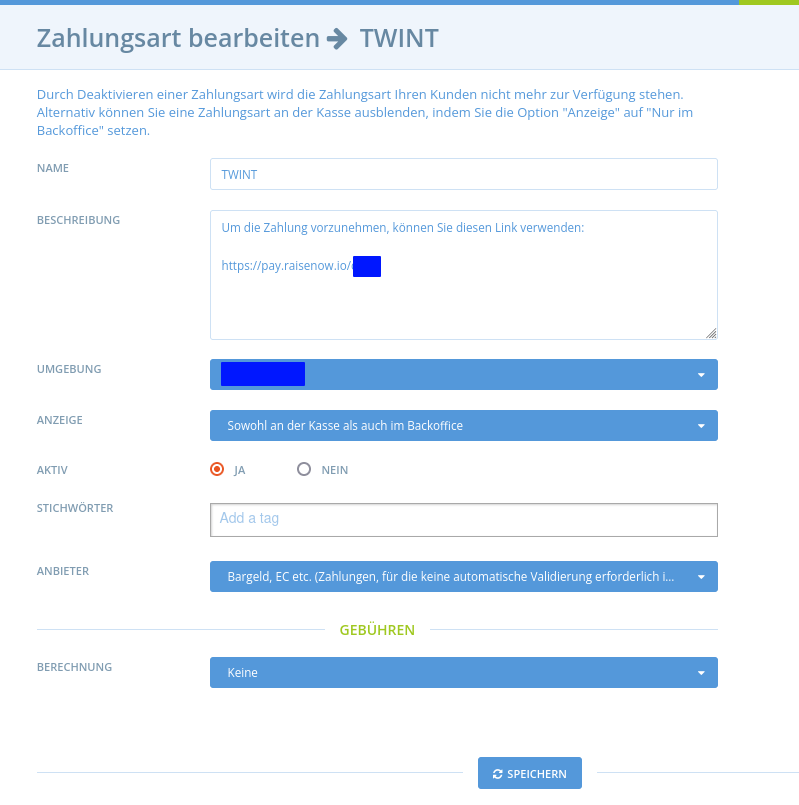
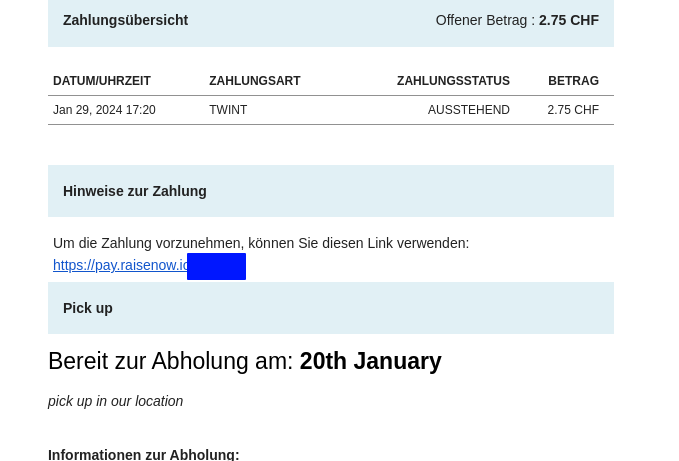

# Zahlungsarten


Sie **müssen** mindestens eine Zahlungsmethode erstellen, bevor Sie Ihren Shop eröffnen können.


Bevor Sie weiterlesen, sollten Sie sich eine kurze Demonstration ansehen, wie Sie Ihre erste Zahlungsmethode einrichten:

## Einrichte einer Zahlungsmethode

* Rufen Sie die Seite Zahlungsmethoden auf, indem Sie im blauen horizontalen Menü auf **Unternehmen** klicken und dann auf **Einstellungen** neben Ihrem Unternehmen. Die Seite "**Zahlungsarten**" finden Sie im Menü auf der linken Seite.
* Klicken Sie auf **Neue Zahlungsmethode erstellen +** . Sie werden auf eine Seite wie diese weitergeleitet:

* Kreuzen Sie Ihr Unternehmen in dem Feld rechts auf der Seite mit der Überschrift Hubs an. Dies zeigt an, für welches Unternehmen die Zahlungsmethode, die Sie erstellen wollen, gelten soll. Sie können mehr als ein Unternehmen auswählen.
* **Name:** Wählen Sie einen Namen für diese Zahlungsmethode. (z. B. "Mit Kreditkarte über Paypal bezahlen"). Dieser Name wird an der Kasse und in den Bestellbestätigungs-E-Mails der Kunden angezeigt.
* **Beschreibung:** Geben Sie weitere Einzelheiten über die Zahlungsmethode an. Bei einer Banküberweisung geben Sie in diesem Feld beispielsweise die Bankverbindung an, auf die der Kunde die BACS-Zahlung leisten soll. Diese Beschreibung wird an der Kasse und in den Bestellbestätigungs-E-Mails angezeigt.
* **Anzeige:** Wählen Sie entweder "Nur Back Office" oder "Sowohl Kasse als auch Back Office". Wenn Sie nur "Nur Back Office" wählen, können nur Sie diese Zahlungsoption sehen und auf "Sowohl Kasse als auch Back Office wechseln, wenn Sie diese Zahlungsoption für Kunden sichbar machen möchten.


Wenn Sie eine Zahlungsmethode für eine Weile deaktivieren möchten, sie aber in Zukunft vielleicht wieder anbieten möchten, dann ändern Sie sie in "Nur Back Office"



Wenn Sie alle Zahlungsmethoden Ihres Unternehmens auf "Nur Back Office" umstellen, wird das Schaufenster nur noch für aktive Bestellzyklen angezeigt.


* **Aktiv:** Wählen Sie aus, ob diese Zahlungsmethode derzeit sichtbar und verfügbar ist oder nicht.
* **Markierungen**: Verwenden Sie Tag-Regeln, wenn Sie bestimmte Zahlungsmethoden für bestimmte Kunden verfügbar/nicht verfügbar machen möchten (z.B. möchten Sie nur Großhandelskunden erlauben, per BACS zu zahlen, aber Privatkunden "zwingen", per Kreditkarte oder PayPal zu zahlen). Für weitere Informationen lesen Sie bitte [hier](customer-management-and-conditional-displays-prices/).
* **Zahlungsanbieter:** Wählen Sie die Option, die für die von Ihnen erstellte Zahlungsmethode relevant ist. Es gibt drei Optionen:
  * PayPal Express &#x20;
  * Stripe SCA (Kredit- und Debitkarten)
  * Cash / EFT / etc. (Bargeld, Twint in Person anwesend, Scheck oder Banküberweisung. Diese Zahlungen laufen nicht über ein Online-Zahlungsportal und werden nicht automatisch validiert)Zur Erinnerung! Wenn Ihr Unternehmen die Option "Kunden können Bestellungen ändern oder stornieren, während ein Bestellzyklus offen ist" aktiviert hat (zu finden unter Unternehmen -> Einstellungen -> Shop-Einstellungen), dann ist der einzige empfohlene Zahlungsanbieter, der mit dieser Funktion kompatibel ist, "Bargeld, EFTs, ...".)


Zur Erinnerung! Wenn Ihr Unternehmen die Option "Kunden können Bestellungen ändern oder stornieren, während ein Bestellzyklus offen ist" aktiviert hat (zu finden unter Unternehmen -> Einstellungen -> Shop-Einstellungen), dann ist der einzige empfohlene Zahlungsanbieter, der mit dieser Funktion kompatibel ist, "Bargeld, EFTs, ...".)


* **Berechnung:** Wählen Sie aus, wie die mit der Zahlungsmethode verbundenen Gebühren auf eine Bestellung angerechnet werden sollen. Beachten Sie, dass die Gebühren für die Zahlungsmethode auf Null gesetzt werden können. Weitere Informationen zu den Gebühren für Zahlungsarten finden Sie weiter unten.

Wenn Sie auf "Speichern"  oder "Neu" klicken, wird die Zahlungsmethode erstellt und Sie erhalten neue Felder zur Festlegung der Gebühren für die Zahlungsmethode. Die sichtbaren Felder hängen davon ab, welchen "Rechner" Sie ausgewählt haben.


Wenn Sie das Feld "Rechner" für die Zahlungsmethode ändern, müssen Sie Ihre Änderungen erst speichern (Aktualisieren), damit die neuen zugehörigen Felder sichtbar werden.


## Integrierte Zahlungsanbieter

Für Paypal-, MasterCard-, Stripe- und Pin-Zahlungen (nur Australien) finden Sie unten zusätzliche Anweisungen.



Um eine PayPal-Zahlungsmethode einzurichten, benötigen Sie ein PayPal-Geschäfts- oder Händlerkonto. Dieses können Sie [hier](https://www.paypal.com/ch/home) einrichten. Sobald Sie dieses haben, können Sie einen "API-Zugang" bei PayPal einrichten, der es OFN ermöglicht, Kunden direkt mit Ihrem PayPal- Konto zu verbinden.

1. Anmeldung bei Ihrem PayPal-Konto
2. Unter Ihrem Kontonamen oben rechts befindet sich ein Dropdown-Menü mit "Kontoeinstellungen".

3. Wählen Sie "Aktualisieren" aus API-Zugang

4. Wählen Sie die Option "API-Zugangsdaten verwalten" in der benutzerdefinierten Checkout-Option.

Von hier aus können Sie auf Ihren API-Benutzernamen, Ihr Passwort und Ihre Signatur zugreifen.

Vergewissern Sie sich, dass Sie **in OFN** als Ihr Unternehmensbenutzer angemeldet sind. Gehen Sie zu einem Unternehmen und erstellen Sie eine Zahlungsmethode. Wählen Sie PayPal und geben Sie die Details von der PayPal-Website ein.

**Server:** Ändern Sie das Feld "Server" in "live" - Groß- und Kleinschreibung ist zu beachten.

**Login:** Geben Sie den API-Benutzernamen ein.

**Passwort:** Geben Sie das API-Passwort ein.

**Signatur:** Geben Sie die API-Signatur in dieses Feld ein.&#x20;

**Lösung:** Die Lösung bestimmt, ob ein Benutzer ein PayPal-Konto benötigt, um zur Kasse zu gehen oder nicht.

Geben Sie "Mark" ein, wenn Sie möchten, dass die Benutzer ein Paypal-Konto haben, oder "Sole", wenn sie ohne Paypal-Konto (mit Kreditkarte) bezahlen können.

**Landing Page:** Sie können auswählen, welche Seite Kunden angezeigt werden soll, wenn sie zu PayPal weitergeleitet werden.

Geben Sie "Login" ein, um den Kunden zum Anmeldeformular für PayPal zu leiten (wenn Sie oben "Mark" ausgewählt haben). Oder geben Sie "Abrechnung" ein, um Kunden ein Formular zu zeigen, in dem sie ihre Kreditkartendaten eingeben und sich möglicherweise für ein PayPal-Konto anmelden können (wenn Sie oben "Sole" ausgewählt haben).



[Stripe](https://stripe.com/au) ist eine Online-Zahlungsplattform ähnlich wie Paypal. Sie ermöglicht es Ihnen, Kreditkartenzahlungen von Ihren Kunden zu akzeptieren. Stripe ist eine globale Plattform, die jedoch nur auf bestimmten OFN-Instanzen verfügbar ist. Wenden Sie sich an Ihr lokales OFN- Team, um zu erfahren, ob es in Ihrem OFN verfügbar ist.

#### Warum Stripe verwenden?

Stripe ist für Shop-Betreiber einfach einzurichten und preisgünstig. Die von Stripe erhobenen Gebühren variieren von Land zu Land: Australien, Kanada, Frankreich, Großbritannien, USA.

Stripe ist auch für die Kunden einfach zu bedienen. Anders als bei Paypal muss sich der Kunde beim Auschecken nicht bei Paypal anmelden, um seine Bestellung aufzugeben, sondern er muss nur seine Kartendaten eingeben und dann seine Bestellung abschließen.

Stripe ist die empfohlene Zahlungsmethode für Shops, die Abonnements auf OFN nutzen möchten, da Stripe es den Kunden ermöglicht, einem Shop die Erlaubnis zu erteilen, ihre Kreditkarte automatisch für Abonnementbestellungen zu belasten. Dies wird von den Zahlungsplattformen Paypal, Pin oder MIGS nicht angeboten.

#### Einrichtung

#### Mit Stripe verbinden

Bevor Sie eine Zahlungsmethode einrichten können, die Stripe verwendet, müssen Sie eine Verbindung mit Stripe herstellen. Klicken Sie dazu auf die Schaltfläche "Mit Stripe verbinden".

Sie werden zu einem Formular weitergeleitet, in das Sie Ihre Daten eingeben können. Wenn Sie bereits ein Konto bei Stripe haben, können Sie sich anmelden. Wenn nicht, füllen Sie das Formular aus, um ein Stripe-Konto zu erstellen.

Zu den Informationen, nach denen Sie gefragt werden, gehören: Land, eine Beschreibung Ihres Unternehmens, Adresse und ABN, Ihre persönlichen Daten und Ihr Bankkonto (auf das die eingehenden Zahlungen überwiesen werden).

#### Eine neue Zahlungsmethode erstellen

Sobald Sie eine Verbindung mit Stripe hergestellt haben, können Sie eine Zahlungsmethode erstellen, die mit Ihrem verbundenen Konto funktioniert.

Behandeln Sie die Felder **Name, Beschreibung, Aktiv** und **Tags** wie bei jeder anderen Zahlungsmethode.

**Anbieter:** Wählen Sie Stripe.

Sobald Sie Stripe ausgewählt haben, wird "Anbietereinstellungen" angezeigt.

#### Stripe-Kontoinhaber:

Wählen Sie das Unternehmen aus, das ein Stripe-Konto angeschlossen hat.

Wenn Sie ein Unternehmen auswählen, das nicht mit Stripe verbunden ist (siehe oben), erhalten Sie die unten abgebildete Fehlermeldung. Klicken Sie entweder auf "Verbinden" oder kehren Sie zu Ihrer Registerkarte "Zahlungsmethoden" zurück, um eine Verbindung mit Stripe herzustellen. Siehe Anweisungen oben.

#### Stripe-Zahlungen für Kunden

Wenn Kunden in einem Shop zur Kasse gehen und mit einer Stripe-Zahlungsmethode bezahlen, haben sie die Möglichkeit, ein Kontrollkästchen zu aktivieren, das es ihnen erlaubt, ihre Kreditkartendaten in ihrem Konto zu speichern (wenn sie eingeloggt sind).

Der Kunde kann auch eine Kreditkarte in seinem Konto speichern oder gespeicherte Karten löschen.

Wenn der Kunde das nächste Mal bei einem OFN-Shop einkauft, der Stripe als Zahlungsmethode anbietet, kann er aus seinen gespeicherten Kreditkarten auswählen.

#### Anzeigen und Einlösen Ihrer Zahlungen über Stripe

Wenn ein Kunde seine Bestellung mit Stripe bezahlt, wird das Geld (abzüglich der Gebühren von Stripe) auf Ihr Stripe-Konto überwiesen. Je nach Ihrer Einstellung in Stripe wird das Geld automatisch überwiesen an das von Ihnen gewählte Bankkonto regelmäßig.

#### Entgegennahme weiterer Zahlungen

Wenn Sie von einem Kunden eine zusätzliche Zahlung verlangen müssen, weil er einen weiteren Betrag schuldet, können Sie in Stripe eine Rechnung erstellen. Der Kunde erhält eine E-Mail, in der er aufgefordert wird, mit Kredit-/Debitkarte zu zahlen. Dies wird nicht an OFN weitergeleitet, so dass Sie die Zahlung manuell abbuchen müssen.

.png>)




Dieser Leitfaden enthält eine Schritt-für-Schritt-Anleitung zur Integration von Twint-Zahlungen in die Open Food Network-Plattform mit Raisenow. Twint ist eine weit verbreitete Zahlungslösung für Hofläden und bietet eine QR-Code-Zahlungsmethode. Diese Integration ermöglicht es Landwirten oder Hubs, Twint-Zahlungen nahtlos in ihren digitalen Workflow zu integrieren.

**Möglichkeit 1**: Payment Link Integration über Raisenow

*   Erstellen Sie ein Raisenow-Konto:

    &#x20;  \-> Besuchen Sie Raisenow Signup und erstellen Sie ein Konto.

<figure><figcaption></figcaption></figure>

&#x20;      \-> Konfigurieren Sie die Second-Factor-Identifikation für zusätzliche Sicherheit.

* Raisenow-Einrichtung abschliessen :

&#x20;      \-> Klicken Sie im 3-Optionen-Menü, um die Konfiguration abzuschließen, auf "bestätige deine Organisation" und geben Sie die erforderlichen Details ein.

<figure><figcaption></figcaption></figure>

&#x20;      \-> Füllen Sie die wichtigsten Informationen über Ihre Organisation aus.

<figure><figcaption></figcaption></figure>

&#x20;      \-> Bei gemeinnützigen Organisationen reichen Sie einen Nachweis (Satzung) zur Überprüfung ein.

&#x20;      \-> Nach der Verifizierung (bis zu zwei Tage) klicken Sie auf "Zahlungsarten aktivieren", um Twint-Zahlungen zu aktivieren.

* Aktivieren Sie Twint-Zahlungen:

&#x20;      \-> Aktivieren Sie unter "Zahlungsarten aktivieren" Twint-Zahlungen.

<figure><figcaption></figcaption></figure>

&#x20;      \-> Klicken Sie auf "Erstelle deine erste Touchpoint-Lösung" und wählen Sie "Twint Zahlungen".

<figure><figcaption></figcaption></figure>

&#x20;     \-> Wählen Sie die Option "Paylink" für die Freigabe von Zahlungsinformationen.

<figure><figcaption></figcaption></figure>

* &#x20;Link Integration auf Open Food Network:

&#x20;      \-> Kehren Sie zur Open Food Network-Plattform zurück.

&#x20;      \-> Erstellen Sie eine Twint-Zahlung und fügen Sie den von Raisenow generierten Paylink in den Text der Zahlungsbeschreibung ein.

<figure><figcaption></figcaption></figure>

&#x20;      \-> Der Link wird nun in der Bestellbestätigungs-E-Mail sichtbar sein.

<figure><figcaption></figcaption></figure>

**Möglichkeit** 2: QR-Code-Sharing über E-Mail-Tool

*   Direkte QR-Code-Weitergabe:

    Generieren Sie einen Twint-QR-Code auf der Twint-Plattform. Teilen Sie diesen QR-Code direkt mit Kunden über das E-Mail-Tool der Initiative (nicht über Open Food Network). Hinweis: Wenn Sie eine stärker integrierte Lösung wünschen, kontaktieren Sie uns, um alternative Optionen zu erkunden.

Wählen Sie die Option, die am besten zu Ihrem Arbeitsablauf und Ihren Präferenzen passt. Die erste Option bietet eine nahtlose Integration über Raisenow's Paylink, während die zweite Option die direkte Weitergabe von QR-Codes per E-Mail beinhaltet. Wenn Sie weitere Unterstützung benötigen oder alternative Lösungen erkunden möchten, können Sie uns gerne kontaktieren.



## Gebühren für die Zahlungsmethode

Sie können den Zahlungsmethoden eine Gebühr hinzufügen. Meistens wird dies verwendet, um die Gebühren eines Zahlungsportals an den Kunden weiterzugeben. Zum Beispiel können Sie dem Kunden für die Bequemlichkeit der Zahlung mit PayPal eine Gebühr in Rechnung stellen, um die von PayPal erhobene Gebühr zu decken.


Zahlungsmethode Die Gebühren enthalten KEINE Steuern (VAT)


### Gebührenberechnungen

**Pauschaler Prozentsatz:** Diese Gebühr wird als Prozentsatz des Gesamtbetrages der Bestellung berechnet. Wenn Sie die Gebührenberechnung gewählt haben, müssen Sie "Speichern" oder "Neu" klicken, damit weitere Optionen zur Festlegung der gewählten Berechnung angezeigt werden.


Alle **prozentualen Gebühren** werden nur auf der Grundlage eines **Prozentsatzes** der Produktkosten berechnet.



Wenn Ihr Unternehmen allen Produkten eine pauschale Unternehmensgebühr hinzufügt und Sie den "pauschalen Prozentsatz" anwenden möchten, dann ist Ihr gewünschter Prozentsatz des Warenkorbs eines Kunden:

&#x20;\= (100 + Unternehmensgebühr) ∗ GewünschterProzentsatz/100&#x20;

z. B. für ein Unternehmen mit einer Unternehmensgebühr von 20 %, das eine Gebühr von 5 % des gesamten Warenkorbs eines Kunden für die Zahlung erheben möchte, lautet der Betrag, der in die Pauschale für diese Zahlungsmethode einzugeben ist:

$$= (100 + 20) *5/100 = 6$$&#x20;


**Pauschalpreis (pro Auftrag)**: Diese Gebühr wird als Standardgebühr für alle Bestellungen erhoben, unabhängig vom Umfang der Bestellung.

**Flexibler Tarif** - Dieser Gebührenrechner ist besonders nützlich, wenn Sie Ihre Kunden zu Großbestellungen ermutigen möchten: Die Kosten für die Zahlung können reduziert werden oder entfallen, wenn eine bestimmte Anzahl von Artikeln erreicht wird.

* Kosten für den "ersten Artikel": Die Gebühr, die für den ersten Artikel in der Bestellung erhoben wird.
* Kosten für "zusätzliche Artikel": Die Gebühr, die für die über den ersten Artikel hinausgehenden Artikel berechnet wird.
* "Maximale Artikel": Die maximale Anzahl von Artikeln, auf die die Gebühr erhoben wird. Für Artikel, die über diese Anzahl hinaus gekauft werden, wird die Gebühr nicht erhoben.

> Beispiel: Wenn die "Kosten für den ersten Artikel" auf 0,20 CHF, die "Kosten für weitere Artikel" auf 0,10 CHF und die "Maximale Artikelanzahl" auf 3 festgelegt ist, werden einem Kunden, der 5 Artikel kauft, 0,40 CHF an Zahlungsgebühren berechnet (0,20 CHF für den ersten Artikel), 0,10 CHF für die Posten zwei und drei und 0,00 CHF für die Posten vier und fünf).

**Pauschalgebühr (pro Artikel):** Diese Gebühr ist eine konstante Gebühr, die auf Produkte angewendet wird, die als "Artikel" aufgeführt sind. (Sie wird nicht auf Produkte angewandt, die nach Gewicht oder Volumen verkauft werden. Daher wird einem Kunden, der z. B. Reis pro kg kauft, keine Gebühr für die Zahlungsmethode berechnet).

**Mengenrabatt:** Dies ist eine flexible Versandgebührenmethode, die es Ihnen ermöglicht, Kunden, die mehr als einen "Mindestbetrag" ausgeben, mit einem Rabatt zu belohnen. Wenn der Kunde weniger als den "Mindestbetrag" ausgibt, können Sie festlegen, wie hoch die Versandgebühren sind.

* "Minimaler Betrag": Wenn der Gesamtbetrag der Bestellung unter diesem Betrag liegt, wird kein Rabatt gewährt. Liegt die Bestellung über diesem Betrag, wird der Rabatt an der Kasse gewährt.&#x20;
* "Normaler Betrag": Dies ist die Versandgebühr, die für Verkäufe unterhalb des "Mindestbetrags" gilt.
* "Rabatt-Betrag": Dies ist die Versandgebühr, die für Verkäufe über dem "Mindestbetrag" erhoben wird.


Der **Mindestbetrag** ist der **Gesamtpreis der Produkte** im Warenkorb eines Kunden und enthält keine Unternehmensgebühren.



Wenn ein Unternehmen beispielsweise eine Unternehmensgebühr von 20 % auf alle Produkte erhebt und den Schwellenwert zwischen keiner Gebühr für die Zahlung (Rabattbetrag = 0) und z. B. einer Gebühr von 0,50 CHF (= normaler Betrag) auf einen Korb von 30 CHF festlegen möchte, lautet der Mindestbetrag

$$= CHF 30 * 100 /(100+20) = CHF25$$&#x20;



Zahlungsportale berechnen Unternehmen oft einen festen Betrag pro Transaktion plus einen kleinen Prozentsatz der Gesamtkosten. Daher sind die Gebühren, die einem Hub oder Shop für Kunden entstehen, die denselben Gesamtbetrag in mehreren kleinen Verkäufen erwerben, höher, als wenn der Kunde alle seine Einkäufe auf einmal tätigt.

Die Rechner "Flexible Rate" und "Preissack", die auf die Gebühren für Zahlungsmethoden angewandt werden, können sich als nützlich erweisen, um dies auszugleichen.


## Erstattungen

Die Ausstellung und Verwaltung von Rückerstattungen hängt davon ab, wie ein Kunde ursprünglich für seine Bestellung bezahlt hat. Weitere Einzelheiten finden Sie [hier](../orders/refunds-and-adjusting-payments.md).
