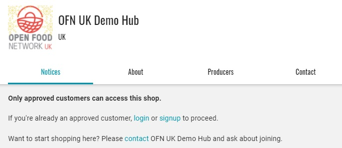

# Privates Schaufenster

Wenn Sie nicht möchten, dass Ihr Schaufenster für die Öffentlichkeit sichtbar ist (d.h. Sie möchten ein Schaufenster einrichten, in dem nur Mitglieder Bestellungen aufgeben können), gibt es zwei Möglichkeiten, Ihren Shop privater zu gestalten:

* Ihren Shop "unsichtbar" machen und nur die Adresse der Shop-Website (URL) mit Ihrem gewünschten Kundenstamm teilen
* Ihren Shop "privat" und nur für registrierte Kunden sichtbar machen.

## Machen Sie Ihre Ladenfront unsichtbar

In Ihren [Unternehmenseinstellungen](../enterprise-profile/enterprise-settings.md) können Sie unter Primäre Details Ihr Profil auf "unsichtbar" setzen.

Wenn die **Option Sichtbar in der Suche**? auf 'nicht sichtbar' eingestellt ist, wird Ihr OFN-Unternehmen sowohl in allen Suchen innerhalb der Plattform als auch in externen Web-Suchmaschinen ausgeblendet. Ihr Unternehmen wird weder im Menü "Geschäfte" noch auf der OFN-Kartenseite angezeigt.

Der Vorteil dieser Methode, Ihr OFN-Geschäft unsichtbar zu machen, ist, dass Sie Kunden einladen können (z. B. per E-Mail), indem Sie ihnen den direkten Link zum Geschäft schicken. Es ist auch eine einfache und effektive Art, Ihr Unternehmen zu verwalten.


**Der Zugang zum Shop ist jedoch nicht eingeschränkt**: Jeder, der die Internetadresse Ihres Shops (URL) kennt, kann den Shop besuchen und eine Bestellung aufgeben.


Wenn also jemand aus Ihrer Mailingliste eine E-Mail von Ihnen an einen Freund weiterleitet, kann dieser eine Bestellung aufgeben, ohne ein registrierter Kunde zu sein. Sie müssen manuell überprüfen, ob alle Bestellungen von registrierten Kunden stammen.

## Nur für registrierte Kunden sichtbar

Ein strengerer, aber möglicherweise zeitaufwändigerer Ansatz besteht darin, Ihr OFN-Unternehmen in den obigen Unternehmenseinstellungen sichtbar zu lassen, aber die Option "**Geöffnet für alle Nutzer?**" (unter Unternehmen-> Einstellungen-> Laden) in **"Nur Kunden auf der Kundenliste"** zu ändern.

Während Ihr Unternehmen bei einer Suche auf der OFN-Plattform sichtbar sein wird, müssen sich Ihre Kunden in ihr OFN-Konto einloggen, um Ihre Schaufensterfront und die angebotenen Produkte sehen zu können. Andere registrierte OFN-Kunden, die nicht auf Ihrer Kundenliste stehen, können Ihre angebotenen Produkte nicht sehen, wenn sie in ihrem OFN-Konto angemeldet sind.

Sie müssen Ihre [Kundenliste](customer-management-and-conditional-displays-prices/customers.md) pflegen und alle neuen Kunden manuell hinzufügen, bevor diese ihre erste Bestellung aufgeben können.

 (1).jpg>)

Sie können auch Kunden löschen, die nicht mehr in der Lage sein sollen, Ihren Shop zu sehen oder eine Bestellung aufzugeben.

### Wie verändert sich das Einkaufserlebnis, wenn Ihr Geschäft privat ist?

Wenn Besucher Ihres Shops den Shop betreten und noch nicht eingeloggt sind, sehen sie die unten stehende Meldung.

Von hier aus gibt es 2 Wege:

a) Wenn sich der Kunde einloggt oder mit einer E-Mail-Adresse anmeldet, die in der Kundenliste des Shops enthalten ist, wird er wie gewohnt zum Schaufenster des Shops weitergeleitet.

b) Wenn sich der Kunde mit einer E-Mail anmeldet oder registriert, die nicht in der Kundenliste des Shops enthalten ist, wird ihm die unten stehende Meldung angezeigt. Er kann sich dann an den Shop wenden, um den Zugang zu beantragen.
