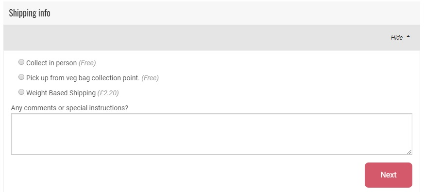

# Versandmethoden


&#x20;You **must** create at least one shipping method before you can open your shop.


Bevor Sie weiterlesen, sollten Sie sich eine kurze Demonstration ansehen, wie Sie Ihre erste Versandmethode einrichten:

**Einrichten einer Versandmethode**

* Rufen Sie die Seite Versandmethoden auf, indem Sie im blauen horizontalen Menü auf **Unternehmen** klicken, und klicken Sie dann auf Einstellungen neben Ihrem Unternehmen. Die Seite "**Versandmethoden**" befindet sich im Menü auf der linken Seite.
* Klicken Sie auf **Neue Versandart erstellen +** . Sie werden auf eine Seite wie diese weitergeleitet:

* Markieren Sie das Kästchen neben Ihrem Unternehmen rechts auf der Seite unter "Hubs". Dies zeigt an, dass die Versandmethode, die Sie gerade erstellen, für dieses Unternehmen gilt. Sie können mehrere Unternehmen auswählen, falls gewünscht.
* **Name:** Wählen Sie einen Namen für die Methode. Dieser Name wird dem Kunden während des Kaufvorgangs und in den Bestellbestätigungs-E-Mails angezeigt. Beispiel:

* **Beschreibung:** Fügen Sie zusätzliche Details hinzu, z. B. die genaue Adresse der Abholstelle. Diese Angaben sind für Kunden in grauer Schrift neben dem Namen (siehe Screenshot oben) und in der Auftragsbestätigungs-E-Mail sichtbar.
* **Anzeige:** Wählen Sie entweder "Nur Back Office" oder "Sowohl Kasse als auch Back Office".


Wenn Sie eine Versandart für eine Weile deaktivieren möchten, sie aber in Zukunft wieder anbieten möchten (z. B. eine Abholstelle, die nur im Sommer verfügbar ist und im Winter nicht für Kunden zur Verfügung stehen soll), ändern Sie sie in "Nur Back Office".


* **Kategorie:** Handelt es sich bei dieser Methode um eine Lieferung oder eine Abholung?
* **Tags**: Geben Sie hier Etiketten ein, wenn Sie zwischen Kunden unterscheiden möchten. Tags können nützlich sein, wenn Sie einer bestimmten Gruppe von Kunden kostenlosen Versand anbieten wollen oder nur denjenigen eine Lieferung anbieten wollen, die eine registrierte Adresse in der Nähe haben. Lesen Sie hier mehr.
* **Kalkulator:** Wählen Sie die Art und Weise aus, wie die Versandgebühren zu dieser Versandart hinzugefügt werden. Beachten Sie, dass eine Versandgebühr Null sein kann. Siehe unten für weitere Details.
* **Steuer-Kategorie:** Hier können Sie die mit Ihrer Versandart/Einzugsgebühr verbundene Steuer unabhängig von der Steuer festlegen, die für steuerpflichtige Produkte Ihres Unternehmens gilt. Die Optionen sind: keine, voller Satz, Nullsatz, ermäßigter Satz oder Versand.
* **Kategorien:** Transportbedingungen (gekühlt, gefroren, Standard), die mit dieser Versandart verbunden sind.


Under 'Categories' tick all boxes which apply to your food enterprise ie. if you sell proKreuzen Sie unter "Kategorien" alle Kästchen an, die auf Ihr Lebensmittelunternehmen zutreffen, d.h. wenn Sie Produkte mit der Versandkategorie "tiefgekühlt" verkaufen, muss die Kategorie "tiefgekühlt" in der gewünschten Versandart angekreuzt werden, damit der Kunde seinen Einkauf erfolgreich abschließen kann.


* **Zonen:** Wählen Sie die entsprechende Zone aus (dies dient der korrekten Steuerberechnung).

Wenn Sie auf **Erstellen** klicken, wird die Versandmethode erstellt, und Sie erhalten neue Felder, in denen Sie Einzelheiten zu den Kosten der Versandmethode eingeben können. Welche Felder angezeigt werden, hängt davon ab, welchen Versandgebührenrechner Sie ausgewählt haben.


Wenn Sie die Berechnungsart für eine Versandart ändern, müssen Sie zuerst speichern, bevor Sie die Berechnungseinstellungen bearbeiten können.


## Gebührenberechnungen

**Pauschaler Prozentsatz** - Diese Gebühr wird als Prozentsatz des Gesamtbetrages der Bestellung berechnet.


Alle prozentualen Gebühren werden nur auf der Grundlage eines Prozentsatzes der Produktkosten berechnet.



Wenn Ihr Unternehmen allen Produkten eine pauschale [Unternehmensgebühr](enterprise-fees.md) hinzufügt, dann ist Ihr gewünschter **Prozentsatz** des Warenkorbs eines Kunden, um den "pauschalen Prozentsatz" zu erreichen

&#x20;$$= (100 + Unternehmensgebühr) ∗ GewünschterProzentsatz/100$$

&#x20;

z.B. für ein Unternehmen mit einer Unternehmensgebühr von 20 %, das eine Gebühr von 5 % des gesamten Warenkorbs eines Kunden für den Versand erheben möchte, lautet der Betrag, der in den pauschalen Prozentsatz für diese Versandart einzugeben ist:

$$= (100 + 20) *5/100 = 6$$&#x20;


**Gewicht (pro kg)** - diese Gebühr wird auf Produkte pro kg angewendet. Die Gebühr wird nur auf Produkte angewandt, deren Preis pro kg angegeben ist, nicht auf Produkte, die als Artikel aufgeführt sind (z. B. trägt ein Produkt, das als "1 Bund Petersilie" aufgeführt ist, nicht zu der Gesamtgebühr bei, die einem Kunden für den Versand berechnet wird).

**Pauschale (pro Auftrag)** - Diese Gebühr wird als Standardgebühr für alle Aufträge erhoben, unabhängig vom Umfang des Auftrags.

**Pauschalgebühr (pro Artikel)** - Diese Gebühr ist eine konstante Gebühr, die auf die als "Artikel" aufgeführten Produkte angewandt wird. (Sie wird nicht auf Produkte angewandt, die nach Gewicht oder Volumen verkauft werden. Daher werden einem Kunden, der z. B. Reis pro kg kauft, keine Versandkosten in Rechnung gestellt).

**Flexibler Tarif** - Dieser Gebührenrechner ist besonders nützlich, wenn Sie Ihre Kunden zu Großbestellungen ermutigen möchten: Die Versandkosten können reduziert oder auf Null gesetzt werden, wenn eine bestimmte Anzahl von Artikeln erreicht wird.

* Kosten für den "ersten Artikel": Die Gebühr, die für den ersten Artikel
* in der Bestellung erhoben wird. Kosten für "zusätzliche Artikel": Die Gebühr, die für die über den ersten Artikel hinausgehenden Artikel berechnet wird.
* "Max Anzahl Artikel": Die maximale Anzahl von Artikeln, auf die die Gebühr erhoben wird. Für Artikel, die über diese Anzahl hinaus gekauft werden, wird die Gebühr nicht erhoben.

> Zum Beispiel: Wenn die Versandgebühr für die "Kosten für den ersten Artikel" £2 beträgt, sind die "Kosten für zusätzliche Artikel" = £1 und die "Maximalen Artikel
>
> \= 3.\
> Einem Kunden, der 5 Artikel kauft, werden £4 Versandkosten berechnet (£2 für den ersten Artikel, £1 für die Artikel zwei und drei und £0 für die Artikel vier und fünf).

**Preis nach Gesamtbetrag** - Dies ist eine flexible Versandgebührenmethode, die nach dem Gesamtbetrag des Verkaufs und nicht nach der Anzahl der gekauften Artikel berechnet wird (Flexible Rate oben).

* "Mindestbetrag": Geldwert der Schwelle zwischen normaler Versandgebühr und ermäßigter Versandgebühr.
* "Normaler Betrag": Versandgebühr für Verkäufe, die unter dem in "Mindestbetrag" angegebenen Schwellenwert liegen.&#x20;
* "Rabatt-Betrag": Versandgebühr für Verkäufe, die über dem in "Mindestbetrag" angegebenen Schwellenwert liegen.


Der Mindestbetrag ist der Gesamtpreis der Produkte im Warenkorb eines Kunden und enthält keine Unternehmensgebühren.



Wenn ein Unternehmen beispielsweise eine Unternehmensgebühr von 20 % auf alle Produkte erhebt und den Schwellenwert zwischen kostenloser Lieferung (Rabattbetrag = 0) und z. B. 5 £ Lieferung (= Normal Betrag) ein Korb von 30 £ sein, dann ist der Mindestbetrag

\= £30 ∗ 100/(100 + 20) = £25


