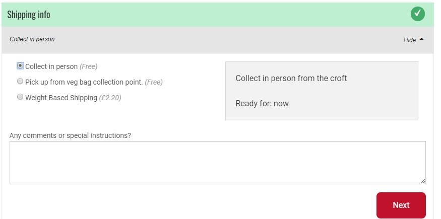

# Metodi di Spedizione


&#x20;Devi creare almeno un metodo di spedizione prima di poter aprire il tuo negozio.&#x20;


Qui sotto trovi un breve tutorial (in inglese):

## Impostare un metodo di spedizione

* Puoi accedere alla pagina "Metodi di Spedizione" cliccando su **Aziende** nel menù azzurro orizzontale e poi su **Impostazioni**, accanto al nome della tua azienda. La voce "**Metodi di Spedizione**" si trova nel menù laterale a sinistra.
* Clicca su **Crea un nuovo metodo di spedizione**. Sarai indirizzato ad una pagina come questa:

* Controlla il riquadro a destra "HUB". Puoi selezionare le aziende (anche più di una, se occorre) a cui applicare il metodo di spedizione che stai creando.&#x20;
* **Nome**: Scegli un nome per il metodo. Questo nome sarà visibile nella schermata dedicata nel processo d'ordine e nelle mail di conferma che verranno inviate ai tuoi clienti.\
  Esempio:

* **Descrizione:** Aggiungi ulteriori dettagli, come l'indirizzo completo del punto di ritiro. Questi dettagli saranno mostrati in un riquadro grigio di fianco al nome, quando selezionato.
* **Visualizza:** Puoi scegliere tra "Solo Back Office" o "Entrabi Checkout e back office"


Se vuoi disattivare un metodo di spedizione temporaneamente, ma hai intenzione di riattivarlo in seguito (ad esempio un punto di ritiro estivo, non attivo in inverno) allora puoi selezionare "Solo Back Office".


* **Categoria:** si tratta di consegna o ritiro?
* **Tag:** inserisci qui le tue etichette se intendi differenziare i metodi di spedizione tra consumatori. Le tag possono esserti utili ad esempio se intendi offrire consegne gratuite ad un determinato tipo di utenti, o se vuoi proporre la consegna a domicilio solo a coloro che  sono registrati con un indirizzo nelle vicinanze o altro. Approfondisci [qui](customer-management-and-conditional-displays-prices/).
* **Calcolatore:** Seleziona la modalità con cui la tariffa verrà applicata al tuo metodo di spedizione. Una tariffa di spedizione può anche essere uguale a 0. Leggi sotto per maggiori dettagli.&#x20;
* **Categorie:** Le condizioni di trasporto (refrigerato, surgelati, default) associate con questo metodo di spedizione.&#x20;
* **Zone:** Seleziona la zona appropriata (questo permetterà il calcolo corretto delle imposte).

Cliccando su Crea, il metodo di spedizione verrà creato e compariranno nuovi campi, per aggiungere i dettagli delle tariffe. Questi campi dipendono da quale calcolatore di tariffa hai selezionato nella schermata precedente.&#x20;


Se modifichi il calcolatore di tarifa, devi **salvare prima** di poter modificare le impostazioni di dettaglio collegate.&#x20;


## Fee Calculators

**Peso (per kg)** – questa tariffa è applicata ai prodotti in base ai kg. Questa tariffa sarà applicata solo ai prodotti che hanno il p rezzo al kg, non ai prodotti venduti a pezzo (es. un prodotto venduto al mazzo non contribuirà alla tariffa totale che il cliene pagherà per la spedizione)

**Percentuale fissa** – Questa tariffa è calcolata come una percentuale sul totale della gentile richiesta.

**Tariffa fissa (per gentile richiesta) -** Questa tariffa è applicata indistintamente a tutte le gentili richieste, indipendentemente dalla loro dimensione.

**Tariffa flessibile** **(per numero articoli)**– Questa tariffa è particolarmente utile se vuoi incoraggiare i consumatori a fare gentili richieste corpose: il costo di spedizione può essere ridotto a zero quando viene raggiunto il numero predefinito di articoli richiesti.

* "Costo primo articolo": la tariffa applicata al primo articolo della gentile richiesta.
* "Costo articolo aggiuntivo": la tariffa applicata agli articoli successivi al primo.
* ‘Max articoli’: il numero massimo di articoli a cui la tariffa verrà applicata. Per gli articoli successivi a questo numero, non verrà applicata alcuna tariffa.

> Per esempio: se "Costo primo articolo"= 2€, "Costo articolo aggiuntivo" = 1 € e "Max articoli"= 3, un consumatore che acquista 5 articoli, pagherà una tariffa di 4€ (2€ per il primo articolo, 1€ per il secondo e il terzo articolo e 0€ per il quarto e il quinto).

**Tariffa fissa (per pezzo)** – Questa tariffa fissa viene applicata a tutti gli articoli venduti al pezzo (Non è applicata ai prodotti venduti a peso o a volume. Non ci sarà dunque nessuna maggiorazione per i consumatori che acquisteranno, ad esempio, un kg di arance).&#x20;

**Tariffa flessibile (per importo totale)** – Questa è una tariffa di spedizione flessibile, calcolata sull'importo monetario totale, invece che sul numero di articoli acquistati (Tariffa flessibile per numero articoli descritta sopra)

* "Importo minimo": Minimum Amount’: Valore monetario della soglia tra la tariffa di spedizione normale e la tariffa di spedizione scontata.&#x20;
* 'Tariffa Normale": Tariffa di spedizione applicata per importi inferiori al valore indicato in "Importo minimo".
* ‘Tariffa Scontata": Tariffa di spedizione applicata ad importi superiori al valore indicato come "Importo minimo".

