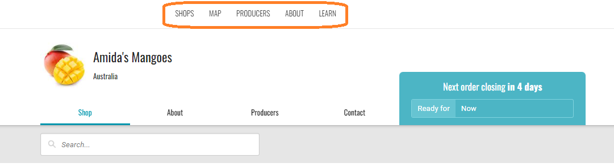
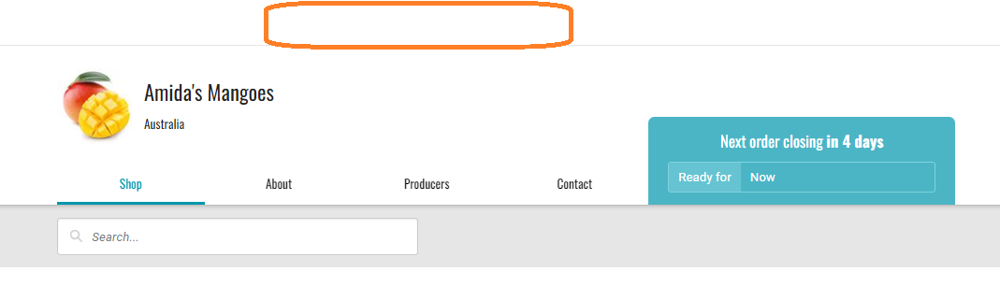
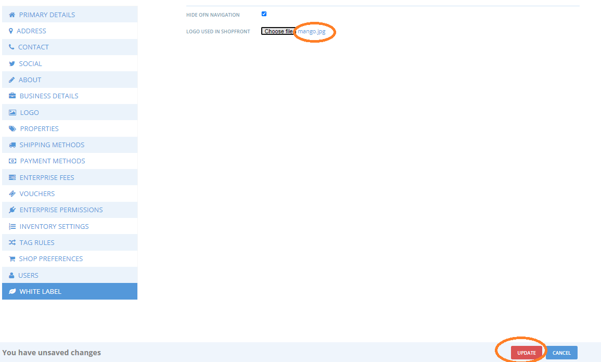
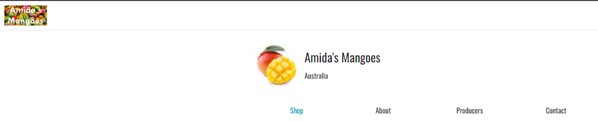

# White Label site

The White Label function allows users to customise their shopfront branding to replace the Open Food Network defaults. These changes will apply across shopfront and checkout screens.

Access White Label functions through the Enterprise Settings menu in your Dashboard

\

### **Hide Open Food Network navigation menu**

Check the ‘Hide OFN navigation’ box to remove the header links to other parts of the Open Food Network site on your shopfront.

**OFN Navigation visible:**

\

**OFN Navigation hidden:**

### Customise logo in site header

To replace the Open Food Network header logo with your own logo:

'Hide OFN Navigation' must be ticked to customise the header logo.

In White Label settings, next to 'Logo Used on Shopfront', click ‘Choose File’ to upload a logo file from your computer.&#x20;

The name of the file to be uploaded will display next to the Choose File button.

Click Update at the bottom of the screen to save changes and see your image file displayed.

The image will be resized to 217 x 44.

<figure><figcaption></figcaption></figure>

<figure><figcaption>
White labelled site header with OFN navigation removed and custom logo
</figcaption></figure>

&#x20;

### Custom link on logo click

Add a custom link to the top-left logo, for example your business website or social media.&#x20;

Enter the link in the field 'Link For Logo Used In Shopfront' in the White Label section of the menu in your Enterprise Settings.

Click Update to save.
