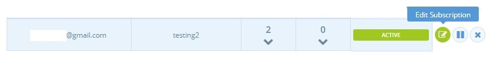

# Abonnements - Erstellen und Verwalten von Bestellungen

Auf dieser Seite wird beschrieben, wie Shops individuelle Abonnements für einzelne Kunden einrichten können. Dazu gehört auch, welche Artikel in ihrem Abonnement enthalten sind, für welchen [Zeitplan](subscriptions-configuration.md#zeitplaene) das Abonnement gilt (d. h. die Rate, zu der sie ihre Bestellung erhalten) und wie sie ihr Abonnement unterbrechen/bearbeiten können.


In dieser ersten Version der **Abonnementfunktion müssen Unternehmen Abonnements im Namen ihrer Kunden einrichten**. Kunden können ihre eigenen Abonnements nicht einrichten.


**Checkliste der Dinge, die zu tun sind, bevor Sie Abonnements für Ihre Kunden erstellen:**

* Aktivieren Sie Abonnements in Ihren [Unternehmenseinstellungen](subscriptions-configuration.md#aktivieren-von-abonnements)
* [Lieferoptionen und Zahlungsarten einrichten](subscriptions-configuration.md#versand-und-zahlungsarten-fuer-abonnements)
* Kontakt mit Ihren Kunden aufnehmen, um deren [Daten zu erhalten](subscriptions-configuration.md#sammeln-sie-informationen-von-ihren-kunden)
* Sie haben Ihre Abonnementkunden zu Ihrer [Kundenliste hinzugefügt](subscriptions-configuration.md#fuegen-sie-ihre-abonnenten-zu-ihrer-kundenliste-hinzu).
* Sie haben Ihre Kunden kontaktiert, um sie zu bitten, sich für [ein Konto bei OFN anzumelden ](subscriptions-the-customers-perspective.md#anmeldung-bei-ofn)und, falls sie mit Stripe abgerechnet werden, sie zu bitten, [ihre Karte zu speichern und Ihren Shop zu ermächtigen](subscriptions-the-customers-perspective.md#speichern-von-kreditkarten-und-autorisierung-von-gebuehren), sie zu belasten.
* Mindestens einen [Zeitplan](subscriptions-configuration.md#zeitplaene) erstellen

## Abonnements erstellen

Klicken Sie im blauen horizontalen Menü auf **Bestellungen** und dann im grünen Untermenü auf **Abonnements**.

 (1).jpg>)

Klicken Sie auf **+ Neues Abonnement**, um eine wiederkehrende Bestellung für Ihren Kunden einzurichten. Sie werden zunächst aufgefordert, den Shop auszuwählen, für den Sie das neue Abonnement erstellen möchten.


Bevor Sie ein Abonnement erstellen können, müssen Sie einen Zeitplan für die Bestellzyklen erstellt haben. Lesen Sie [hier](subscriptions-configuration.md#zeitplaene) mehr.


### Grundlegende Details

**Kunde:** Wählen Sie einen Kunden aus der Dropdown-Liste aus. Sie können nur aus den Personen wählen, die der [Kundenliste](subscriptions-configuration.md#fuegen-sie-ihre-abonnenten-zu-ihrer-kundenliste-hinzu) für das Unternehmen hinzugefügt wurden, für das Sie das Abonnement erstellen.

**Zeitplan:** Wählen Sie den Zeitplan, den der Kunde abonnieren möchte.

**Zahlungsart:** Wählen Sie die bevorzugte Zahlungsart des Kunden. Dies muss entweder Stripe oder eine manuelle Zahlungsmethode (Bargeld, Scheck, Banküberweisung) sein. Siehe [hier](subscriptions-configuration.md#zahlungsmoeglichkeiten) für weitere Informationen.

**Lieferoption:** Wählen Sie die vom Kunden bevorzugte Versandart.

**Beginnt am:** Dies ist das Datum, an dem die erste Bestellung des Kunden im Rahmen des Abonnements generiert wird.


Wenn dieses Datum in der Mitte eines offenen Bestellzyklus in ihrem Zeitplan liegt, wird ein Auftrag für diesen Bestellzyklus generiert. Andernfalls wird der erste Abonnementauftrag erteilt, wenn der nächste offene Bestellzyklus in ihrem Zeitplan beginnt.


**Endet am:** Nach diesem Datum werden die Abonnementbestellungen des Kunden nicht mehr generiert. Dieses Feld ist optional, wenn es leer gelassen wird, wird der Auftrag weiterhin auf unbestimmte Zeit generiert.


Wenn das Enddatum in der Mitte eines zukünftigen Bestellzyklus liegt, wird keine Abonnementbestellung aufgegeben, zum Beispiel:

* Wenn das Endedatum der 01.10.2020 ist, aber der nächste Bestellzyklus im Zeitplan dieses Kunden am 01.09.2020 beginnt und am 01.11.2020 endet, wird kein Auftrag für den Kunden generiert.
* Wenn das Enddatum der 01.12.2020 ist, wird der oben genannte Bestellzyklus einen letzten Abonnementauftrag für den Kunden erzeugen.


### Addresse

Füllen Sie die Rechnungs- und Versanddaten des Kunden aus. Die Adressdaten von Kunden, die bereits Bestellungen bei OFN aufgegeben haben, werden automatisch geladen.


Wenn Sie die Adress-/Kontaktdaten des [Kunden](../shopfront/customer-management-and-conditional-displays-prices/customers.md) auf der Kundenseite aktualisieren, wird die Änderung nicht automatisch auf sein Abonnement übertragen. Sie müssen die Daten auch hier aktualisieren.


### Produkte hinzufügen

Fügen Sie die Artikel hinzu, die der Kunde regelmäßig von Ihrem Unternehmen erhalten möchte.


Sie können nur Produkte hinzufügen, die in zukünftigen Bestellzyklen für Ihr Unternehmen aufgeführt sind und die auch zum gewählten Abonnementplan des Kunden gehören.


### Prüfen & Sparen

Überprüfen Sie, ob die Angaben korrekt sind, und klicken Sie dann auf **Abonnement erstellen** oder **Abbrechen**.


Wenn der Zeitplan, für den Sie gerade ein neues Kundenabonnement erstellt haben, einen offenen Bestellzyklus hat, wird der erste Auftrag sofort generiert, es sei denn, Sie ändern das Datum "Beginnt am" auf einen Zeitpunkt in der Zukunft.


**Was passiert, wenn sich der Preis eines Produkts nach Abschluss des Abonnements ändert?**

Die Preise der Artikel innerhalb der Abonnements werden aktualisiert und dem Kunden entsprechend dem aktualisierten Preis in Rechnung gestellt. Zu Beginn jedes Bestellzyklus, mit dem ihr Abonnement erstellt wird, erhalten sie eine E-Mail mit einer Zusammenfassung ihrer Bestellung, einschließlich der aktuellen Preise.

**Was ist, wenn ein Produkt eines Abonnements in einem Bestellzyklus nicht verfügbar ist?**

Wenn ein Artikel in einem Abonnement nicht verfügbar ist (z. B. wenn es sich um ein saisonales Produkt handelt), wird der Kunde in seinen Bestätigungs-E-Mails darauf hingewiesen.

## Das Abonnement eines Kunden bearbeiten

### Bearbeiten Sie das Basisabonnement

Um Änderungen am gesamten Abonnement vorzunehmen (d.h. an allen Bestellungen, die von nun an für den Kunden aufgegeben werden), gehen Sie zu **Bestellungen** (blaues Menü) -> **Abonnements** (grünes Untermenü).

Wählen Sie das Unternehmen, bei dem der Kunde ein Abonnement hat, aus dem Dropdown-Menü aus.

 (1) (1).jpg>)

Daraufhin wird eine Tabelle mit allen Abonnements Ihrer Kunden angezeigt. Wählen Sie das Symbol Bearbeiten (Stift und Papier) rechts neben dem Kunden:


Sie können die Produkte, die der Kunde im Abonnement bestellt, seine bevorzugten Versand- und Zahlungsarten sowie das Start- und Enddatum seines Abonnements ändern.



Sie können den Zeitplan des Abonnements des Kunden nicht ändern. Stattdessen muss das Abonnement mit dem neuen bevorzugten Zeitplan neu erstellt und die alte Version gelöscht werden.


### Einen bestimmten Auftrag bearbeiten

Wenn Sie einen einzelnen anstehenden Auftrag in einem Abonnement ändern möchten, können Sie auf die Nummer in der **Spalte** der Kundenaufträge klicken.

Dadurch werden alle anstehenden Aufträge im Zeitplan angezeigt, und Sie können dann einen bestimmten Auftrag bearbeiten.


Beachten Sie, dass Sie auf diese Weise zwar Artikel aus einer Bestellung entfernen, aber nicht hinzufügen können. Zusätzliche Artikel müssen hinzugefügt werden, indem Sie einen neuen Auftrag erstellen, wie [hier](../orders/create-orders-manually.md) beschrieben.


### Ein Abonnement löschen

Um ein Abonnement für einen Kunden zu löschen, der nicht mehr regelmäßig von Ihnen beliefert werden möchte, klicken Sie auf die Schaltfläche mit dem **Kreuz** rechts neben der Tabelle. Dadurch werden keine weiteren Abonnements mehr erstellt und dieses Abonnement wird endgültig gelöscht.


Wenn Sie ein Abonnement löschen, während ein offener Bestellzyklus besteht, werden Sie gefragt, ob Sie den offenen Auftrag des Kunden beibehalten oder den aktuellen Auftrag löschen möchten.


### Ein Abonnement anhalten

Es kann sein, dass ein Kunde seine Bestellung pausieren möchte, wenn er zum Beispiel im Urlaub ist. In diesem Fall klicken Sie auf die Schaltfläche "**Pause**" (zwei vertikale Linien) rechts neben der Tabelle der Abonnements. Dadurch wird verhindert, dass alle zukünftigen Bestellungen in diesem Abonnement generiert werden, bis es wieder aktiviert wird.

Um ein Abonnement zu deaktivieren (wieder zu aktivieren), klicken Sie auf die Schaltfläche "**Play**" (Pfeil).


Wenn Sie ein Abonnement unterbrechen, während ein Bestellzyklus noch offen ist, werden Sie gefragt, ob Sie die aktuelle Bestellung beibehalten möchten oder nicht.

Abonnements, die in der Mitte eines offenen Bestellzyklus reaktiviert werden, erzeugen sofort Aufträge.


## Wie werden die Abonnements bearbeitet?

Sie haben ein Abonnement für einen Kunden eingerichtet. Was passiert nun jedes Mal, wenn ein Bestellzyklus geöffnet und geschlossen wird?

### Der zum Abonnementplan gehörende Bestellzyklus öffnet sich:

* Die Bestellung Ihres Kunden wird sofort erstellt. Er erhält eine E-Mail, die ihn darüber informiert.
* Die Lagerbestände der im Rahmen des Abonnements bestellten Produkte werden zu diesem Zeitpunkt entsprechend abgezogen.
* Der [Manager des Unternehmens](../enterprise-profile/enterprise-settings.md#benutzer), der den betreffenden Bestellzyklus koordiniert, erhält eine E-Mail, in der er zusammenfasst, wie viele Bestellungen aufgegeben wurden und bei wie vielen es Probleme gab (z. B. unzureichender Bestand).
* Wenn Ihr Unternehmen so konfiguriert ist, dass "Bestellungen geändert/storniert werden können, während ein Bestellzyklus offen ist" (siehe [hier](subscriptions-creating-and-managing-orders.md#abonnements-erstellen)), können Kunden mit einer im Abonnement generierten Bestellung Produkte aus ihrer Bestellung entfernen oder diese stornieren.


Beachten Sie: Wenn Sie ein Abonnement erstellen, während ein Bestellzyklus im Zeitplan offen ist, wird sofort ein Auftrag für diesen Abonnenten erstellt.



Kunden können keine Artikel zu einer Abonnementbestellung hinzufügen, sobald diese erstellt wurde, selbst wenn die Schaltfläche "Bestellungen können geändert/storniert werden, während ein Bestellzyklus offen ist" aktiviert ist. Wenn sie dies tun, erstellen sie eine zweite Bestellung und werden wie gewohnt zur Kasse geführt.


### Der Bestellzyklus schließt sich

* Wenn der Bestellzyklus abgeschlossen ist, werden die Abonnementbestellungen bestätigt. Die Kunden erhalten eine Auftragsbestätigung per E-Mail.
* Bei Kunden, die sich für die Bezahlung ihres Abonnements über Stripe entschieden haben, wird ihre Kredit-/Debitkarte an dieser Stelle belastet.
* Der [Manager des Unternehmens](../enterprise-profile/enterprise-settings.md#benutzer), der den betreffenden Bestellzyklus koordiniert, erhält eine E-Mail, die bestätigt, wie viele Abonnements bearbeitet wurden. Sie enthält auch Angaben zu möglichen Fehlern (z. B. eine Kreditkarte, die nicht belastet werden konnte).

### Planung für künftige Abonnements

Es gibt mehrere Möglichkeiten, wie Sie künftige Bestellzyklen für Ihr Unternehmen planen können, wenn Sie Ihren Kunden die Möglichkeit einer regelmäßigen automatisierten Abonnementbestellung bieten:

* Erstellen Sie alle Bestellzyklen für die Saison im Voraus. Das geht schnell, indem Sie einen Bestellzyklus kopieren und die Öffnungs- und Schließungsdaten sowie den Namen so ändern, dass sie den gewünschten Zeitraum abdecken. Fügen Sie die Bestellzyklen wie gewünscht zu den Abonnementplänen hinzu.


Wenn Sie viele Bestellzyklen im Voraus einrichten, erkundigen Sie sich bei Ihren Lieferanten nach der saisonalen Verfügbarkeit von Artikeln!


* Erstellen Sie wöchentliche (oder monatliche) Bestellzyklen. Stellen Sie bei der Erstellung sicher, dass Sie den Auftrag auch dem entsprechenden Abonnementplan hinzufügen.


Tipps:

* Vielleicht möchten Sie mit der Tatsache werben, dass Sie Abonnements anbieten. Dies kann potenzielle Kunden dazu bringen, Artikel von Ihrem Unternehmen zu kaufen. Gemüsetaschen sind sehr beliebt und können mit der Abonnementfunktion nachgebildet werden.
* Wenn Sie feststellen, dass eine Reihe von Kunden regelmäßig die gleichen Artikel bestellen, könnte es sehr nützlich sein, ihnen die Möglichkeit einer automatischen Bestellung (Abonnement) anzubieten.

