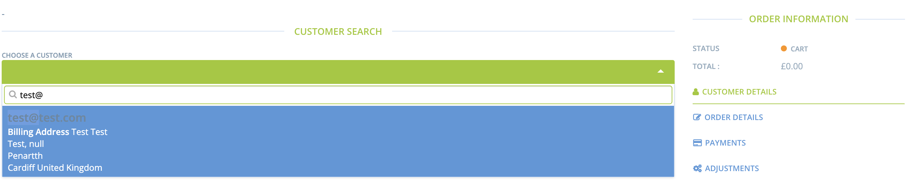

# Bestellungen auf Kredit annehmen

Einführung

Obwohl diese Funktion noch nicht in OFN integriert ist, ist es mit ein paar schnellen Schritten möglich, Kunden die Möglichkeit zu geben, mit Prepaid-Guthaben auf OFN zu bezahlen. Dazu muss zunächst ein Kreditprodukt erstellt werden, mit dem der Kunde auscheckt. Der Filialleiter geht dann in das Backoffice und „löscht“ dieses Produkt, indem er ein „Guthaben“ auf das Kundenkonto setzt. Künftige Bestellungen können dann mit dem Guthaben auf dem Konto „bezahlt“ werden.

## Prozess

Erstellen Sie zunächst ein Kreditprodukt im Backend. Wenn Sie das Produkt im Backend erstellen, legen Sie auch eine Variante mit dem Namen „Platzhalterguthaben“ für € 0 und mit „0“ für „vorrätig“ an. Diese Variante wird später in der Bestellverwaltung im Backend nützlich sein. Fügen Sie dann alle Varianten zu einem Bestellzyklus hinzu, um das Prepaid-Guthaben an Ihre Kunden zu verkaufen.

<figure><figcaption></figcaption></figure>

Hier ist ein Beispiel für ein Kreditprodukt im Schaufenster, das der Kunde auswählen kann, um seinem Konto „Kredit“ hinzuzufügen.

<figure><figcaption></figcaption></figure>

Weisen Sie den Kunden an, die Höhe des Guthabens auszuwählen, das er seinem Konto gutschreiben möchte und seine Bestellung zu bezahlen. Achten Sie darauf, dass der Kunde seine Kontoinformationen „speichert“, indem er beim Auschecken „LOGIN“ wählt und ein Konto mit einem Passwort erstellt.

Im Backend sehen Sie nun die Bestellung mit dem Betrag des Guthabens, das der Kunde kauft.

<figure><figcaption></figcaption></figure>

Sobald der Kunde die Bestellung bezahlt hat, können Sie die Zahlung mit dem grünen Häkchen „erfassen“.

<figure><figcaption></figcaption></figure>

Danach müssen Sie die Bestellung bearbeiten, aber zuerst müssen Sie dem Produkt „Platzhalterguthaben“ einen „Bestand“ hinzufügen. Fügen Sie die Menge an „Vorrat“ hinzu, die der Anzahl der Kreditaufträge entspricht, die Sie zu diesem Zeitpunkt bearbeiten (d.h. Wenn Sie 1 Kreditauftrag haben, fügen Sie „1“ als „Vorrat“ zur Variante „Platzhalterguthaben“ hinzu und SPEICHERN SIE DIE ÄNDERUNGEN).

<figure><figcaption></figcaption></figure>

Nun können Sie zu Ihrer Bestellliste zurückkehren und die Kreditbestellung bearbeiten.

Zuerst müssen Sie das „Platzhalterguthaben“ zur Bestellung hinzufügen.

<figure><figcaption></figcaption></figure>

Jetzt können Sie das andere „Guthaben“-Produkt aus der Bestellung löschen (durch das Hinzufügen der „Platzhalterguthaben“-Variante wird verhindert, dass die gesamte Bestellung storniert wird; dieser Schritt wäre unnötig, wenn die Bestellung bereits andere Produkte enthält).

<figure><figcaption></figcaption></figure>

In Ihrer Auftragsliste wird der Zahlungsstatus für den Auftrag nun auf „Geschuldetes Guthaben“ für den Betrag des vorausbezahlten Guthabens zurückgesetzt.

<figure><figcaption></figcaption></figure>

So sieht es auch in Ihrer Kundenliste auf der Registerkarte Kunden für diesen Kunden aus.

<figure><figcaption></figcaption></figure>

Und wenn Sie unter **Berichte** einen Lieferbericht für einen Bestellzyklus (Bestellzyklusverwaltung -> Lieferungen) erstellen, wird dieser einen positiven Saldo für den Kunden ausweisen.

<figure><figcaption></figcaption></figure>

Wenn sich der Kunde bei seinem Konto auf OFN anmeldet und zu den Transaktionen geht, sieht er den laufenden Saldo seines Kontos bei Ihnen.

Um das Guthaben für künftige Bestellungen zu verwenden, müssen Sie eine [Zahlungsoption einrichten](bestellungen-auf-kredit-annehmen.md#einfuhrung)- „mit Guthaben bezahlen“ -, die die Kunden an der Kasse auswählen können, um anzugeben, dass sie ihr Guthaben verwenden möchten.

<figure><figcaption></figcaption></figure>

Sie können [Tags](https://guide.openfoodnetwork.org/v/deutsch/basic-features/shopfront/customer-management-and-conditional-displays-prices/tags-and-tag-rules) verwenden, wenn Sie möchten, dass diese Zahlungsoption nur für die Kunden verfügbar/sichtbar ist, die bei Ihnen ein Prepaid-Guthaben erworben haben. Fügen Sie das entsprechende Tag zum Kundenkonto hinzu:

<figure><figcaption></figcaption></figure>

Und richten Sie die folgenden Tag-Regeln ein:

<figure><figcaption></figcaption></figure>

Stellen Sie sicher, dass Sie die neue Zahlungsmethode auf Seite 4 Ihrer Bestellzyklen ('Checkout options') hinzufügen, wenn Sie einen neuen Bestellzyklus einrichten.

Dies ist das, was der Kunde sieht, wenn er zur Kasse geht:

<figure><figcaption></figcaption></figure>

Sobald der Kunde eine 2. Bestellung aufgegeben hat, erscheint diese in Ihrer **Bestellungsliste** mit einem **fälligen** **Saldo**.

<figure><figcaption></figcaption></figure>

Das sieht der Kunde, wenn er sich bei seinem Konto anmeldet. Der negative Betrag steht für das Restguthaben.

<figure><figcaption></figcaption></figure>

Und das werden Sie sehen, wenn Sie als Manager von Ihrer Kundenliste ausgehen:

<figure><figcaption></figcaption></figure>

Und wenn Sie den Lieferbericht ausführen.

<figure><figcaption></figcaption></figure>

**WENN** Sie die neue Bestellung als „Bezahlt“ markieren möchten, indem Sie den Zahlungsstatus von „Restbetrag fällig“ auf „Bezahlt“ ändern, können Sie auf das grüne Häkchen rechts neben der Bestellung klicken. (**Hinweis**: Überprüfen Sie zunächst Ihre Kundenliste, um sicherzustellen, dass der Kunde über genügend Guthaben verfügt, um die Kosten der Bestellung zu decken. Ist dies nicht der Fall, können Sie eine Teilzahlung auf die Bestellung mit dem verbleibenden Guthaben vornehmen und dem Kunden dann eine Rechnung über den Restbetrag der Bestellung schicken).

Der Zahlungsstatus der Bestellung lautet nun „bezahlt“ in Ihrer Auftragsliste.

<figure><figcaption></figcaption></figure>

Im Kundendatensatz und in Ihrer Kundenliste wird der laufende Saldo jedoch wieder auf den vollen im Voraus bezahlten Kreditbetrag zurückgesetzt.

Um die Zahlung für den 2. Auftrag dem laufenden Guthaben gutzuschreiben, müssen wir nun den ursprünglichen Kreditauftrag aufrufen und eine negative Zahlung in Höhe des 2. Auftrags vornehmen (d. h. - 5,70 €).

<figure><figcaption></figcaption></figure>

<figure><figcaption></figcaption></figure>

Um die Zahlung für den 2. Auftrag dem laufenden Guthaben abzuziehen, müssen wir nun den ursprünglichen Kreditauftrag aufrufen und eine negative Zahlung in Höhe des 2. Auftrags vornehmen (d. h. - 5,70 €).

Bearbeiten Sie zunächst den ursprünglichen Kreditauftrag.

<figure><figcaption></figcaption></figure>

Wählen Sie dann Zahlungen aus dem Menü auf der rechten Seite. Wählen Sie Neue Zahlung aus dem Menü oben rechts.

<figure><figcaption></figcaption></figure>

Geben Sie den Betrag der bezahlten Bestellung ein, dem ein Minuszeichen vorangestellt ist (z. B. -5,70 €), und wählen Sie „Per Kredit bezahlen“, dann „Aktualisieren“.

<figure><figcaption></figcaption></figure>

Erfassen“ Sie diese Zahlung mit dem grünen Häkchen.

<figure><figcaption></figcaption></figure>

Jetzt wurde das „geschuldete Guthaben“ um den korrekten Betrag auf dem Kreditauftrag reduziert.

Und der Saldo ist in Ihrer Kundenliste korrekt.

<figure><figcaption></figcaption></figure>

Und im Lieferbericht wird der aktuelle Saldo für den Kunden angezeigt. Die 2. Bestellung wurde bezahlt (sie ist also nicht mehr negativ) und das Guthaben oder der positive Saldo wurde reduziert.

<figure><figcaption></figcaption></figure>

Und wenn sich der Kunde schließlich in sein Konto einloggt, sind der aktuelle Saldo und der Guthabenbetrag korrekt.

<figure><figcaption></figcaption></figure>
