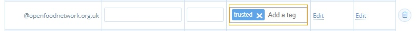
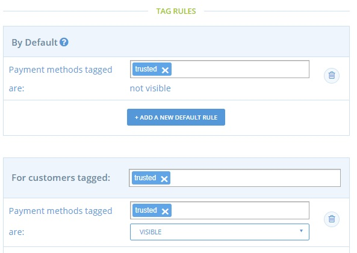

# Bargeld/EFTs nur für vertrauenswürdige Kunden

## Einführung

Es ist immer sehr enttäuschend, wenn Ihr Lieferant Zeit und Ressourcen aufgewendet hat, um Waren für einen Kunden vorzubereiten, und dieser dann nicht kommt, um seine Einkäufe abzuholen. Dies ist besonders dann ein Risiko, wenn die Waren nicht im Voraus bezahlt werden.

Mit [Stripe (Kartenzahlung) oder PayPal](../../basic-features/shopfront/payment-methods.md) können Unternehmen automatisch Zahlungen von ihren Käufern zum Zeitpunkt der Kasse über die OFN-Plattform einziehen. Diese Kartenzahlungsmethoden sind jedoch nicht für alle Kunden geeignet: Einige haben Angst vor Online-Zahlungen, andere haben kein Bankkonto und wieder andere nutzen Bargeld, um ihr Wochenbudget im Auge zu behalten.

Als Geschäftsführer eines lokalen Lebensmittelunternehmens kennen Sie die Bedürfnisse Ihrer Kunden. Vielleicht möchten Sie, dass die Mehrheit Ihrer Kunden mit Karte bezahlt (weniger Verwaltungsaufwand für Sie, um Zahlungen per BACS oder Bargeld zu verfolgen/einzuziehen, die Gewissheit, dass Sie die Zahlung für die Waren im Voraus haben, anstatt auf den Tag der Abholung zu warten .... usw.), aber einer kleinen Auswahl, die Sie kennen und der Sie vertrauen, erlauben Sie, mit Bargeld oder BACS zu bezahlen. Sie können [Tags und Tag-Regeln](../../basic-features/shopfront/customer-management-and-conditional-displays-prices/tags-and-tag-rules.md#zahlungsarten-anzeigen-ausblenden) verwenden, um dies wie unten beschrieben umzusetzen.

## Prozess

* Richten Sie eine [Stripe](../../basic-features/shopfront/payment-methods.md#stripe)- (oder PayPal-) Zahlungsmethode ein, die für die meisten Kunden die einzige Option sein wird. (Besuchen Sie **Unternehmen -> Einstellungen -> Zahlungsmethode** und "**Neue Zahlungsmethode+ erstellen**". Weitere Informationen finden Sie in diesem [Leitfaden](../../basic-features/shopfront/payment-methods.md)).
* Erstellen Sie eine zweite Zahlungsmethode mit den folgenden Einstellungen:\
  Name: Barzahlung oder BACS-Zahlung".\
  Beschreibung: Geben Sie hier relevante Details an, z. B. die Bankinformationen, die ein vertrauenswürdiger Kunde benötigt, um eine direkte Zahlung auf Ihr Bankkonto vorzunehmen.\
  Anzeige: Sowohl Kasse als auch Backoffice\
  Aktiv: ja\
  **Tags: 'vertrauenswürdig'**\
  Anbieter: Bargeld/EFT/etc

* Besuchen Sie Ihre [Kundenseite](https://app.openfoodswitzerland.ch/admin/customers).
* Verwenden Sie das Feld "Schnellsuche", um die Daten Ihrer Stammkunden und vertrauenswürdigen Kunden zu finden:

* Fügen Sie ihrem Eintrag die Markierung "vertrauenswürdig" hinzu:

* Gehen Sie zu **Unternehmen -> Einstellungen -> Tag-Regeln** und fügen Sie Folgendes hinzu:

Standard: Als "vertrauenswürdig" gekennzeichnete Zahlungsarten sind NICHT SICHTBAR\
Regel: Für Kunden, die als "vertrauenswürdig" gekennzeichnet sind, sind Zahlungsmethoden mit der Kennzeichnung "vertrauenswürdig" sichtbar.

**Bingo! Nur Ihren vertrauenswürdigen Kunden wird die Wahl zwischen Barzahlung und BACS angeboten.**


Wenn Sie feststellen, dass ein Kunde regelmäßig nicht bei Abholung zahlt oder wiederholt mit BACS-Zahlungen in Verzug ist, können Sie diese Option jederzeit entfernen, indem Sie die Markierung "vertrauenswürdig" in seinem [Kundendatensatz](https://app.openfoodswitzerland.ch/admin/customers) löschen. Der Kunde kann dann nur noch im Voraus mit Karte bezahlen, wie Ihre anderen Kunden auch.

